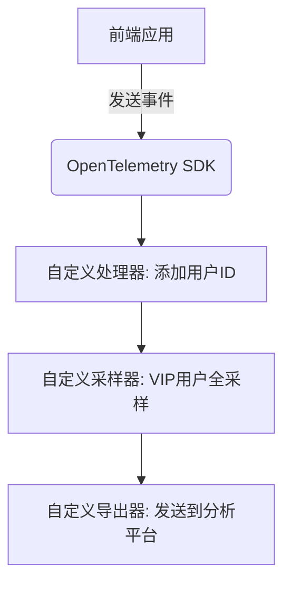

## 介绍

OpenTelemetry SDK扩展允许开发者通过自定义组件来增强或修改SDK的默认行为。这些扩展可以用于：

1. 添加自定义的处理器（Processor）
2. 实现特殊的导出器（Exporter）
3. 创建上下文传播器（Context Propagator）
4. 开发自定义的采样器（Sampler）

:::tip 为什么需要扩展？
当默认的SDK功能无法满足以下需求时，扩展就派上用场：
- 特殊的数据处理逻辑
- 非标准协议的导出需求
- 业务特定的采样策略
:::

## 核心扩展点

### 1. 自定义处理器

处理器负责在数据导出前进行转换或过滤：

```python
from opentelemetry.sdk.trace import SpanProcessor

class RedactionProcessor(SpanProcessor):
    def on_end(self, span):
        if "password" in span.attributes:
            span.attributes["password"] = "***REDACTED***"
```

**应用场景**：敏感信息脱敏

### 2. 自定义导出器

```java
public class CustomExporter implements SpanExporter {
    @Override
    public CompletableResultCode export(Collection<SpanData> spans) {
        // 实现自定义导出逻辑
        return CompletableResultCode.ofSuccess();
    }
}
```

**典型用例**：将数据导出到内部监控系统

### 3. 自定义采样器

```go
type BusinessSampler struct{}

func (s BusinessSampler) ShouldSample(p SamplingParameters) SamplingResult {
    if strings.Contains(p.Name, "checkout") {
        return SamplingResult{Decision: RecordAndSample}
    }
    return SamplingResult{Decision: Drop}
}
```

**使用场景**：对关键业务路径进行全采样

## 实际案例：用户行为分析扩展



实现代码示例：

```javascript
// 自定义用户属性处理器
class UserEnrichmentProcessor {
  onStart(span, context) {
    const user = getUserFromContext(context);
    span.setAttribute('user.id', user.id);
    span.setAttribute('user.tier', user.tier);
  }
}

// 注册扩展
tracerProvider.addSpanProcessor(new UserEnrichmentProcessor());
```

## 最佳实践

1. **保持兼容性**：确保扩展不会破坏标准数据格式
2. **性能考量**：复杂处理应异步执行
3. **错误处理**：妥善处理扩展组件中的异常

:::caution 注意事项
- 扩展可能影响SDK的稳定性
- 升级SDK版本时需要测试兼容性
- 复杂的扩展可能成为性能瓶颈
:::

## 总结

OpenTelemetry SDK扩展提供了强大的定制能力，通过：

- 处理器实现数据加工
- 导出器支持多目标输出
- 采样器控制数据量
- 传播器处理上下文信息

## 延伸学习

1. 官方扩展示例仓库
2. 尝试实现一个将数据导出到CSV文件的导出器
3. 创建基于QPS（每秒查询率）的动态采样器