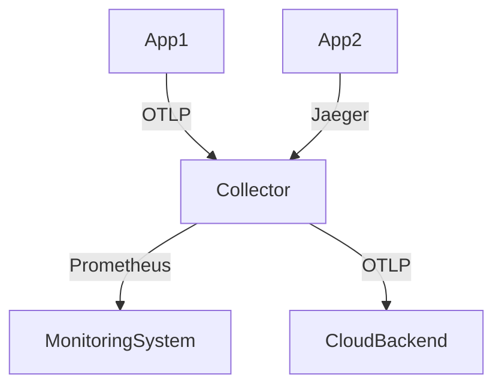

# OpenTelemetry Collector概述

## 什么是OpenTelemetry Collector？

OpenTelemetry Collector是一个**可扩展的代理服务**，用于接收、处理和导出遥测数据（如指标、日志和追踪）。它作为OpenTelemetry生态系统的核心组件，帮助开发者在不同环境中统一管理可观测性数据。

:::note 关键特性
- **多协议支持**：支持OTLP、Jaeger、Prometheus等多种数据格式<br />
- **数据处理管道**：提供接收（Receivers）、处理（Processors）、导出（Exporters）的模块化流水线<br />
- **与供应商解耦**：将数据采集与后端分析工具分离
:::

## 核心架构


1. **Receivers**：接收数据（如HTTP/gRPC端点、文件读取等）
2. **Processors**：执行数据过滤、转换或增强（如添加属性、采样）
3. **Exporters**：将数据发送到后端系统（如Jaeger、Prometheus、AWS X-Ray）

## 基础配置示例

以下是一个简单的Collector配置文件（`otel-collector-config.yaml`）：

```yaml
receivers:
  otlp:
    protocols:
      grpc:
      http:

processors:
  batch:
    timeout: 5s
    send_batch_size: 100

exporters:
  logging:
    logLevel: debug

service:
  pipelines:
    traces:
      receivers: [otlp]
      processors: [batch]
      exporters: [logging]
```

启动Collector时指定配置文件：
```bash
./otelcol --config=otel-collector-config.yaml
```

## 实际应用场景

### 场景1：统一数据收集


**优势**：不同技术栈的应用（如Java/Python服务）可以通过各自支持的协议将数据发送到Collector，由Collector统一转换后分发到不同后端。

### 场景2：数据预处理
```yaml
processors:
  attributes:
    actions:
      - key: environment
        value: production
        action: upsert
```
此配置会自动为所有经过的数据添加`environment=production`标签。

:::tip 初学者建议
从最简单的日志导出开始实验：
1. 配置`logging` exporter
2. 发送少量测试数据
3. 逐步添加处理逻辑
:::

## 常见问题解决

**问题**：数据未出现在后端系统？
- 检查Collector日志中的错误消息
- 验证接收器协议是否与客户端匹配
- 确保导出器配置了正确的目标地址

## 总结

OpenTelemetry Collector通过模块化架构解决了可观测性数据收集的三大挑战：
1. **协议多样性**：支持多种数据格式接入
2. **处理复杂性**：提供批处理、转换等中间操作
3. **目标灵活性**：同一数据可同时发送到多个分析平台

## 扩展学习

- 官方文档：[opentelemetry.io/docs/collector](https://opentelemetry.io/docs/collector/)
- 实践练习：尝试配置一个将数据同时输出到控制台和Jaeger的管道
- 进阶话题：研究如何通过Collector实现自定义指标计算

:::caution 注意
生产环境部署时务必配置资源限制（如内存/CPU配额），避免Collector处理大量数据时耗尽系统资源。
:::