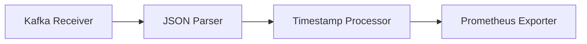

## 简介

OpenTelemetry Collector是一个高度模块化的组件，用于接收、处理和导出遥测数据（如指标、日志和跟踪）。其核心设计理念之一就是**扩展性**——允许用户通过添加自定义组件来适应不同的数据流水线需求。本文将带你逐步理解Collector的扩展机制，并通过实际案例展示如何实现。

:::note 关键概念
扩展性指通过添加或修改以下组件来增强Collector功能：
- **接收器（Receivers）**：数据输入接口
- **处理器（Processors）**：数据转换/过滤
- **导出器（Exporters）**：数据输出接口
:::

## 扩展机制详解

### 1. 组件类型与接口
Collector的所有扩展组件都需实现特定接口：

```go
// 示例：接收器接口（Go语言）
type Receiver interface {
    Start(ctx context.Context, host Host) error
    Shutdown(ctx context.Context) error
}
```

### 2. 扩展方式
#### 方式一：使用现有组件
通过YAML配置组合内置组件：

```yaml
service:
  pipelines:
    metrics:
      receivers: [prometheus]
      processors: [batch]
      exporters: [logging]
```

#### 方式二：开发自定义组件
以创建一个添加`request_id`的处理器为例：

```go
package customprocessor

type requestIDProcessor struct {
    next consumer.Traces
}

func (p *requestIDProcessor) ConsumeTraces(ctx context.Context, td ptrace.Traces) error {
    for i := 0; i < td.ResourceSpans().Len(); i++ {
        span := td.ResourceSpans().At(i).ScopeSpans().At(0).Spans().At(0)
        span.Attributes().PutStr("request_id", uuid.NewString())
    }
    return p.next.ConsumeTraces(ctx, td)
}
```

### 3. 注册组件
在`components.go`中注册新组件：

```go
func Components() (otelcol.Factories, error) {
    factories, _ := defaultcomponents.Factories()
    factories.Processors["requestid"] = newProcessorFactory()
    return factories, nil
}
```

## 实际案例：处理Kafka消息

### 场景需求
需要从Kafka接收JSON格式的指标数据，并添加时间戳后导出到Prometheus。

### 解决方案


配置示例：
```yaml
receivers:
  kafka:
    brokers: ["localhost:9092"]
    topic: "metrics_topic"

processors:
  timestamp:
    time_field: "@timestamp"

exporters:
  prometheus:
    endpoint: "0.0.0.0:8889"

service:
  pipelines:
    metrics:
      receivers: [kafka]
      processors: [timestamp]
      exporters: [prometheus]
```

## 性能考量

:::caution 扩展注意事项
1. 处理器链长度影响延迟
2. 自定义组件需考虑线程安全
3. 批处理（batch）处理器能显著提高吞吐量
:::

## 总结

OpenTelemetry Collector的扩展性使其能适应各种复杂的监控场景。通过：
1. 灵活组合内置组件
2. 开发定制化组件
3. 合理设计数据处理流水线

你可以构建出完全符合业务需求的遥测数据管道。

## 延伸学习

### 推荐练习
1. 创建一个添加环境标签（env=production）的处理器
2. 将Nginx日志通过Fluent Forwarder接收并导出到Jaeger
3. 比较批处理与直接导出的性能差异

### 官方资源
- [OpenTelemetry Collector Contrib仓库](https://github.com/open-telemetry/opentelemetry-collector-contrib)
- [自定义组件开发指南](https://opentelemetry.io/docs/collector/custom-components/)