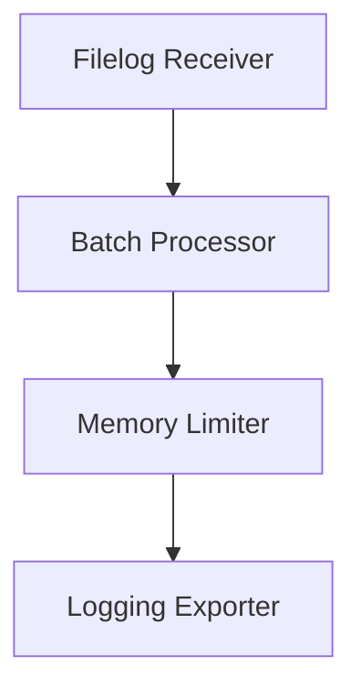

## 介绍

OpenTelemetry Collector是一个用于接收、处理和导出遥测数据（如指标、日志和跟踪）的组件。性能调优是确保Collector在高负载下稳定运行的关键步骤。本指南将介绍常见的性能瓶颈及优化策略，适合初学者理解实践。

## 核心性能参数

### 1. 批处理配置
通过批处理减少网络请求和存储开销：
```yaml
processors:
  batch:
    timeout: 5s  # 最大等待时间
    send_batch_size: 1000  # 每批最大数据量
```

### 2. 内存管理
限制内存使用避免OOM错误：
```yaml
service:
  telemetry:
    memory_ballast:
      size_mib: 512  # 内存缓冲池大小
```

### 3. 并发控制
调整接收器和处理器的并发数：
```yaml
receivers:
  otlp:
    protocols:
      grpc:
        max_concurrent_streams: 50
```

## 实际案例

### 场景：高吞吐量日志处理
配置示例：
```yaml
service:
  pipelines:
    logs:
      receivers: [filelog]
      processors: [batch, memory_limiter]
      exporters: [logging]
processors:
  memory_limiter:
    check_interval: 1s
    limit_mib: 1024
```



:::tip
使用 `memory_limiter` 处理器时，建议设置为总内存的50-70%
:::

## 性能监控

通过内置指标监控Collector状态：
```bash
# 查询处理延迟
otelcol_processor_batch_batch_send_size{service_instance_id="123"}
```

## 总结

关键优化手段：
1. 合理配置批处理参数
2. 设置内存限制和缓冲
3. 根据硬件调整并发数

## 延伸练习

1. 尝试在不同 `send_batch_size` 值下测试吞吐量
2. 使用 `pprof` 分析CPU使用情况

## 附加资源

- [官方性能调优文档](https://opentelemetry.io/docs/collector/performance-tuning/)
- `otelcol-contrib` 性能测试工具包