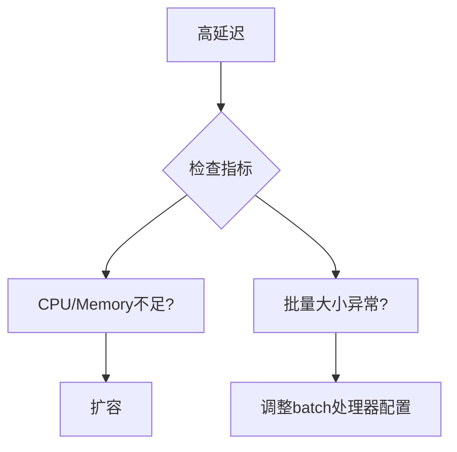

## 介绍

OpenTelemetry Collector是一个强大的工具，用于收集、处理和导出遥测数据（指标、日志和跟踪）。但你是否想过，Collector自身也需要被监控？本文将指导你如何配置OpenTelemetry Collector来监控其自身的运行状态，确保其稳定性和可靠性。

:::note
**为什么需要监控Collector？**  
Collector作为数据管道的核心组件，其性能问题可能导致数据丢失或延迟。监控其资源使用率、处理延迟和错误率至关重要。
:::

---

## 配置Collector自监控

### 1. 启用内置监控指标

OpenTelemetry Collector默认暴露Prometheus格式的自身指标。在配置文件中添加以下内容启用HTTP服务：

```yaml
service:
  pipelines:
    metrics:
      receivers: [prometheus]
      processors: []
      exporters: [logging]
  extensions: [health_check, pprof]
  telemetry:
    metrics:
      address: ":8888"  # 暴露指标端口
```

### 2. 关键监控指标

Collector暴露的指标包括：
- `otelcol_process_uptime`：运行时间
- `otelcol_process_memory_rss`：内存占用
- `otelcol_process_cpu_seconds`：CPU使用率
- `otelcol_receiver_accepted_spans`：接收的Span数量

通过Prometheus抓取这些指标：
```yaml
scrape_configs:
  - job_name: 'otel-collector'
    static_configs:
      - targets: ['localhost:8888']
```

---

## 实际案例：诊断性能问题

### 场景
假设Collector处理延迟突然升高，通过以下步骤诊断：
1. 检查`otelcol_processor_batch_batch_send_size`确认批量大小
2. 分析`otelcol_exporter_sent_spans`与`otelcol_exporter_failed_spans`的比率



---

## 日志与跟踪配置

### 日志收集
在Collector配置中添加自身日志收集：
```yaml
receivers:
  filelog:
    include: [ "/var/log/otel-collector.log" ]
```

### 分布式跟踪
启用跟踪上下文传播以监控内部流程：
```yaml
service:
  telemetry:
    traces:
      sampler: always_on
      exporters: [jaeger]
```

---

## 总结

通过本文你学会了：
- 启用Collector的自身指标暴露
- 关键性能指标的含义
- 如何通过日志和跟踪进一步监控
- 实际故障排查的流程

---

## 延伸学习

1. **官方文档**：[OpenTelemetry Collector自监控指南](https://opentelemetry.io/docs/collector/configuration/#telemetry)
2. **练习**：部署一个Collector实例，配置自监控并模拟高负载场景观察指标变化
3. **进阶**：将Collector指标接入Grafana仪表盘

:::tip
使用`docker stats`或`kubectl top pod`作为辅助工具，结合OpenTelemetry指标进行交叉验证。
:::