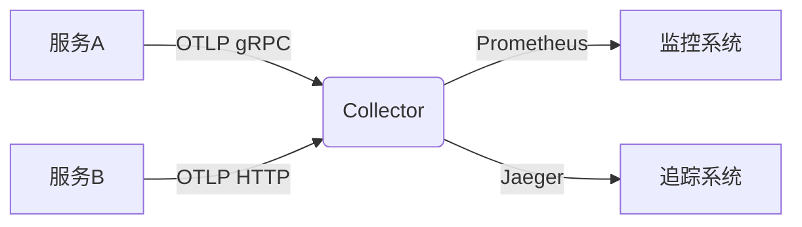
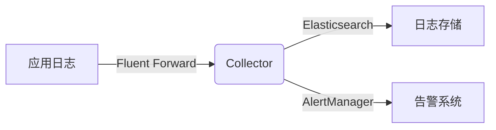

# OpenTelemetry Collector安装

## 介绍

OpenTelemetry Collector是一个开源组件，用于接收、处理和导出遥测数据（如指标、日志和追踪）。它作为应用程序和监控后端（如Prometheus、Jaeger等）之间的中间层，提供灵活的管道配置能力。本指南将带您完成安装过程。

:::note 关键概念
Collector由三个主要组件组成：
- **接收器(Receivers)**：接收数据
- **处理器(Processors)**：处理数据
- **导出器(Exporters)**：发送数据到目的地
:::

## 系统要求

在开始安装前，请确保您的系统满足以下要求：

- 操作系统：Linux、Windows或macOS
- 架构：amd64、arm64等（根据您的系统选择）
- 磁盘空间：至少100MB可用空间
- 内存：建议至少512MB

## 安装方法

### 方法1：使用预编译二进制文件（推荐）

这是最简单的安装方式：

1. 访问[官方发布页面](https://github.com/open-telemetry/opentelemetry-collector-releases/releases)
2. 下载适合您系统的版本
3. 解压文件

```bash
# Linux/macOS示例
wget https://github.com/open-telemetry/opentelemetry-collector-releases/releases/download/v0.60.0/otelcol_0.60.0_linux_amd64.tar.gz
tar -xvf otelcol_0.60.0_linux_amd64.tar.gz
```

### 方法2：使用Docker

如果您使用Docker，可以通过以下命令运行Collector：

```bash
docker run -p 4317:4317 otel/opentelemetry-collector
```

### 方法3：从源代码构建

适合需要自定义功能的用户：

```bash
git clone https://github.com/open-telemetry/opentelemetry-collector.git
cd opentelemetry-collector
make otelcol
```

## 基本配置

安装完成后，您需要创建一个配置文件。下面是一个基本示例（保存为`config.yaml`）：

```yaml
receivers:
  otlp:
    protocols:
      grpc:
      http:

processors:
  batch:

exporters:
  logging:
    logLevel: debug

service:
  pipelines:
    traces:
      receivers: [otlp]
      processors: [batch]
      exporters: [logging]
    metrics:
      receivers: [otlp]
      processors: [batch]
      exporters: [logging]
    logs:
      receivers: [otlp]
      processors: [batch]
      exporters: [logging]
```

## 运行Collector

根据您的安装方式选择相应命令：

### 二进制文件方式

```bash
./otelcol --config=config.yaml
```

### Docker方式

```bash
docker run -v $(pwd)/config.yaml:/etc/otel/config.yaml -p 4317:4317 otel/opentelemetry-collector
```

## 验证安装

Collector运行后，您可以通过以下方式验证：

1. 检查日志输出
2. 发送测试数据：

```bash
curl -X POST http://localhost:4317/v1/traces -H "Content-Type: application/json" -d @trace.json
```

## 实际应用场景

### 场景1：监控微服务应用



### 场景2：日志集中处理



## 常见问题解决

:::caution 常见问题
1. **端口冲突**：确保4317端口未被占用
2. **权限问题**：Linux系统可能需要`sudo`
3. **配置错误**：使用`--config`参数指定正确的配置文件路径
:::

## 总结

通过本指南，您已经学会了：
- OpenTelemetry Collector的基本概念
- 三种安装方法
- 如何创建基本配置
- 如何运行和验证Collector
- 实际应用场景

## 延伸学习

1. 尝试添加更多接收器和导出器
2. 探索处理器功能（如过滤、转换）
3. 学习如何扩展Collector功能

:::tip 练习建议
1. 修改配置，将数据导出到控制台和文件
2. 设置一个简单的处理器链（如batch → memory_limiter）
3. 尝试不同的协议接收数据（如Zipkin、Jaeger）
:::