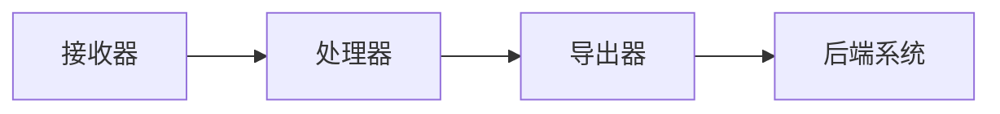

# OpenTelemetry Collector 导出器

## 介绍

OpenTelemetry Collector 是一个用于接收、处理和导出遥测数据（如指标、日志和跟踪）的组件。**导出器（Exporter）** 是 Collector 的核心功能之一，负责将处理后的数据发送到指定的后端系统（如 Prometheus、Jaeger 或云服务）。本文将详细介绍导出器的概念、配置方法及实际应用。

:::note
导出器决定了数据的最终去向，例如存储、可视化或分析平台。
:::

---

## 导出器的工作原理

OpenTelemetry Collector 的导出器通过以下流程工作：

1. **接收数据**：从接收器（Receiver）获取原始遥测数据。
2. **处理数据**：通过处理器（Processor）过滤或转换数据。
3. **导出数据**：通过导出器将数据发送到目标系统。



---

## 常见导出器类型

OpenTelemetry Collector 支持多种导出器，以下是常用的几类：

1. **日志导出器**：
   - `logging`：将数据输出到 Collector 的日志（用于调试）。
   - `elasticsearch`：将日志发送到 Elasticsearch。

2. **指标导出器**：
   - `prometheus`：导出指标到 Prometheus。
   - `googlecloud`：发送指标到 Google Cloud Monitoring。

3. **跟踪导出器**：
   - `jaeger`：导出跟踪数据到 Jaeger。
   - `zipkin`：兼容 Zipkin 格式的后端。

---

## 配置导出器

以下是一个简单的配置文件示例，展示如何配置 `logging` 和 `prometheus` 导出器：

```yaml
receivers:
  otlp:
    protocols:
      grpc:

processors:
  batch:

exporters:
  logging:
    logLevel: debug
  prometheus:
    endpoint: "0.0.0.0:8889"

service:
  pipelines:
    metrics:
      receivers: [otlp]
      processors: [batch]
      exporters: [logging, prometheus]
```

:::tip
`logging` 导出器适合调试，但在生产环境中应替换为更稳定的后端（如 Prometheus）。
:::

---

## 实际案例：导出数据到 Jaeger

假设你需要将跟踪数据发送到 Jaeger，以下是配置步骤：

1. **定义 Jaeger 导出器**：
   ```yaml
   exporters:
     jaeger:
       endpoint: "jaeger-all-in-one:14250"
       tls:
         insecure: true
   ```

2. **添加到服务管道**：
   ```yaml
   service:
     pipelines:
       traces:
         receivers: [otlp]
         processors: [batch]
         exporters: [jaeger]
   ```

3. **启动 Collector** 后，跟踪数据将出现在 Jaeger UI 中。

---

## 高级功能：自定义导出器

如果需要将数据发送到私有系统，可以通过编写自定义导出器实现。以下是一个 Go 示例的骨架代码：

```go
package main

import (
    "go.opentelemetry.io/collector/component"
    "go.opentelemetry.io/collector/exporter"
)

type customExporter struct {
    // 实现 exporter 接口
}

func main() {
    factory := exporter.NewFactory(
        "custom",
        createDefaultConfig,
        exporter.WithTraces(createTracesExporter, component.StabilityLevelAlpha),
    )
    // 注册到 Collector
}
```

:::caution
自定义导出器需要熟悉 Go 和 OpenTelemetry 的组件模型，建议先阅读官方文档。
:::

---

## 总结

- **导出器**是 OpenTelemetry Collector 将数据发送到后端的关键组件。
- 支持多种类型（日志、指标、跟踪），如 `logging`、`prometheus` 和 `jaeger`。
- 通过 YAML 配置文件即可快速集成，也支持自定义开发。

## 下一步

1. 尝试在本地配置一个 `logging` 导出器，观察输出。
2. 阅读 [OpenTelemetry 官方文档](https://opentelemetry.io/docs/) 了解更多导出器选项。
3. 练习将数据导出到 Prometheus 并可视化。