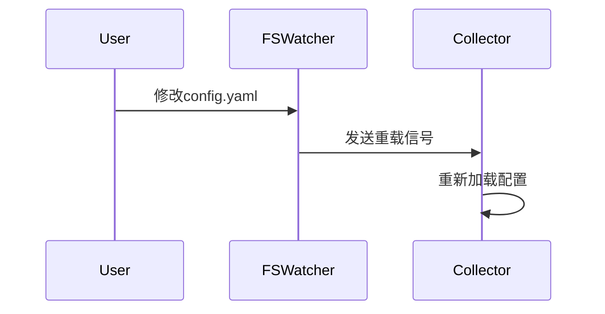

# OpenTelemetry Collector扩展

## 介绍

OpenTelemetry Collector是一个用于接收、处理和导出遥测数据（如指标、日志和跟踪）的核心组件。**扩展（Extensions）**是Collector的附加模块，用于提供非数据处理功能，如健康检查、性能监控或第三方服务集成（如API密钥管理）。与接收器/处理器/导出器不同，扩展不直接参与数据处理流水线。

:::tip 关键区别
- **接收器/处理器/导出器**：处理遥测数据流。
- **扩展**：提供辅助功能（如身份验证、诊断）。
:::

---

## 扩展的类型

OpenTelemetry Collector支持以下扩展类型：

1. **健康检查（Health Check）**：通过HTTP端点暴露Collector的健康状态。
2. **性能诊断（pprof）**：提供性能分析数据。
3. **ZPages**：实时调试工具（如`/debug/tracez`）。
4. **文件系统监控（FSWatcher）**：动态重载配置。
5. **自定义扩展**：用户开发的插件。

---

## 配置扩展

以下是一个配置`health_check`和`pprof`扩展的示例：

```yaml
extensions:
  health_check:
    endpoint: 0.0.0.0:13133
  pprof:
    endpoint: 0.0.0.0:1777

service:
  extensions: [health_check, pprof]
  pipelines:
    traces:
      receivers: [otlp]
      processors: []
      exporters: [logging]
```

:::note
- `extensions`：声明扩展及其配置。
- `service.extensions`：激活已声明的扩展。
:::

---

## 自定义扩展开发

### 步骤1：实现接口
创建一个Go模块，实现`component.Extension`接口：

```go
package myextension

import (
    "context"
    "go.opentelemetry.io/collector/component"
)

type myExtension struct {
    config *Config
}

func (e *myExtension) Start(ctx context.Context, host component.Host) error {
    // 初始化逻辑
    return nil
}

func (e *myExtension) Shutdown(ctx context.Context) error {
    // 清理逻辑
    return nil
}
```

### 步骤2：注册扩展
在工厂函数中注册扩展：

```go
func NewFactory() component.ExtensionFactory {
    return component.NewExtensionFactory(
        "myextension",
        createDefaultConfig,
        createExtension,
    )
}
```

---

## 实际案例：动态配置重载

通过`FSWatcher`扩展实现配置热更新：

```yaml
extensions:
  file_system_watcher:
    paths: [ "/etc/otel/config.yaml" ]
    delay: 1s
```

当配置文件变更时，Collector会自动重新加载配置，无需重启。



---

## 总结

- **扩展用途**：增强Collector的非数据处理能力（如监控、调试）。
- **内置扩展**：优先使用官方提供的扩展（如`health_check`）。
- **自定义开发**：通过Go实现`component.Extension`接口。

---

## 附加资源

1. [官方扩展列表](https://github.com/open-telemetry/opentelemetry-collector-contrib/tree/main/extension)
2. 练习：尝试配置`zpages`扩展并访问`/debug/tracez`端点。
3. 进阶：开发一个扩展，将Collector的指标推送到Prometheus。