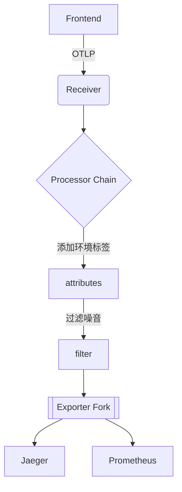

## 介绍

OpenTelemetry Collector是一个用于接收、处理和导出遥测数据（如指标、日志和追踪）的中转组件。它的核心设计基于**流水线（Pipeline）**模型，允许数据在不同阶段被灵活处理。本文将逐步拆解流水线的工作原理，帮助初学者理解其核心概念。

:::note 关键术语
- **接收器（Receiver）**：数据入口，支持多种协议（如OTLP、Jaeger、Prometheus）
- **处理器（Processor）**：数据加工层（如过滤、转换、采样）
- **导出器（Exporter）**：数据出口，发送到后端系统（如Jaeger、Prometheus、Azure Monitor）
:::

## 流水线结构

典型的Collector流水线包含以下三个阶段：


### 1. 接收器（Receivers）
接收器负责从各种来源收集数据。支持的类型包括：
- **推送型**（如OTLP/gRPC、OTLP/HTTP）
- **拉取型**（如Prometheus scraper）

示例配置（`receivers`部分）：
```yaml
receivers:
  otlp:
    protocols:
      grpc:
      http:
  prometheus:
    config:
      scrape_configs:
        - job_name: "demo-service"
          scrape_interval: 15s
```

### 2. 处理器（Processors）
处理器对数据进行转换或增强。常用处理器包括：

| 处理器类型       | 功能描述                     |
|------------------|----------------------------|
| `batch`         | 批量打包数据减少网络请求    |
| `memory_limiter`| 防止内存溢出                |
| `attributes`    | 添加/修改资源属性           |

示例配置（处理顺序很重要！）：
```yaml
processors:
  batch:
    timeout: 5s
    send_batch_size: 100
  memory_limiter:
    check_interval: 1s
    limit_mib: 2000
```

### 3. 导出器（Exporters）
将处理后的数据发送到目标系统：

```yaml
exporters:
  logging:
    logLevel: debug
  otlp:
    endpoint: "jaeger:4317"
    tls:
      insecure: true
```

## 完整流水线配置示例

以下是一个将OTLP数据转储到日志并转发到Jaeger的配置：

```yaml
service:
  pipelines:
    traces:
      receivers: [otlp]
      processors: [batch, memory_limiter]
      exporters: [logging, otlp]
```

:::warning 配置验证
使用`otelcol validate <config-file>`命令检查配置语法是否正确
:::

## 实际应用场景

**案例：电商平台监控**
1. 接收器收集来自前端的OTLP追踪数据
2. `attributes`处理器添加`environment=prod`标签
3. `filter`处理器丢弃健康检查请求
4. 导出器同时发送数据到：
   - Jaeger（用于调试）
   - Prometheus（生成业务指标）



## 总结与练习

### 核心要点
- 流水线由**接收→处理→导出**三阶段组成
- 处理器按配置顺序执行
- 可同时定义多个独立流水线（如分别处理traces/metrics/logs）

### 动手练习
1. 创建一个配置，实现：
   - 接收Prometheus指标
   - 使用`resource`处理器添加`service.name=cart-service`
   - 导出到控制台和OTLP端点

2. 尝试添加`probabilistic_sampler`处理器，只采样50%的追踪数据

### 扩展阅读
- [官方处理器列表](https://opentelemetry.io/docs/collector/configuration/#processors)
- [高级流水线设计模式](https://github.com/open-telemetry/opentelemetry-collector-contrib/tree/main/examples)