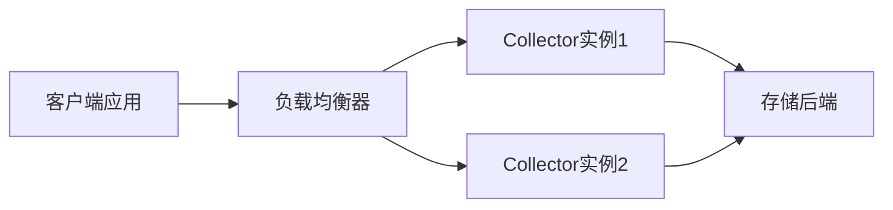
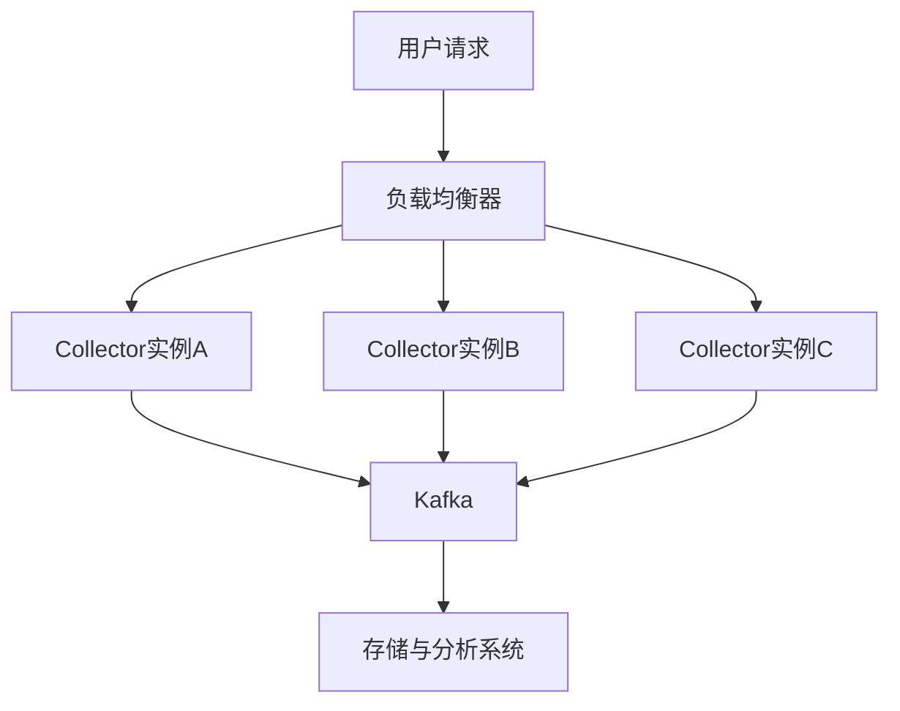

## 介绍

OpenTelemetry Collector是云原生观测数据的处理中枢，负责接收、转换和导出遥测数据（如指标、日志、链路）。**高可用部署**通过冗余和负载均衡机制，避免单点故障导致数据丢失。本文将分步骤讲解如何实现这一架构。

:::note 关键概念
- **冗余**：部署多个Collector实例，避免单点故障。
- **负载均衡**：通过均衡策略分散流量压力。
- **持久化队列**：在故障时暂存数据，确保最终一致性。
:::

## 基础架构设计

高可用架构通常包含以下组件：
1. **多个Collector实例**：部署在独立节点或容器中。
2. **负载均衡器**（如Nginx、HAProxy）：分配客户端请求。
3. **持久化存储**（如文件系统、Kafka）：缓存未处理的数据。



## 部署步骤

### 1. 配置Collector实例
创建基础配置文件 `collector-config.yaml`，启用批处理和队列：

```yaml
receivers:
  otlp:
    protocols:
      grpc:
      http:

processors:
  batch:
    timeout: 5s
    send_batch_size: 1000

exporters:
  logging:
    logLevel: debug
  otlp/http:
    endpoint: "http://backend:4318"

service:
  pipelines:
    traces:
      receivers: [otlp]
      processors: [batch]
      exporters: [logging, otlp/http]
```

### 2. 使用Docker Compose部署多实例
通过`docker-compose.yml`启动两个实例并暴露端口：

```yaml
version: "3"
services:
  collector1:
    image: otel/opentelemetry-collector
    volumes:
      - ./collector-config.yaml:/etc/collector-config.yaml
    command: ["--config=/etc/collector-config.yaml"]
    ports:
      - "4317:4317"

  collector2:
    image: otel/opentelemetry-collector
    volumes:
      - ./collector-config.yaml:/etc/collector-config.yaml
    command: ["--config=/etc/collector-config.yaml"]
    ports:
      - "4318:4317"
```

### 3. 设置Nginx负载均衡
配置Nginx将流量轮询分发到两个实例：

```nginx
http {
    upstream collectors {
        server collector1:4317;
        server collector2:4317;
    }

    server {
        listen 4317;
        location / {
            proxy_pass http://collectors;
        }
    }
}
```

## 实际案例：电商平台监控

**场景**：一个电商平台需要确保促销期间监控数据不丢失。

**解决方案**：
1. 部署3个Collector实例，分别位于不同可用区。
2. 使用Kafka作为队列缓冲突发流量。
3. 配置自动扩缩容（如Kubernetes HPA）。



## 总结与练习

### 总结
- 高可用部署通过冗余和负载均衡提升可靠性。
- 持久化队列应对流量高峰和故障恢复。
- 实际场景需结合业务需求调整架构。

### 练习
1. 使用Docker Compose部署两个Collector实例，并通过`curl`测试负载均衡。
2. 修改配置，将数据导出到Jaeger代替Logging Exporter。

:::tip 扩展阅读
- [OpenTelemetry官方文档](https://opentelemetry.io/docs/)
- 《Cloud Native Observability with OpenTelemetry》
:::