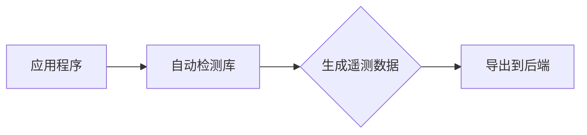
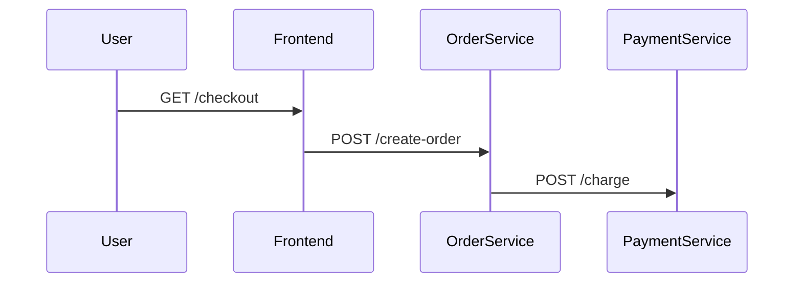

## 引言

OpenTelemetry是一个开源的观测性框架，用于生成、收集和管理遥测数据（如指标、日志和追踪）。**自动检测（Auto-Instrumentation）**是OpenTelemetry的核心功能之一，它允许开发者无需手动修改代码即可为应用程序添加观测能力。本文将介绍自动检测的工作原理、优势以及如何在实际项目中使用它。

## 什么是自动检测？

自动检测是指通过工具或库自动为应用程序注入观测代码（如追踪 spans 或指标），而无需开发者显式编写相关代码。OpenTelemetry通过语言特定的代理或库实现这一功能，支持多种编程语言（如Java、Python、Node.js等）。

:::note 关键优势
- **零代码侵入**：无需修改业务逻辑。
- **快速集成**：适合已有项目的观测性改造。
- **标准化数据**：自动生成符合OpenTelemetry规范的遥测数据。
:::

## 工作原理

自动检测通常通过以下方式实现：
1. **字节码注入**（如Java Agent）：在运行时动态修改类字节码。
2. **包装库函数**（如Python装饰器）：劫持目标函数调用并注入观测逻辑。
3. **运行时Hook**（如Node.js的`require`拦截）：在模块加载时注入代码。



## 代码示例

以下是一个Python Flask应用的自动检测示例。**无需手动编写追踪代码**，仅需安装OpenTelemetry库并配置自动检测：

1. 安装依赖：
```bash
pip install opentelemetry-distro opentelemetry-exporter-otlp
```

2. 运行应用时启用自动检测：
```bash
opentelemetry-instrument --traces_exporter otlp flask run
```

**输入**（原始Flask应用）：
```python
from flask import Flask
app = Flask(__name__)

@app.route("/")
def hello():
    return "Hello, World!"
```

**输出**（自动生成的追踪数据）：
```json
{
  "name": "GET /",
  "context": {
    "trace_id": "7bba9f33312b3dbb8f2b2d3b504f0902",
    "span_id": "086e83747d0e381b"
  },
  "attributes": {
    "http.method": "GET",
    "http.route": "/"
  }
}
```

## 实际应用场景

### 场景1：微服务链路追踪
自动检测可追踪跨服务的请求流转。例如：
1. 用户请求从**前端服务**到**订单服务**再到**支付服务**。
2. 每个服务的自动检测库会生成关联的Span，形成完整链路。



### 场景2：性能瓶颈分析
自动检测的指标（如请求延迟、错误率）可帮助定位性能问题。例如：
- 数据库查询Span显示耗时过长 → 优化SQL或索引。

## 总结

OpenTelemetry自动检测大幅降低了观测性集成的门槛，尤其适合：
- 需要快速接入观测能力的遗留系统。
- 不希望引入额外开发负担的团队。
- 标准化多语言环境的遥测数据。

:::tip 下一步
1. 尝试为你的项目添加自动检测（参考[官方文档](https://opentelemetry.io/docs/)）。
2. 使用Jaeger或Prometheus可视化自动生成的数据。
3. 探索手动检测以补充自动检测的不足。
:::