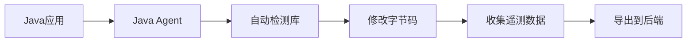

# OpenTelemetry Java自动检测

## 介绍

OpenTelemetry是一个开源的观测性框架，用于生成、收集和管理遥测数据（如指标、日志和追踪）。**Java自动检测**是OpenTelemetry提供的一项强大功能，它允许开发者通过简单的配置即可为Java应用程序添加观测能力，而无需手动修改代码。

自动检测通过Java代理（Java Agent）实现，它在运行时动态修改字节码来注入遥测逻辑。这种方式特别适合初学者，因为它：
- 无需深入理解OpenTelemetry API
- 减少代码侵入性
- 快速获得应用程序的观测数据

## 准备工作

在开始之前，确保你已经具备：
1. Java 8或更高版本
2. 一个基本的Java应用程序（可以是Spring Boot、Jakarta EE或其他框架）
3. OpenTelemetry Java代理JAR文件（可从[官方发布页面](https://github.com/open-telemetry/opentelemetry-java-instrumentation/releases)下载）

## 基本配置

### 1. 下载Java代理

下载最新版的OpenTelemetry Java代理：
```bash
wget https://github.com/open-telemetry/opentelemetry-java-instrumentation/releases/download/v1.30.0/opentelemetry-javaagent.jar
```

### 2. 运行应用程序时附加代理

使用`-javaagent`参数启动你的Java应用：
```bash
java -javaagent:path/to/opentelemetry-javaagent.jar \
     -Dotel.service.name=your-service-name \
     -Dotel.traces.exporter=logging \
     -jar your-application.jar
```

:::note
`otel.service.name`是你的服务名称，将出现在所有遥测数据中。`otel.traces.exporter=logging`表示将追踪数据输出到控制台。
:::

### 3. 验证自动检测

访问你的应用程序端点，你应该会在控制台看到类似以下的追踪信息：
```plaintext
INFO: {
  "name": "HTTP GET",
  "context": {
    "trace_id": "7b9b8f8b8b8b8b8b8b8b8b8b8b8b8b8b",
    "span_id": "8b8b8b8b8b8b8b8b",
    "trace_flags": 1
  },
  "parent_id": null,
  "start_time": "2023-10-01T12:00:00Z",
  "end_time": "2023-10-01T12:00:01Z",
  "attributes": {
    "http.method": "GET",
    "http.target": "/api/resource"
  }
}
```

## 支持的库和框架

OpenTelemetry Java自动检测支持众多流行的Java库和框架，包括但不限于：

- HTTP客户端：Apache HttpClient, OkHttp, JDK HttpClient
- HTTP服务器：Servlet, Spring Web, JAX-RS
- 数据库：JDBC, Hibernate, MongoDB
- 消息系统：Kafka, RabbitMQ
- RPC框架：gRPC, Dubbo

:::tip
你可以通过查看[官方文档](https://opentelemetry.io/docs/instrumentation/java/automatic/)获取完整的支持库列表。
:::

## 高级配置

### 导出到收集器

通常，你会希望将数据发送到OpenTelemetry收集器或后端系统（如Jaeger、Prometheus）。修改启动参数：

```bash
java -javaagent:path/to/opentelemetry-javaagent.jar \
     -Dotel.service.name=your-service-name \
     -Dotel.traces.exporter=otlp \
     -Dotel.metrics.exporter=otlp \
     -Dotel.exporter.otlp.endpoint=http://localhost:4317 \
     -jar your-application.jar
```

### 自定义采样率

控制追踪数据的采样率以减少开销：

```bash
-Dotel.traces.sampler=parentbased_always_on \
-Dotel.traces.sampler.arg=0.1 # 10%的采样率
```

### 添加资源属性

为你的服务添加额外的元数据：

```bash
-Dotel.resource.attributes=deployment.environment=production,team=backend
```

## 实际案例：Spring Boot应用

让我们看一个Spring Boot应用的完整配置示例：

1. 创建一个简单的Spring Boot控制器：
```java
@RestController
public class DemoController {
    
    @GetMapping("/hello")
    public String sayHello() {
        return "Hello, OpenTelemetry!";
    }
}
```

2. 使用以下命令启动应用：
```bash
java -javaagent:opentelemetry-javaagent.jar \
     -Dotel.service.name=spring-boot-demo \
     -Dotel.traces.exporter=logging \
     -Dotel.metrics.exporter=logging \
     -jar spring-boot-app.jar
```

3. 访问`http://localhost:8080/hello`后，你将看到自动生成的追踪和指标数据。

## 工作原理



1. Java代理在应用启动时加载
2. 检测引擎分析应用的类路径
3. 对支持的库自动注入观测代码
4. 运行时收集数据并通过配置的导出器发送

## 常见问题

### 性能影响如何？

自动检测会引入一些性能开销，但通常很小（`<5%`）。对于高吞吐量系统，可以调整采样率来平衡。

### 如何排除特定路径？

使用`otel.instrumentation.http.server.excluded-paths`属性：
```bash
-Dotel.instrumentation.http.server.excluded-paths=/health,/metrics
```

### 自定义跨度名称？

默认情况下，HTTP请求的跨度名称是方法+路径。你可以通过实现`SpanNameProvider`接口来自定义。

## 总结

OpenTelemetry的Java自动检测功能为初学者提供了一种简单有效的方式来为应用程序添加观测能力，无需深入理解复杂的API或修改大量代码。通过简单的配置，你可以快速获得有价值的应用性能数据。

## 进一步学习

1. [OpenTelemetry Java自动检测官方文档](https://opentelemetry.io/docs/instrumentation/java/automatic/)
2. 尝试将数据导出到Jaeger或Zipkin进行可视化
3. 探索手动检测API以获得更精细的控制
4. 实验不同的采样策略对系统性能的影响

## 练习

1. 设置一个简单的Java Web应用并配置自动检测
2. 比较自动检测和手动检测的代码差异
3. 尝试将遥测数据导出到不同的后端系统
4. 为你的应用添加自定义资源属性

通过实践这些练习，你将更好地理解OpenTelemetry Java自动检测的强大功能和灵活性。