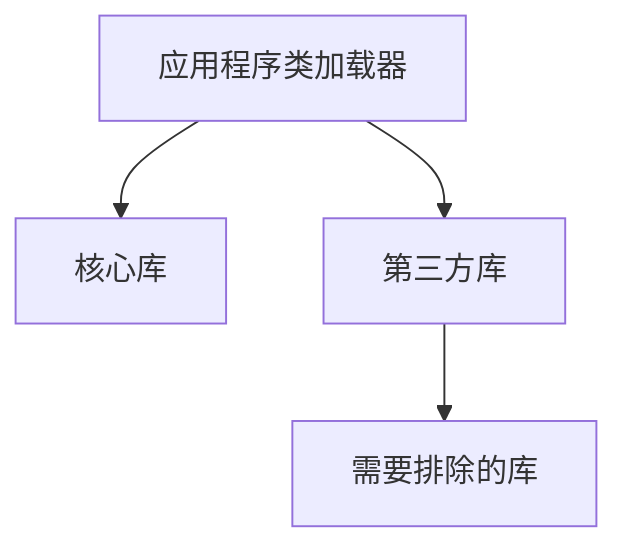

# OpenTelemetry 自动检测排除规则

## 介绍

OpenTelemetry的自动检测（Auto-Instrumentation）功能能够自动为应用程序添加监控代码，但有时我们需要排除特定类、方法或库的检测。排除规则（Exclusion Rules）正是为此设计的配置项，它能帮助我们：

1. 减少不必要的性能开销
2. 避免敏感数据的收集
3. 排除已知不兼容的库
4. 优化监控数据的质量

## 基本排除规则配置

### Java示例配置

在Java自动检测中，可以通过环境变量设置排除规则：

```properties
OTEL_INSTRUMENTATION_COMMON_EXCLUDE_METHODS=com.example.SensitiveClass.sensitiveMethod
OTEL_INSTRUMENTATION_HTTP_EXCLUDE_URLS=/health,/private/*
```

### 规则语法说明

1. **全限定名排除**：`package.ClassName.methodName`
2. **通配符支持**：
   - `*` 匹配任意字符序列
   - `?` 匹配单个字符
3. **路径模式**：用于URL排除，支持Ant风格模式

:::tip
排除规则是大小写敏感的，请确保与实际的类/方法名完全匹配
:::

## 实际应用案例

### 案例1：排除健康检查端点

```yaml
# 通过YAML配置
instrumentation:
  http:
    exclude_urls:
      - "/health"
      - "/actuator/*"
```

**效果**：这些端点的请求不会生成Span，减少存储开销。

### 案例2：排除敏感数据处理方法

```java
// 被排除的类
package com.example.payment;

public class CreditCardProcessor {
    public String processPayment(String cardNumber) { // 这个方法将被排除
        // 敏感处理逻辑
    }
}
```

配置方式：
```properties
OTEL_INSTRUMENTATION_COMMON_EXCLUDE_METHODS=com.example.payment.CreditCardProcessor.processPayment
```

## 高级排除模式

### 类加载器级别排除



配置示例：
```properties
OTEL_INSTRUMENTATION_EXCLUDE_CLASSLOADERS=com.example.SecureClassLoader
```

### 组合排除规则

```properties
# 同时排除多个元素
OTEL_INSTRUMENTATION_JDBC_EXCLUDE_CLASSES=com.zaxxer.hikari.*,com.mysql.cj.jdbc.ConnectionImpl
```

:::caution
过度使用排除规则可能导致监控数据不完整，建议通过采样(Sampling)来平衡性能和数据质量
:::

## 验证排除效果

1. 检查导出的Span中是否包含被排除的元素
2. 使用诊断日志：
```properties
OTEL_LOG_LEVEL=DEBUG
```
3. 查看代理启动日志中的"Excluded"条目

## 总结

OpenTelemetry的排除规则是精细控制监控范围的重要工具，关键要点：

- 通过环境变量或配置文件定义规则
- 支持多种匹配模式和层级
- 需要平衡监控完整性和系统性能
- 建议配合采样策略使用

## 延伸学习

1. 官方文档：[OpenTelemetry Instrumentation Configuration](https://opentelemetry.io/docs/)
2. 实践练习：尝试为示例应用设置排除规则并验证效果
3. 进阶主题：研究如何动态更新排除规则而不重启应用

:::note
排除规则的具体实现可能因语言SDK和版本有所不同，请始终参考对应版本的文档
:::