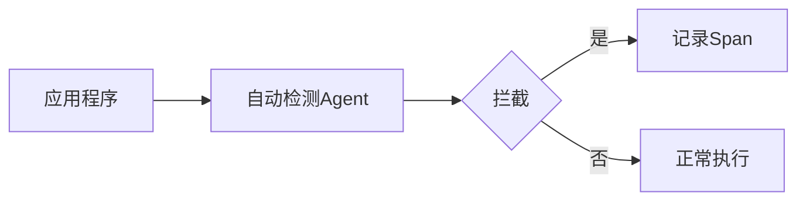

## 介绍

OpenTelemetry的自动检测（Auto-Instrumentation）是一种无需修改代码即可收集应用程序遥测数据（如跟踪、指标和日志）的技术。虽然它极大简化了可观测性接入，但初学者常担心其性能开销。本文将深入探讨自动检测的工作原理、性能影响因素及优化策略。

## 自动检测如何工作？

自动检测通过以下方式实现：
1. **字节码注入**：在运行时修改类加载的字节码（Java/Python等）。
2. **包装库调用**：拦截标准库调用（如HTTP请求）。
3. **环境变量配置**：通过`OTEL_JAVAAGENT_ENABLED=true`等开关控制。



## 性能影响因素

### 1. 采样率（Sampling）
:::tip 关键设置
采样率是性能影响的最大变量。100%采样会产生完整数据，但可能增加30%以上的延迟。
:::

```yaml
# 配置示例 (OpenTelemetry Collector)
processors:
  probabilistic_sampler:
    sampling_percentage: 10  # 仅采样10%的请求
```

### 2. 导出频率
高频导出（如每秒一次）会导致：
- 网络带宽消耗
- 序列化/反序列化CPU开销

```python
# Python示例：批量导出配置
from opentelemetry.sdk.trace.export import BatchSpanProcessor
exporter = OTLPSpanExporter(endpoint="http://localhost:4317")
span_processor = BatchSpanProcessor(exporter, schedule_delay_millis=5000)  # 5秒批量
```

### 3. 检测深度
检测的库越多，开销越大：
- **基础检测**（HTTP/DB调用）：~3%延迟增加
- **全栈检测**（包括子进程）：可能达15%

## 真实案例对比

| 场景                | 无检测 | 基础检测 | 全量检测 |
|---------------------|--------|----------|----------|
| API延迟 (p50)       | 120ms  | 124ms    | 138ms    |
| CPU使用率           | 45%    | 48%      | 52%      |
| 内存增长            | -      | +8MB     | +22MB    |

:::caution 注意
测试环境：Spring Boot应用，4核CPU/8GB内存，100RPS压力测试
:::

## 优化策略

1. **选择性检测**：
   ```bash
   OTEL_INSTRUMENTATION_HTTP_ENABLED=false  # 禁用HTTP检测
   ```

2. **使用批处理导出**：
   ```java
   // Java示例
   SpanExporter exporter = OtlpGrpcSpanExporter.builder()
       .setTimeout(2, TimeUnit.SECONDS)
       .build();
   ```

3. **调整采样策略**：
   ```go
   // Go示例
   sampler := sdktrace.ParentBased(
       sdktrace.TraceIDRatioBased(0.3),  // 30%采样
   )
   ```

## 总结

OpenTelemetry自动检测的性能影响通常可控（`<5`%开销），通过合理配置可进一步降低：
- 采样率设置在`1%-10%`
- 使用批量导出（间隔`2-5`秒）
- 仅启用必要检测库

## 延伸学习

1. [OpenTelemetry性能基准测试报告](https://opentelemetry.io/docs/reference/performance/)
2. 练习：在本地环境中比较`OTEL_SAMPLING=always_on`与`always_off`的延迟差异
3. 高级话题：分布式追踪的尾部采样（Tail Sampling）