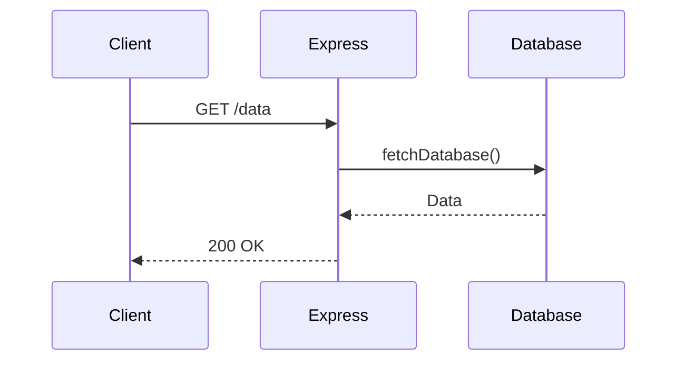

# OpenTelemetry 自动检测最佳实践

## 介绍

OpenTelemetry（简称OTel）是一个开源的观测性框架，用于生成、收集和导出遥测数据（如指标、日志和追踪）。**自动检测（Auto-Instrumentation）**是其核心功能之一，它通过动态注入代码来捕获应用性能数据，无需手动修改业务逻辑。本指南将帮助初学者理解如何高效使用这一功能。

---

## 为什么需要自动检测？

手动为每个函数或服务添加检测代码既耗时又容易出错。自动检测的优势在于：
- **零代码侵入**：无需修改现有代码库。
- **标准化数据**：自动遵循OpenTelemetry规范。
- **快速集成**：支持主流语言（Java、Python、Node.js等）。

:::tip
自动检测特别适合微服务架构或遗留系统迁移，能显著降低监控接入成本。
:::

---

## 配置自动检测

### 1. 环境准备
确保已安装OpenTelemetry SDK和自动检测工具包。以Node.js为例：
```bash
npm install @opentelemetry/sdk-node \
  @opentelemetry/auto-instrumentations-node
```

### 2. 初始化自动检测
创建`tracing.js`文件初始化检测：
```javascript
const { NodeSDK } = require('@opentelemetry/sdk-node');
const { getNodeAutoInstrumentations } = require('@opentelemetry/auto-instrumentations-node');

const sdk = new NodeSDK({
  instrumentations: [getNodeAutoInstrumentations()]
});

sdk.start();
```

### 3. 运行应用
通过`--require`参数加载配置：
```bash
node --require ./tracing.js app.js
```

---

## 实际案例：监控HTTP服务

### 场景描述
假设有一个Express.js服务，需要自动追踪HTTP请求和数据库查询。

### 输入代码（原始服务）
```javascript
const express = require('express');
const app = express();

app.get('/data', async (req, res) => {
  const data = await fetchDatabase(); // 模拟数据库查询
  res.json(data);
});

app.listen(3000);
```

### 输出结果
启动服务后，OpenTelemetry会自动：
1. 记录每个HTTP请求的路径、状态码和耗时。
2. 追踪`fetchDatabase`调用的性能数据。
3. 生成Span并导出到配置的后端（如Jaeger）。



---

## 最佳实践

### 1. 选择正确的检测库
- 使用官方维护的[自动检测包](https://opentelemetry.io/docs/instrumentation/js/automatic/)。
- 例如：Python的`opentelemetry-instrumentation-flask`。

### 2. 控制采样率
避免生产环境数据过载：
```javascript
const { AlwaysOnSampler } = require('@opentelemetry/core');

const sdk = new NodeSDK({
  sampler: new AlwaysOnSampler(), // 或使用概率采样
});
```

### 3. 过滤敏感信息
通过处理器移除敏感字段：
```javascript
const { SimpleSpanProcessor } = require('@opentelemetry/sdk-trace-base');

sdk.addSpanProcessor(
  new SimpleSpanProcessor(exporter, {
    attributeFilter: (attribute) => 
      !['password', 'token'].includes(attribute.key)
  })
);
```

---

## 总结

OpenTelemetry自动检测大幅降低了应用监控的接入门槛。关键步骤包括：
1. 安装正确的语言工具包。
2. 初始化SDK并加载自动检测。
3. 根据业务需求调整采样和过滤策略。

:::caution
自动检测可能无法覆盖所有自定义逻辑，此时需结合[手动检测](https://opentelemetry.io/docs/concepts/instrumentation/)补充。
:::

## 扩展资源
- [官方自动检测文档](https://opentelemetry.io/docs/instrumentation/js/automatic/)
- 练习：尝试为你的REST API添加自动检测，并可视化追踪数据。