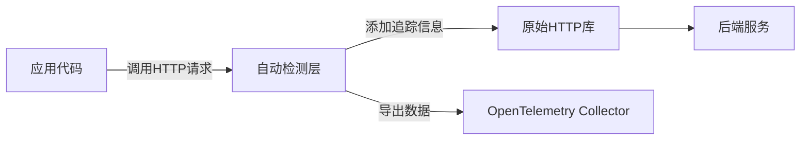

# OpenTelemetry JavaScript自动检测

## 介绍

OpenTelemetry是一个开源的观测性框架，用于生成、收集和管理遥测数据（如指标、日志和追踪）。**自动检测（Auto-Instrumentation）**是其核心功能之一，它允许开发者无需手动修改代码即可为应用添加监控能力。本文将通过JavaScript示例，带你了解如何实现自动检测。

:::note 为什么需要自动检测？
手动为每个函数或模块添加追踪代码既耗时又容易出错。自动检测通过包装常见库（如HTTP、数据库驱动）自动注入追踪逻辑，大幅降低接入成本。
:::

---

## 工作原理

OpenTelemetry的自动检测通过以下步骤实现：
1. **库劫持（Library Instrumentation）**：拦截目标库（如`http`、`express`）的API调用。
2. **上下文传播（Context Propagation）**：在分布式系统中传递追踪上下文（如TraceID）。
3. **数据导出（Exporting）**：将生成的遥测数据发送到后端（如Jaeger、Prometheus）。



---

## 实战配置

### 1. 安装依赖
首先安装必要的npm包：
```bash
npm install @opentelemetry/sdk-node \
            @opentelemetry/auto-instrumentations-node \
            @opentelemetry/exporter-trace-otlp-http
```

### 2. 初始化自动检测
创建`tracing.js`文件配置自动检测：
```javascript
const { NodeSDK } = require('@opentelemetry/sdk-node');
const { getNodeAutoInstrumentations } = require('@opentelemetry/auto-instrumentations-node');
const { OTLPTraceExporter } = require('@opentelemetry/exporter-trace-otlp-http');

const sdk = new NodeSDK({
  traceExporter: new OTLPTraceExporter({ url: 'http://collector:4318/v1/traces' }),
  instrumentations: [getNodeAutoInstrumentations()] // 启用所有自动检测
});

sdk.start();
```

### 3. 运行应用
通过`--require`参数预加载配置：
```bash
node --require ./tracing.js app.js
```

---

## 实际案例：Express应用

假设有一个简单的Express服务：
```javascript
// app.js
const express = require('express');
const app = express();

app.get('/', (req, res) => {
  res.send('Hello Auto-Instrumentation!');
});

app.listen(3000);
```

启用自动检测后，所有路由请求会自动生成：
- **Span**：记录请求处理时间、状态码
- **Trace**：串联跨服务的调用链

:::tip 查看结果
启动应用后访问`http://localhost:3000`，数据将出现在Jaeger等可视化工具中：
```
TraceID: 7b3b8f4a1d2e5f6c
Span: GET / (200) - 15ms
```
:::

---

## 自定义检测

虽然自动检测覆盖大部分场景，但你可能需要手动补充业务逻辑追踪：
```javascript
const { trace } = require('@opentelemetry/api');

app.get('/checkout', (req, res) => {
  const tracer = trace.getTracer('shop-tracer');
  tracer.startActiveSpan('process-payment', span => {
    // 业务逻辑...
    span.end();
  });
});
```

---

## 总结

OpenTelemetry的自动检测为JavaScript应用提供了：
- **零代码侵入**的监控能力
- **开箱即用**的常见库支持（Express、MongoDB等）
- **标准化数据格式**，兼容多种后端系统

---

## 延伸学习
1. [OpenTelemetry官方文档](https://opentelemetry.io/docs/instrumentation/js/getting-started/)
2. 尝试为Koa或NestJS项目添加自动检测
3. 比较自动检测与手动检测的性能开销

:::warning 注意事项
- 生产环境建议限制检测范围（如通过`instrumentations`数组选择需要的库）
- 某些ES模块可能需要额外配置（如`--experimental-loader`）
:::