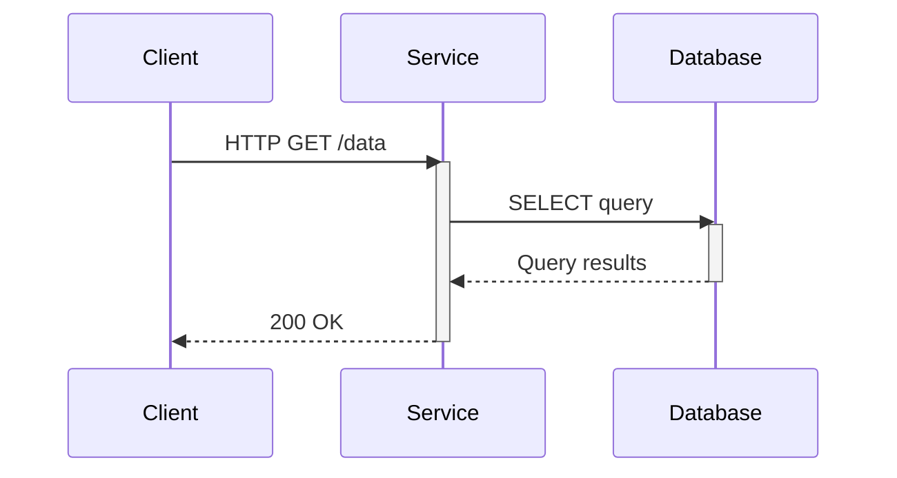

# OpenTelemetry Go自动检测

## 介绍

OpenTelemetry是一个开源的观测性框架，用于生成、收集和管理遥测数据（如追踪、指标和日志）。**自动检测（Auto-Instrumentation）**是OpenTelemetry的核心功能之一，它允许开发者在无需手动修改代码的情况下，自动捕获应用程序的运行时信息。对于Go语言开发者而言，这大大降低了集成分布式追踪系统的复杂度。

:::tip 为什么需要自动检测？
- 减少手动插桩（instrumentation）的工作量
- 快速获得关键性能指标（如HTTP请求延迟、数据库查询时间）
- 避免因手动插桩导致的代码侵入性
:::

## 准备工作

在开始之前，请确保：
1. 已安装Go 1.16或更高版本
2. 运行中的OpenTelemetry Collector（或兼容的后端如Jaeger/Prometheus）
3. 基础Go项目（以下示例基于HTTP服务）

```bash
# 安装OpenTelemetry Go SDK和自动检测包
go get go.opentelemetry.io/otel \
  go.opentelemetry.io/otel/sdk \
  go.opentelemetry.io/contrib/instrumentation/net/http/otelhttp
```

## 基础配置

以下是一个启用自动检测的最小示例：

```go
package main

import (
	"net/http"

	"go.opentelemetry.io/contrib/instrumentation/net/http/otelhttp"
	"go.opentelemetry.io/otel"
	"go.opentelemetry.io/otel/exporters/stdout/stdouttrace"
	"go.opentelemetry.io/otel/sdk/trace"
)

func main() {
	// 1. 创建控制台导出器（实际项目应替换为Jaeger等）
	exporter, _ := stdouttrace.New(stdouttrace.WithPrettyPrint())
	
	// 2. 配置追踪提供者
	tp := trace.NewTracerProvider(
		trace.WithBatcher(exporter),
	)
	otel.SetTracerProvider(tp)

	// 3. 使用自动检测的HTTP处理器
	handler := http.HandlerFunc(func(w http.ResponseWriter, r *http.Request) {
		w.Write([]byte("Hello, OpenTelemetry!"))
	})
	instrumentedHandler := otelhttp.NewHandler(handler, "hello-endpoint")
	
	http.ListenAndServe(":8080", instrumentedHandler)
}
```

运行后访问 `http://localhost:8080`，控制台将输出类似以下追踪数据：
```json
{
  "Name": "hello-endpoint",
  "SpanContext": {
    "TraceID": "7b20b5a3d38f9a7b",
    "SpanID": "a7b3f8d9e2c1b4a6"
  },
  "Attributes": [
    {"Key": "http.method", "Value": "GET"},
    {"Key": "http.route", "Value": "/"}
  ]
}
```

## 关键组件解析

### 1. HTTP自动检测
`otelhttp` 包为 `net/http` 提供了自动检测：
- 自动记录请求/响应时间和状态码
- 捕获HTTP头信息（如 `User-Agent`）
- 传播追踪上下文（W3C TraceContext）

```go
// 包装http.Client示例
client := http.Client{
  Transport: otelhttp.NewTransport(http.DefaultTransport),
}
resp, _ := client.Get("https://api.example.com")
```

### 2. 数据库检测
通过驱动层自动检测（以PostgreSQL为例）：
```bash
go get go.opentelemetry.io/contrib/instrumentation/github.com/lib/pq/otelpq
```

```go
import (
  _ "github.com/lib/pq"
  "go.opentelemetry.io/contrib/instrumentation/github.com/lib/pq/otelpq"
)

// 连接字符串添加追踪参数
db, err := sql.Open("postgres", "user=pqgotest dbname=pqgotest sslmode=disable trace=on")
```

### 3. 工作流可视化



## 实际应用场景

### 电商微服务追踪
假设有一个订单处理服务：
1. 用户发起 `POST /orders` 请求
2. 服务依次调用：
   - 库存服务（HTTP）
   - 支付服务（gRPC）
   - 数据库写入（PostgreSQL）

通过自动检测，你可以：
- 查看完整调用链
- 识别性能瓶颈（如慢SQL查询）
- 分析跨服务错误

:::warning 生产环境注意事项
- 控制采样率避免性能开销
- 使用批处理导出器（如OTLP）
- 保护敏感数据（通过属性过滤）
:::

## 高级配置

### 自定义属性
```go
handler := otelhttp.NewHandler(
  http.HandlerFunc(func(w http.ResponseWriter, r *http.Request) {
    // 添加自定义属性
    span := trace.SpanFromContext(r.Context())
    span.SetAttributes(attribute.String("shop.cart_id", "12345"))
  }),
  "checkout",
)
```

### 资源检测
标识服务元数据：
```go
import "go.opentelemetry.io/otel/sdk/resource"

res := resource.NewWithAttributes(
  semconv.SchemaURL,
  semconv.ServiceNameKey.String("payment-service"),
  semconv.ServiceVersionKey.String("1.0.0"),
  attribute.String("environment", "production"),
)

tp := trace.NewTracerProvider(
  trace.WithResource(res),
  // ...其他选项
)
```

## 总结

OpenTelemetry的Go自动检测功能通过：
- 提供开箱即用的常见库支持（HTTP/数据库等）
- 减少手动插桩的代码量
- 标准化观测数据格式

## 延伸学习

1. [官方Go自动检测文档](https://opentelemetry.io/docs/instrumentation/go/automatic/)
2. 尝试集成到你的现有项目中：
   - 添加gRPC自动检测
   - 导出数据到Jaeger可视化
3. 比较自动检测与手动插桩的数据差异

:::note 练习建议
1. 创建一个简单的HTTP服务，记录：
   - 请求处理时间
   - 响应状态码分布
2. 尝试检测一个数据库查询密集型的服务
3. （进阶）配置采样率为50%
:::