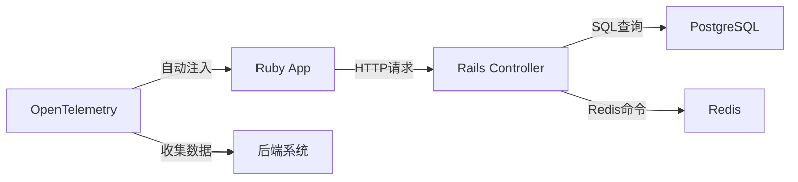

## 介绍

OpenTelemetry的自动检测（Auto-Instrumentation）功能允许开发者在不修改或少量修改代码的情况下，自动收集应用的遥测数据（如追踪、指标、日志）。对于Ruby应用，OpenTelemetry提供了专门的自动检测库，可快速集成常见的框架（如Rails、Sinatra）和数据库驱动（如PG、Redis）。

:::note
自动检测通过动态加载预定义的插桩库（Instrumentation）实现，减少了手动插桩的工作量。
:::

## 安装与配置

### 1. 添加依赖
在Gemfile中添加以下依赖：
```ruby
gem 'opentelemetry-sdk'
gem 'opentelemetry-instrumentation-all' # 包含所有官方支持的自动检测库
```

### 2. 初始化配置
在应用的启动文件（如`config/initializers/opentelemetry.rb`）中配置：
```ruby
require 'opentelemetry/sdk'
require 'opentelemetry/instrumentation/all'

OpenTelemetry::SDK.configure do |c|
  c.service_name = 'my-ruby-app'
  c.use_all() # 启用所有自动检测库
end
```

## 自动检测的工作原理

当应用启动时，OpenTelemetry会自动检测已加载的库（如Rails、Redis），并注入追踪逻辑。例如：
- **HTTP请求**：自动记录Rails控制器动作的耗时和状态码。
- **数据库调用**：捕获SQL查询的执行时间和参数（敏感数据默认被过滤）。



## 实际案例：监控Rails应用

### 场景
假设有一个Rails应用，包含以下功能：
1. 用户注册（写入PostgreSQL）
2. 缓存用户数据（Redis）

### 自动生成的追踪数据
无需手动插桩，OpenTelemetry会自动生成如下追踪：
- `POST /users` 的HTTP Span
  - `User.create` 的数据库Span
  - `Redis.set` 的缓存Span

:::tip
通过环境变量 `OTEL_TRACES_EXPORTER=console` 可在开发时直接查看控制台输出的追踪数据。
:::

## 自定义自动检测

### 排除特定库
若需禁用某些插桩（如避免敏感数据采集）：
```ruby
OpenTelemetry::SDK.configure do |c|
  c.use 'OpenTelemetry::Instrumentation::PG', enabled: false
end
```

### 添加自定义属性
在自动检测的基础上扩展元数据：
```ruby
# 在Rails控制器中
class UsersController < ApplicationController
  def create
    current_span = OpenTelemetry::Trace.current_span
    current_span.set_attribute('user.email', params[:email])
    # ...
  end
end
```

## 总结

OpenTelemetry的Ruby自动检测功能显著降低了集成分布式追踪的复杂度：
1. **零代码入侵**：无需修改业务逻辑。
2. **广泛支持**：覆盖主流Ruby框架和数据库。
3. **灵活扩展**：支持自定义过滤和属性添加。

## 下一步

- **练习**：尝试在本地Rails应用中启用自动检测，并使用Jaeger查看追踪数据。
- **资源**：
  - [OpenTelemetry Ruby文档](https://opentelemetry.io/docs/ruby/)
  - [自动检测库列表](https://github.com/open-telemetry/opentelemetry-ruby-contrib)