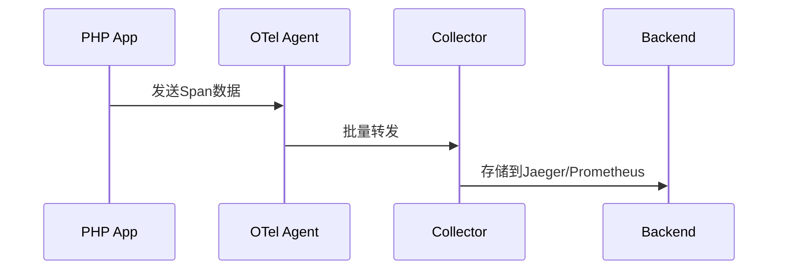

# OpenTelemetry PHP自动检测

## 介绍

OpenTelemetry是一个开源的观测性框架，用于生成、收集和管理遥测数据（如指标、日志和追踪）。PHP自动检测（Auto-instrumentation）是其核心功能之一，允许开发者**无需修改代码**即可为应用添加分布式追踪能力。本文将介绍如何为PHP应用配置自动检测，并通过实际案例展示其工作原理。

:::note 关键概念
自动检测通过PHP扩展或Composer包在运行时动态注入追踪逻辑，覆盖常见库（如PDO、Redis等）。
:::

---

## 前置条件

1. PHP 7.4或更高版本
2. 已安装Composer
3. OpenTelemetry Collector（用于接收遥测数据）

---

## 安装与配置

### 1. 安装PHP扩展
使用PECL安装OpenTelemetry扩展：
```bash
pecl install opentelemetry
```

### 2. 启用扩展
在`php.ini`中添加：
```ini
extension=opentelemetry.so
```

### 3. 通过Composer安装自动检测包
```bash
composer require open-telemetry/opentelemetry-auto-instrumentation
```

---

## 代码示例

### 自动检测的输入（原始代码）
以下是一个未插桩的PHP文件：
```php
<?php
// index.php
$pdo = new PDO('mysql:host=localhost;dbname=test', 'user', 'pass');
$stmt = $pdo->query('SELECT * FROM users');
print_r($stmt->fetchAll());
```

### 输出结果
启用自动检测后，OpenTelemetry会自动：
1. 追踪PDO查询的执行时间和状态
2. 生成包含以下信息的Span：
   ```json
   {
     "name": "PDO::query",
     "kind": "CLIENT",
     "attributes": {
       "db.system": "mysql",
       "db.statement": "SELECT * FROM users"
     }
   }
   ```

---

## 实际案例：电商应用

### 场景描述
一个使用Laravel的电商应用需要追踪：
- 数据库查询
- HTTP请求
- Redis缓存操作

### 配置步骤
1. 在`composer.json`中添加自动检测包：
   ```json
   {
     "require": {
       "open-telemetry/opentelemetry-auto-instrumentation": "^0.1"
     }
   }
   ```

2. 设置环境变量启用检测：
   ```bash
   export OTEL_PHP_AUTOLOAD_ENABLED=true
   export OTEL_SERVICE_NAME=payment-service
   ```

3. 启动应用时自动收集遥测数据：
   ```bash
   php -d extension=opentelemetry.so artisan serve
   ```

---

## 可视化数据流



---

## 总结

通过OpenTelemetry的PHP自动检测：
- ✅ **零代码修改**即可获得基础追踪能力
- ✅ 支持主流PHP库（MySQL、Redis、Guzzle等）
- ✅ 与OpenTelemetry Collector无缝集成

:::tip 最佳实践
1. 在生产环境始终配置采样率（如`OTEL_TRACES_SAMPLER=parentbased_traceidratio`）
2. 通过`OTEL_PHP_DISABLED_INSTRUMENTATIONS`禁用非必要检测以减少开销
:::

---

## 扩展学习

1. [OpenTelemetry PHP官方文档](https://opentelemetry.io/docs/instrumentation/php/)
2. 练习：尝试为WordPress项目启用自动检测并分析生成的Span
3. 进阶：自定义自动检测规则以追踪特定函数调用