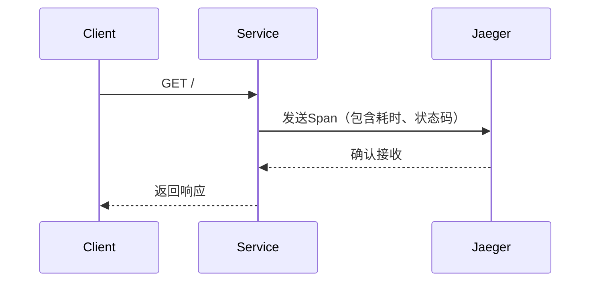

# OpenTelemetry Rust自动检测

## 介绍

OpenTelemetry的**自动检测（Auto-Instrumentation）**是一种无需修改代码即可收集应用遥测数据（如追踪、指标、日志）的技术。对于Rust开发者而言，这能显著降低接入分布式追踪系统的门槛。本文将介绍如何为Rust应用配置自动检测，并通过实际案例展示其工作原理。

:::note 关键概念
- **自动检测**：通过库/工具自动注入观测代码，无需手动插桩。
- **手动检测**：开发者显式调用OpenTelemetry API插入观测点。
:::

---

## 准备工作

### 依赖安装
在`Cargo.toml`中添加以下依赖：

```toml
[dependencies]
opentelemetry = { version = "0.18", features = ["rt-tokio"] }
opentelemetry-otlp = "0.11"
tokio = { version = "1.0", features = ["full"] }
tracing = "0.1"
tracing-opentelemetry = "0.18"
tracing-subscriber = { version = "0.3", features = ["fmt"] }
```

---

## 配置自动检测

### 1. 初始化追踪提供者
通过`tracing-opentelemetry`库自动捕获`tracing`事件：

```rust
use opentelemetry::global;
use tracing_subscriber::{layer::SubscriberExt, Registry};

fn init_tracer() {
    let tracer = opentelemetry_otlp::new_pipeline()
        .with_endpoint("http://localhost:4317") // OTLP接收端地址
        .install_batch(opentelemetry::runtime::Tokio)
        .expect("Failed to create tracer");

    // 将OpenTelemetry层添加到tracing订阅器
    let telemetry_layer = tracing_opentelemetry::layer().with_tracer(tracer);
    let subscriber = Registry::default().with(telemetry_layer);
    tracing::subscriber::set_global_default(subscriber).unwrap();
}
```

### 2. 自动检测HTTP请求
使用`tracing`宏自动记录函数调用：

```rust
#[tracing::instrument]
async fn handle_request() -> String {
    tracing::info!("Processing request...");
    "Hello, Auto-Instrumentation!".to_string()
}

#[tokio::main]
async fn main() {
    init_tracer();
    handle_request().await;
    global::shutdown_tracer_provider(); // 确保数据导出
}
```

---

## 实际案例：Web服务监控

### 场景描述
假设有一个Rust HTTP服务，我们需要自动追踪所有请求的耗时和状态。

### 代码实现
结合`axum`框架和自动检测：

```rust
use axum::{routing::get, Router};
use std::net::SocketAddr;

#[tracing::instrument]
async fn root_handler() -> &'static str {
    "Welcome to Auto-Instrumented Service!"
}

#[tokio::main]
async fn main() {
    init_tracer(); // 使用之前定义的初始化函数

    let app = Router::new().route("/", get(root_handler));
    let addr = SocketAddr::from(([127, 0, 0, 1], 3000));
    
    tracing::info!("Server running on {}", addr);
    axum::Server::bind(&addr)
        .serve(app.into_make_service())
        .await
        .unwrap();
}
```

### 输出结果
在Jaeger中看到的追踪数据：


---

## 工作原理剖析

### 自动检测流程
1. **代码注入**：`#[tracing::instrument]`宏在编译时插入追踪代码。
2. **数据收集**：`tracing-opentelemetry`将事件转换为OpenTelemetry Span。
3. **数据导出**：通过OTLP协议发送到后端（如Jaeger/Prometheus）。

:::warning 限制
- 自动检测无法捕获所有上下文（如业务逻辑细节）。
- 部分库需要手动适配（如数据库驱动）。
:::

---

## 总结与练习

### 关键收获
- 自动检测通过库集成实现零代码入侵的观测。
- Rust中主要依赖`tracing`和`opentelemetry`生态。
- 适合快速接入基础监控，复杂场景仍需手动插桩。

### 扩展练习
1. 尝试将数据导出到Prometheus而非Jaeger。
2. 为自定义结构体实现`tracing::Value` trait以记录更多字段。
3. 比较自动检测与手动插桩的性能开销。

### 推荐资源
- [OpenTelemetry Rust文档](https://opentelemetry.io/docs/instrumentation/rust/)
- `tracing`官方示例仓库
- 《Rust高性能日志与追踪》电子书