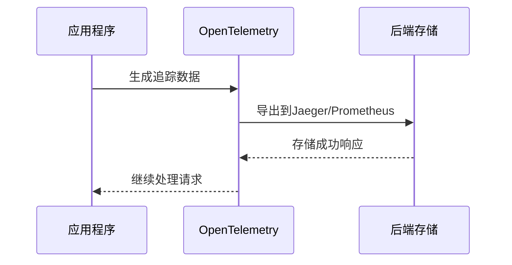

## 介绍

OpenTelemetry是一个开源的观测性框架，用于生成、收集和管理遥测数据（如追踪、指标和日志）。**自动检测（Auto-Instrumentation）**是OpenTelemetry的一项强大功能，它允许开发者无需手动修改代码即可为应用程序添加观测性。本指南将详细介绍如何配置OpenTelemetry的自动检测功能，适合初学者快速上手。

:::note
自动检测通过动态注入代码（如Java的字节码操作或JavaScript的运行时包装）来实现观测性，适用于大多数流行语言和框架。
:::

## 为什么需要自动检测？

手动为每个函数或服务添加追踪代码既繁琐又容易出错。自动检测可以：
- **减少代码侵入性**：无需修改业务逻辑。
- **快速启用观测性**：尤其适合遗留系统或第三方库。
- **标准化数据格式**：自动生成符合OpenTelemetry规范的遥测数据。

## 配置步骤

### 1. 选择语言和工具
OpenTelemetry支持多种语言（Java、Python、Node.js等）。以下以**Node.js**为例：

```bash
npm install @opentelemetry/api @opentelemetry/auto-instrumentations-node
```

### 2. 初始化自动检测
创建配置文件 `tracing.js`：

```javascript
const { NodeTracerProvider } = require('@opentelemetry/sdk-trace-node');
const { registerInstrumentations } = require('@opentelemetry/instrumentation');
const { HttpInstrumentation } = require('@opentelemetry/instrumentation-http');

const provider = new NodeTracerProvider();
provider.register();

// 启用HTTP请求的自动检测
registerInstrumentations({
  instrumentations: [new HttpInstrumentation()],
});
```

### 3. 运行应用程序
通过`--require`参数加载配置：

```bash
node --require ./tracing.js app.js
```

:::tip
对于Java应用，可以使用 `-javaagent:` 参数加载OpenTelemetry的Java代理JAR文件。
:::

## 实际案例

### 场景：监控Express应用
假设有一个Express服务，自动检测会：
1. 记录所有HTTP请求的耗时和状态码。
2. 追踪跨服务的调用链（如调用数据库或其他API）。

```javascript
const express = require('express');
const app = express();

app.get('/', (req, res) => {
  res.send('Hello World');
});

app.listen(3000);
```

**输出示例**（在Jaeger UI中看到的追踪数据）：
```json
{
  "traceId": "abc123",
  "name": "GET /",
  "duration": 45,
  "attributes": {
    "http.method": "GET",
    "http.status_code": 200
  }
}
```

## 高级配置

### 自定义采样率
通过 `Sampler` 控制哪些请求需要被记录：

```javascript
const { AlwaysOnSampler } = require('@opentelemetry/core');

const provider = new NodeTracerProvider({
  sampler: new AlwaysOnSampler() // 记录所有请求
});
```

### 添加资源属性
标识服务的运行环境：

```javascript
const { Resource } = require('@opentelemetry/resources');
const { SemanticResourceAttributes } = require('@opentelemetry/semantic-conventions');

const resource = new Resource({
  [SemanticResourceAttributes.SERVICE_NAME]: "my-express-app",
  [SemanticResourceAttributes.DEPLOYMENT_ENVIRONMENT]: "production"
});
```

## 可视化数据流



## 总结

OpenTelemetry的自动检测能显著降低观测性的实现门槛。通过本指南，你学会了：
1. 如何安装和配置自动检测。
2. 实际案例中的HTTP请求追踪。
3. 高级功能如采样和资源标记。

## 附加资源

- [OpenTelemetry官方文档](https://opentelemetry.io/docs/)
- 练习：尝试为你的Redis或MySQL调用添加自动检测。
- 调试技巧：使用 `OTEL_LOG_LEVEL=debug` 环境变量查看详细日志。