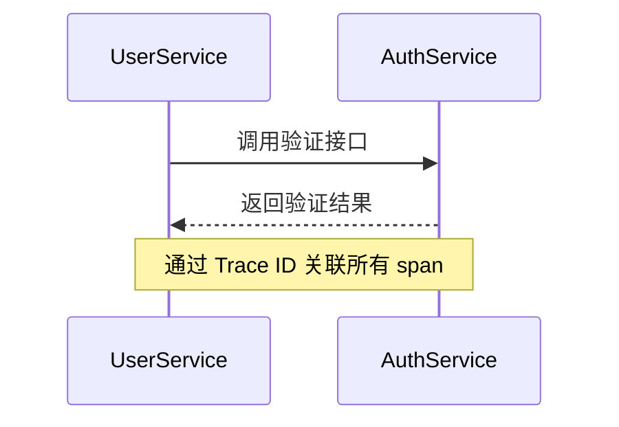

## 介绍

OpenTelemetry 是一个开源的观测性框架，用于生成、收集和管理遥测数据（如指标、日志和跟踪）。它支持多种编程语言，允许开发者在不同环境中实现统一的观测性。本文将介绍 OpenTelemetry 的语言实现核心概念，并通过示例展示其应用。

## 核心语言实现

OpenTelemetry 提供了多种语言的 SDK 和 API 实现，包括但不限于：
- **Java**
- **Python**
- **JavaScript/Node.js**
- **Go**
- **.NET**

:::note
所有语言实现均遵循统一的 [OpenTelemetry 规范](https://opentelemetry.io/docs/specs/)，确保跨语言兼容性。
:::

### 通用组件
无论使用哪种语言，OpenTelemetry 实现通常包含以下组件：
1. **API**：定义遥测数据的生成接口。
2. **SDK**：提供数据采集、处理和导出的具体实现。
3. **导出器（Exporters）**：将数据发送到后端（如 Jaeger、Prometheus）。

## 代码示例：Python 实现

以下是一个简单的 Python 示例，展示如何创建跟踪（trace）和指标（metric）：

```python
from opentelemetry import trace
from opentelemetry import metrics

# 初始化跟踪
tracer = trace.get_tracer("example.tracer")
with tracer.start_as_current_span("hello"):
    print("Hello, OpenTelemetry!")

# 初始化指标
meter = metrics.get_meter("example.meter")
counter = meter.create_counter("example.counter")
counter.add(1, {"environment": "dev"})
```

**输出**：
- 跟踪数据会生成一个名为 `hello` 的 span。
- 指标数据会记录一个值为 1 的计数器，并附带标签 `environment=dev`。

## 逐步讲解

### 1. 安装依赖
首先安装语言对应的 OpenTelemetry 包。以 Python 为例：
```bash
pip install opentelemetry-api opentelemetry-sdk
```

### 2. 配置导出器
将数据导出到控制台（仅用于测试）：
```python
from opentelemetry.sdk.trace.export import ConsoleSpanExporter
from opentelemetry.sdk.trace import TracerProvider
from opentelemetry.sdk.trace.export import BatchSpanProcessor

provider = TracerProvider()
processor = BatchSpanProcessor(ConsoleSpanExporter())
provider.add_span_processor(processor)
trace.set_tracer_provider(provider)
```

### 3. 集成实际后端
替换 `ConsoleSpanExporter` 为 Jaeger 或 Prometheus 导出器即可。

## 实际案例：微服务跟踪

假设有一个用户注册微服务，以下是跨服务跟踪的实现逻辑：



:::tip
在微服务架构中，确保所有服务使用相同的 Trace ID 上下文传递协议（如 W3C TraceContext）。
:::

## 总结

OpenTelemetry 的语言实现为开发者提供了灵活的观测性工具。关键点包括：
- 多语言支持，统一规范。
- 组件化设计（API、SDK、导出器）。
- 易于集成到现有系统中。

## 延伸资源
1. [官方文档](https://opentelemetry.io/docs/)
2. 练习：尝试在本地运行 Python 示例并导出数据到 Jaeger。
3. 社区：加入 [CNCF Slack](https://cloud-native.slack.com/) 的 `#opentelemetry` 频道。