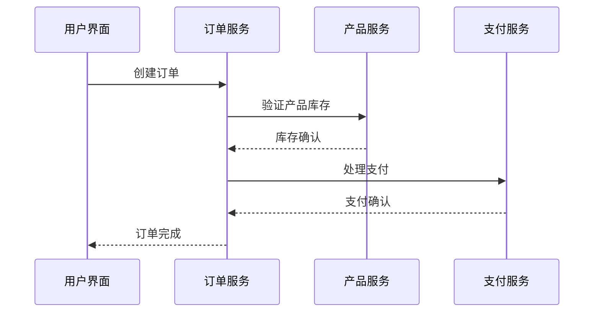

# OpenTelemetry Java实现

## 介绍

OpenTelemetry是一个开源的观测性框架，用于生成、收集和管理遥测数据（如追踪、指标和日志）。Java实现是OpenTelemetry生态系统中的重要组成部分，它允许Java开发者轻松集成分布式追踪和指标收集功能到应用程序中。

在本指南中，我们将从基础概念开始，逐步介绍如何在Java应用中使用OpenTelemetry，包括SDK的配置、创建追踪和指标，以及如何将数据导出到后端系统。

## 核心概念

### 1. 主要组件

OpenTelemetry Java SDK包含以下核心组件：

- **TracerProvider**：创建`Tracer`实例的工厂
- **Tracer**：用于创建Span（追踪的基本单位）
- **MeterProvider**：创建`Meter`实例的工厂
- **Meter**：用于创建指标
- **Context Propagation**：跨服务传播追踪上下文
- **Exporters**：将遥测数据发送到后端系统

### 2. 依赖配置

首先，添加必要的Maven依赖：

```xml
<dependency>
  <groupId>io.opentelemetry</groupId>
  <artifactId>opentelemetry-api</artifactId>
  <version>1.30.1</version>
</dependency>
<dependency>
  <groupId>io.opentelemetry</groupId>
  <artifactId>opentelemetry-sdk</artifactId>
  <version>1.30.1</version>
</dependency>
<dependency>
  <groupId>io.opentelemetry</groupId>
  <artifactId>opentelemetry-exporter-logging</artifactId>
  <version>1.30.1</version>
</dependency>
```

## 基础使用

### 1. 初始化OpenTelemetry

```java
import io.opentelemetry.api.OpenTelemetry;
import io.opentelemetry.api.trace.Tracer;
import io.opentelemetry.sdk.OpenTelemetrySdk;

public class OtelExample {
  public static void main(String[] args) {
    // 初始化OpenTelemetry SDK
    OpenTelemetry openTelemetry = OpenTelemetrySdk.builder()
        .buildAndRegisterGlobal();
    
    // 获取Tracer实例
    Tracer tracer = openTelemetry.getTracer("com.example", "1.0.0");
  }
}
```

### 2. 创建Span

```java
// 创建一个简单的Span
Span span = tracer.spanBuilder("my-operation").startSpan();
try (Scope scope = span.makeCurrent()) {
    // 业务逻辑代码
    System.out.println("Doing some work...");
} finally {
    span.end();
}
```

### 3. 添加Span属性

```java
Span span = tracer.spanBuilder("database-query")
    .setAttribute("db.system", "mysql")
    .setAttribute("db.user", "admin")
    .startSpan();
```

## 实际案例：HTTP服务追踪

让我们看一个更实际的例子，追踪一个简单的HTTP服务：

```java
import io.opentelemetry.api.trace.Span;
import io.opentelemetry.api.trace.Tracer;
import io.opentelemetry.context.Scope;

public class HttpService {
  private final Tracer tracer;
  
  public HttpService(Tracer tracer) {
    this.tracer = tracer;
  }
  
  public String handleRequest(String requestId) {
    // 创建Span表示请求处理
    Span span = tracer.spanBuilder("handle-request")
        .setAttribute("request.id", requestId)
        .startSpan();
    
    try (Scope scope = span.makeCurrent()) {
      // 模拟业务处理
      Thread.sleep(100);
      
      // 记录事件
      span.addEvent("Processing completed");
      
      return "Processed: " + requestId;
    } catch (InterruptedException e) {
      // 记录错误
      span.recordException(e);
      span.setStatus(StatusCode.ERROR);
      return "Error";
    } finally {
      span.end();
    }
  }
}
```

## 指标收集

OpenTelemetry Java SDK也支持指标收集：

```java
import io.opentelemetry.api.metrics.Meter;

// 获取Meter实例
Meter meter = openTelemetry.getMeter("com.example.metrics");

// 创建计数器
LongCounter requestCounter = meter
    .counterBuilder("requests.count")
    .setDescription("Total number of requests")
    .setUnit("1")
    .build();

// 记录指标
requestCounter.add(1, Attributes.of(
    AttributeKey.stringKey("method"), "GET",
    AttributeKey.stringKey("status"), "200"
));
```

## 上下文传播

分布式追踪的关键是上下文传播。OpenTelemetry自动处理W3C Trace Context标准的传播：

```java
// 提取上下文（例如从HTTP头）
Context extractedContext = openTelemetry.getPropagators().getTextMapPropagator()
    .extract(Context.current(), carrier, getter);

// 在提取的上下文中创建Span
try (Scope scope = extractedContext.makeCurrent()) {
    Span span = tracer.spanBuilder("child-span").startSpan();
    // ...
    span.end();
}
```

## 导出数据

配置日志导出器（用于开发环境）：

```java
SdkTracerProvider tracerProvider = SdkTracerProvider.builder()
    .addSpanProcessor(SimpleSpanProcessor.create(LoggingSpanExporter.create()))
    .build();

OpenTelemetrySdk openTelemetry = OpenTelemetrySdk.builder()
    .setTracerProvider(tracerProvider)
    .buildAndRegisterGlobal();
```

## 实际应用场景

假设你有一个微服务架构的电商系统，包含以下服务：

1. 用户服务
2. 产品服务
3. 订单服务
4. 支付服务

使用OpenTelemetry Java SDK，你可以：

1. 追踪一个订单从创建到完成的完整流程
2. 测量每个服务的响应时间
3. 识别跨服务调用的性能瓶颈
4. 监控错误率和服务健康状态



## 总结

OpenTelemetry Java实现为Java应用提供了强大的观测能力：

- 易于集成到现有Java应用中
- 支持分布式追踪和指标收集
- 遵循开放标准，兼容多种后端系统
- 提供灵活的配置选项

## 附加资源

1. [OpenTelemetry Java官方文档](https://opentelemetry.io/docs/instrumentation/java/)
2. [OpenTelemetry Java GitHub仓库](https://github.com/open-telemetry/opentelemetry-java)
3. [Jaeger - 分布式追踪系统](https://www.jaegertracing.io/)
4. [Prometheus - 指标监控系统](https://prometheus.io/)

## 练习

1. 创建一个简单的Spring Boot应用并集成OpenTelemetry
2. 实现一个跨两个服务的追踪示例
3. 添加自定义指标来监控应用的关键业务指标
4. 配置将遥测数据导出到Jaeger或Zipkin

:::tip
在开发环境中，可以先使用`LoggingSpanExporter`来验证你的配置是否正确，然后再切换到生产环境的导出器。
:::

:::caution
在生产环境中，确保配置适当的采样率，以避免生成过多的遥测数据影响系统性能。
:::