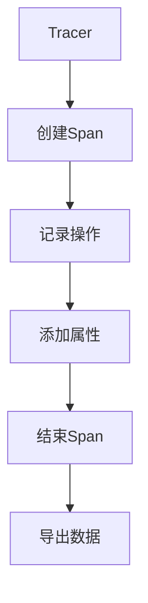

# OpenTelemetry Swift实现

## 介绍

OpenTelemetry是一个开源的观测性框架，用于生成、收集和管理遥测数据（如追踪、指标和日志）。Swift实现允许iOS/macOS开发者将OpenTelemetry集成到应用中，帮助监控应用性能和行为。

:::note
OpenTelemetry Swift目前处于活跃开发阶段，部分功能可能尚未稳定。
:::

## 核心概念

### 1. 主要组件

OpenTelemetry Swift包含以下核心组件：

- **TracerProvider**: 创建和管理`Tracer`实例
- **Tracer**: 生成Span（追踪的基本单元）
- **Span**: 代表操作或工作单元
- **Exporter**: 将遥测数据发送到后端系统

### 2. 数据模型



## 安装与设置

### 1. 添加依赖

在`Package.swift`中添加依赖：

```swift
dependencies: [
    .package(url: "https://github.com/open-telemetry/opentelemetry-swift", from: "1.0.0")
]
```

### 2. 基本配置

```swift
import OpenTelemetryApi
import OpenTelemetrySdk

// 1. 创建导出器
let exporter = StdoutExporter()

// 2. 配置Provider
let provider = TracerProviderBuilder()
    .add(spanProcessor: SimpleSpanProcessor(spanExporter: exporter))
    .build()

// 3. 设置为全局Provider
OpenTelemetry.registerTracerProvider(tracerProvider: provider)
```

## 代码示例

### 1. 创建简单Span

```swift
let tracer = OpenTelemetry.instance.tracerProvider.get(instrumentationName: "example-app")

// 开始一个Span
let span = tracer.spanBuilder(operationName: "network-request").startSpan()

// 添加属性
span.setAttribute(key: "http.method", value: "GET")
span.setAttribute(key: "http.url", value: "https://api.example.com")

// 业务逻辑...

// 结束Span
span.end()
```

### 2. 嵌套Span示例

```swift
func fetchUserData() {
    let parentSpan = tracer.spanBuilder(operationName: "fetch-user-data").startSpan()
    
    defer {
        parentSpan.end()
    }
    
    // 子Span1: 网络请求
    let networkSpan = tracer.spanBuilder(operationName: "api-request")
        .setParent(parentSpan)
        .startSpan()
    
    // 模拟网络请求
    Thread.sleep(forTimeInterval: 0.1)
    networkSpan.end()
    
    // 子Span2: 数据处理
    let processSpan = tracer.spanBuilder(operationName: "data-processing")
        .setParent(parentSpan)
        .startSpan()
    
    // 模拟数据处理
    Thread.sleep(forTimeInterval: 0.05)
    processSpan.end()
}
```

## 实际应用场景

### 1. 网络请求监控

```swift
class NetworkManager {
    private let tracer = OpenTelemetry.instance.tracerProvider.get(instrumentationName: "network-manager")
    
    func makeRequest(url: URL, completion: @escaping (Data?, Error?) -> Void) {
        let span = tracer.spanBuilder(operationName: "network-request")
            .setAttribute(key: "http.url", value: url.absoluteString)
            .startSpan()
        
        URLSession.shared.dataTask(with: url) { data, response, error in
            if let httpResponse = response as? HTTPURLResponse {
                span.setAttribute(key: "http.status_code", value: httpResponse.statusCode)
            }
            
            if let error = error {
                span.setStatus(.error(description: error.localizedDescription))
            }
            
            span.end()
            completion(data, error)
        }.resume()
    }
}
```

### 2. 性能分析

```swift
func expensiveOperation() {
    let span = tracer.spanBuilder(operationName: "expensive-operation").startSpan()
    defer { span.end() }
    
    // 记录开始时间
    let startTime = Date()
    
    // 执行耗时操作
    // ...
    
    // 记录持续时间
    let duration = Date().timeIntervalSince(startTime)
    span.setAttribute(key: "duration_ms", value: duration * 1000)
}
```

## 高级主题

### 1. 上下文传播

```swift
// 提取上下文
let carrier = ["traceparent": "00-4bf92f3577b34da6a3ce929d0e0e4736-00f067aa0ba902b7-01"]
let context = OpenTelemetry.instance.propagators.textMapPropagator.extract(
    carrier: carrier,
    getter: DictionaryGetter()
)

// 使用提取的上下文创建Span
let span = tracer.spanBuilder(operationName: "child-operation")
    .setParent(context)
    .startSpan()
```

### 2. 自定义导出器

```swift
class CustomExporter: SpanExporter {
    func export(spans: [SpanData]) -> SpanExporterResultCode {
        spans.forEach { span in
            print("Exporting span: $span.name)")
            // 自定义导出逻辑...
        }
        return .success
    }
    
    func shutdown() { /* 清理资源 */ }
    func forceFlush() -> SpanExporterResultCode { return .success }
}
```

## 总结

OpenTelemetry Swift实现为iOS/macOS应用提供了强大的观测能力：

1. 通过Span追踪应用中的操作流程
2. 使用属性记录操作的详细信息
3. 支持上下文传播实现分布式追踪
4. 可扩展的导出器架构

:::tip 最佳实践
- 为关键操作创建Span
- 记录有意义的属性（如HTTP状态码、操作结果）
- 保持Span的合理粒度（通常100ms-5s）
:::

## 进一步学习

1. [OpenTelemetry Swift官方文档](https://github.com/open-telemetry/opentelemetry-swift)
2. [OpenTelemetry概念指南](https://opentelemetry.io/docs/concepts/)
3. [使用Jaeger可视化追踪数据](https://www.jaegertracing.io/)

### 练习建议

1. 在现有应用中添加OpenTelemetry
2. 实现一个自定义导出器将数据发送到本地文件
3. 尝试测量关键功能的执行时间并可视化