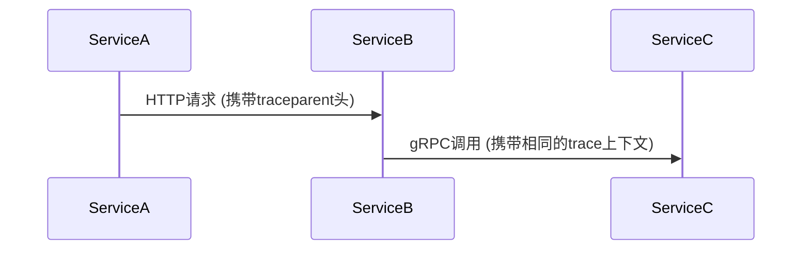

# OpenTelemetry C++实现

## 介绍

OpenTelemetry是一个开源的观测性框架，用于生成、收集和管理遥测数据（如追踪、指标和日志）。C++实现提供了高性能的API，适用于需要低延迟的系统。本文将介绍如何在C++项目中集成OpenTelemetry。

:::note
OpenTelemetry C++ SDK目前支持追踪(Tracing)和指标(Metrics)，日志(Logs)功能仍在开发中。
:::

## 安装与设置

首先，安装OpenTelemetry C++ SDK的依赖项：

```bash
# 使用vcpkg安装（推荐）
vcpkg install opentelemetry-cpp
```

## 基础追踪示例

以下是一个简单的追踪示例，展示如何创建Span：

```cpp
#include <opentelemetry/trace/provider.h>
#include <opentelemetry/exporters/ostream/span_exporter.h>
#include <opentelemetry/sdk/trace/simple_processor.h>
#include <opentelemetry/sdk/trace/tracer_provider.h>

namespace trace_api = opentelemetry::trace;
namespace trace_sdk = opentelemetry::sdk::trace;

void InitTracer() {
  auto exporter = std::unique_ptr<trace_sdk::SpanExporter>(
      new opentelemetry::exporter::trace::OStreamSpanExporter);
  auto processor = std::unique_ptr<trace_sdk::SpanProcessor>(
      new trace_sdk::SimpleSpanProcessor(std::move(exporter)));
  auto provider = nostd::shared_ptr<trace_api::TracerProvider>(
      new trace_sdk::TracerProvider(std::move(processor)));
  trace_api::Provider::SetTracerProvider(provider);
}

int main() {
  InitTracer();
  auto tracer = trace_api::Provider::GetTracerProvider()->GetTracer("demo");
  auto span = tracer->StartSpan("MySpan");
  // ... 业务逻辑
  span->End();
  return 0;
}
```

输出示例：
```
{
  "name": "MySpan",
  "trace_id": "7b9d...",
  "span_id": "5678...",
  "start_time": "2023-01-01T00:00:00Z",
  "end_time": "2023-01-01T00:00:01Z"
}
```

## 关键概念

### 1. Tracer Provider
管理Tracer实例的创建和配置。

### 2. Span
表示一个工作单元，具有：
- 开始/结束时间
- 状态码
- 属性（键值对）
- 事件（带时间戳的日志）

### 3. Context Propagation
跨服务传递追踪上下文：



## 实际案例：Web服务追踪

假设我们有一个HTTP服务，需要追踪请求处理过程：

```cpp
#include <opentelemetry/trace/propagation/http_trace_context.h>

void HandleRequest(const HttpRequest& req, HttpResponse& res) {
  auto tracer = trace_api::Provider::GetTracerProvider()->GetTracer("web");
  
  // 从HTTP头提取上下文
  auto ctx = opentelemetry::trace::propagation::Extract(
      req.headers, [](const std::string& key) { return req.GetHeader(key); });
  
  auto span = tracer->StartSpan("HandleRequest", {ctx});
  
  // 添加属性
  span->SetAttribute("http.method", req.method);
  span->SetAttribute("http.path", req.path);
  
  try {
    ProcessRequest(req, res);  // 业务逻辑
    span->SetStatus(trace_api::StatusCode::kOk);
  } catch (...) {
    span->SetStatus(trace_api::StatusCode::kError);
    throw;
  }
  
  span->End();
}
```

## 指标收集

OpenTelemetry C++也支持指标收集：

```cpp
#include <opentelemetry/metrics/provider.h>

void InitMeter() {
  auto provider = std::make_shared<metrics_sdk::MeterProvider>();
  metrics_api::Provider::SetMeterProvider(provider);
}

void RecordMetrics() {
  auto meter = metrics_api::Provider::GetMeterProvider()->GetMeter("app");
  auto counter = meter->CreateIntCounter("requests.count");
  counter->Add(1, {{"route", "/home"}});
}
```

## 总结

通过OpenTelemetry C++ SDK，你可以：
1. 自动生成分布式追踪数据
2. 收集应用指标
3. 通过上下文传播实现端到端追踪

:::tip 最佳实践
- 为关键操作创建有意义的Span名称
- 合理设置Span的属性和状态
- 在微服务环境中确保上下文正确传播
:::

## 延伸学习

1. [OpenTelemetry官方文档](https://opentelemetry.io/docs/cpp/)
2. 练习：尝试将OpenTelemetry集成到一个简单的gRPC服务中
3. 进阶：探索自定义的Span导出器（如导出到Jaeger）