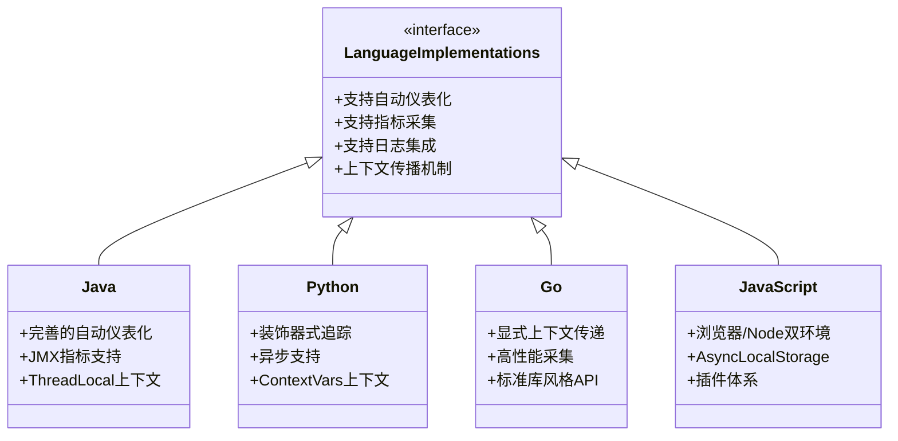

# OpenTelemetry 语言实现比较

## 介绍

OpenTelemetry是一个开源的观测性框架，用于生成、收集和管理遥测数据（如指标、日志和追踪）。它支持多种编程语言，但不同语言的实现细节和功能支持可能存在差异。本文将比较主流语言（如Java、Python、Go、JavaScript）的实现特点，帮助初学者快速入门。

:::note
OpenTelemetry的核心组件：
- **Tracing**：记录请求在分布式系统中的流转路径
- **Metrics**：采集系统性能指标（如CPU、内存）
- **Logs**：结构化日志记录（部分语言仍在开发中）
:::

## 语言实现对比

### 1. Java实现
**特点**：
- 最成熟的实现之一，支持完整的OTel规范
- 自动仪表化（Auto-instrumentation）功能强大
- 依赖管理通过Maven/Gradle

**示例代码**：
```java
// 初始化Tracer
OpenTelemetry openTelemetry = OpenTelemetrySdk.builder()
    .setTracerProvider(
        SdkTracerProvider.builder()
            .addSpanProcessor(BatchSpanProcessor.builder(
                OtlpGrpcSpanExporter.builder().build()).build())
            .build())
    .build();

Tracer tracer = openTelemetry.getTracer("com.example");
Span span = tracer.spanBuilder("mySpan").startSpan();
try (Scope scope = span.makeCurrent()) {
    // 业务代码
} finally {
    span.end();
}
```

**适用场景**：
- 企业级后端服务
- Spring Boot应用
- 需要细粒度控制的场景

### 2. Python实现
**特点**：
- 动态语言特性使集成更灵活
- 支持异步追踪（asyncio）
- 依赖自动注入（通过`opentelemetry-instrument`）

**示例代码**：
```python
from opentelemetry import trace
from opentelemetry.sdk.trace import TracerProvider
from opentelemetry.sdk.trace.export import BatchSpanProcessor

provider = TracerProvider()
processor = BatchSpanProcessor(ConsoleSpanExporter())
provider.add_span_processor(processor)
trace.set_tracer_provider(provider)

tracer = trace.get_tracer(__name__)
with tracer.start_as_current_span("python-span"):
    print("Hello OpenTelemetry!")
```

**适用场景**：
- 数据科学/机器学习管道
- 快速原型开发
- 脚本监控

### 3. Go实现
**特点**：
- 高性能，低开销
- 显式上下文传播设计
- 标准库风格API

**示例代码**：
```go
import (
    "go.opentelemetry.io/otel"
    "go.opentelemetry.io/otel/exporters/otlp/otlptrace"
)

func initTracer() {
    exporter, _ := otlptrace.New(context.Background(), otlptrace.WithInsecure())
    tp := sdktrace.NewTracerProvider(
        sdktrace.WithBatcher(exporter),
    )
    otel.SetTracerProvider(tp)
}

func main() {
    tracer := otel.Tracer("go-app")
    ctx, span := tracer.Start(context.Background(), "go-span")
    defer span.End()
    // 业务逻辑
}
```

**适用场景**：
- 云原生微服务
- 高性能网络服务
- 需要精细内存控制的场景

### 4. JavaScript/Node.js实现
**特点**：
- 支持浏览器和Node.js环境
- 自动上下文传播（AsyncLocalStorage）
- 插件式架构

**示例代码**：
```javascript
const { NodeTracerProvider } = require('@opentelemetry/sdk-trace-node');
const { SimpleSpanProcessor } = require('@opentelemetry/sdk-trace-base');
const { OTLPTraceExporter } = require('@opentelemetry/exporter-trace-otlp-grpc');

const provider = new NodeTracerProvider();
provider.addSpanProcessor(new SimpleSpanProcessor(new OTLPTraceExporter()));
provider.register();

const tracer = trace.getTracer('js-app');
tracer.startActiveSpan('js-span', span => {
    console.log('Tracing in JavaScript');
    span.end();
});
```

**适用场景**：
- 全栈应用监控
- Serverless函数
- 前端性能追踪

## 实现特性对比表



## 实际案例

**电商系统监控示例**：
1. **Java**：监控订单服务（Spring Boot）
2. **Python**：跟踪推荐算法执行
3. **Go**：支付网关性能分析
4. **JavaScript**：前端页面加载追踪

:::tip 选型建议
- 已有技术栈优先选择对应语言实现
- 需要最高性能 → Go
- 需要快速集成 → Python/JavaScript
- 企业级复杂系统 → Java
:::

## 总结

不同语言的OpenTelemetry实现各有侧重，但都遵循统一的数据模型和协议标准。初学者应根据：

1. 项目技术栈选择对应实现
2. 性能需求考虑运行时开销
3. 团队熟悉程度决定开发效率

## 扩展资源

1. [官方文档](https://opentelemetry.io/docs/)
2. 练习：在本地运行不同语言的"Hello World"追踪示例
3. 进阶：比较OTLP与Jaeger/Zipkin导出器的性能差异