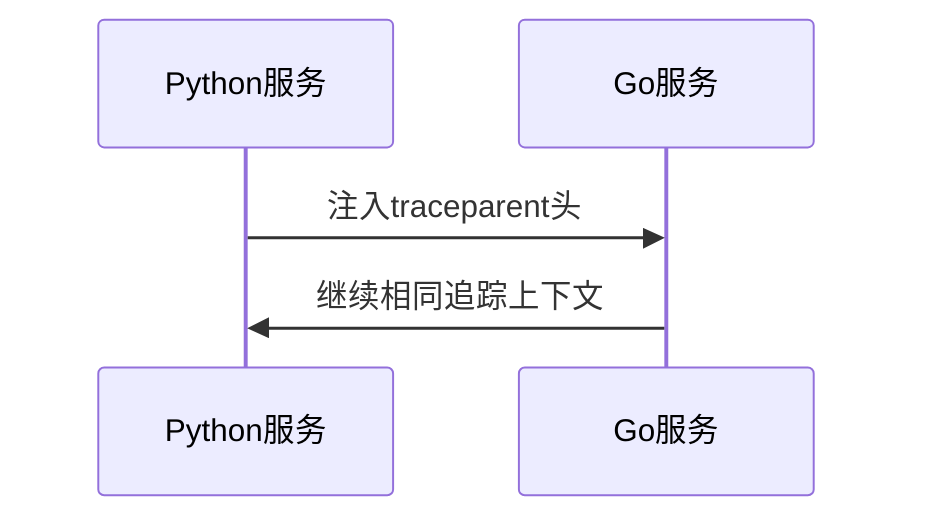
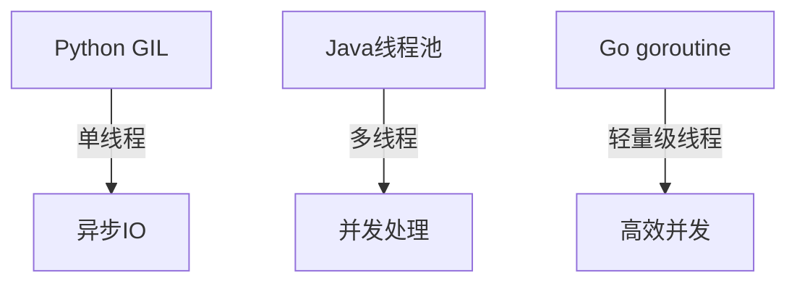

# OpenTelemetry 语言互操作性

## 介绍

OpenTelemetry（简称OTel）是一个**跨语言**的观测性框架，其核心设计目标之一是实现不同编程语言生成的遥测数据（如追踪、指标、日志）的互操作性。这意味着：

- 用Python编写的服务可以与Go服务交换追踪上下文
- Java应用的指标数据能够与Node.js应用的数据关联
- 统一的协议和标准确保数据在传输过程中不会丢失关键信息

## 互操作性基础

### 1. 上下文传播（Context Propagation）

跨语言互操作性的核心是**W3C TraceContext**标准。所有OpenTelemetry语言实现都遵循该标准处理以下内容：



### 2. 协议统一性

所有语言实现共享：
- 相同的OTLP（OpenTelemetry Protocol）传输协议
- 通用的语义约定（Semantic Conventions）
- 兼容的导出器（Exporters）格式

## 代码示例

### 跨语言追踪示例

**Python服务（发送端）**:
```python
from opentelemetry import trace
from opentelemetry.propagate import inject

# 创建span
tracer = trace.get_tracer(__name__)
with tracer.start_as_current_span("python_span") as span:
    headers = {}
    inject(headers)  # 注入上下文到headers字典
    # 通过HTTP请求将headers传递给Go服务
```

**Go服务（接收端）**:
```go
import (
    "go.opentelemetry.io/otel"
    "go.opentelemetry.io/otel/propagation"
)

func handler(w http.ResponseWriter, r *http.Request) {
    // 提取上下文
    ctx := otel.GetTextMapPropagator().Extract(r.Context(), propagation.HeaderCarrier(r.Header))
    _, span := otel.Tracer("go-service").Start(ctx, "go_span")
    defer span.End()
    // 处理请求...
}
```

## 实际应用场景

### 微服务架构中的互操作性

假设有一个电商系统：
1. **前端**（JavaScript）：发起请求时创建初始追踪
2. **API网关**（Java）：处理身份验证并转发请求
3. **订单服务**（Go）：处理业务逻辑
4. **支付服务**（Python）：调用第三方支付接口

:::tip 关键优势
所有服务共享相同的`trace_id`，即使语言不同也能在可视化工具（如Jaeger）中看到完整的调用链
:::

## 常见挑战与解决方案

### 1. 数据类型差异

不同语言对数据类型的处理可能不同：

| 语言      | 整数大小 | 默认字符串编码 |
|-----------|----------|----------------|
| Python    | 动态     | UTF-8          |
| Go        | 明确指定 | UTF-8          |
| Java      | 固定     | 平台依赖       |

**解决方案**：OTel规范明确定义了所有数据类型的传输格式

### 2. 线程模型差异



**解决方案**：各语言SDK根据自身特性实现上下文传播机制

## 总结

OpenTelemetry通过以下方式实现语言互操作性：
1. 采用W3C标准上下文传播格式
2. 定义统一的OTLP协议
3. 提供各语言一致的API设计
4. 强制实施语义约定

## 延伸学习

- 实践练习：尝试用两种不同语言实现服务并查看Jaeger中的完整追踪
- 官方文档：[W3C TraceContext规范](https://www.w3.org/TR/trace-context/)
- 深入阅读：OpenTelemetry跨语言设计白皮书

:::note 进阶思考
如何设计一个测试方案来验证不同语言实现之间的兼容性？
:::