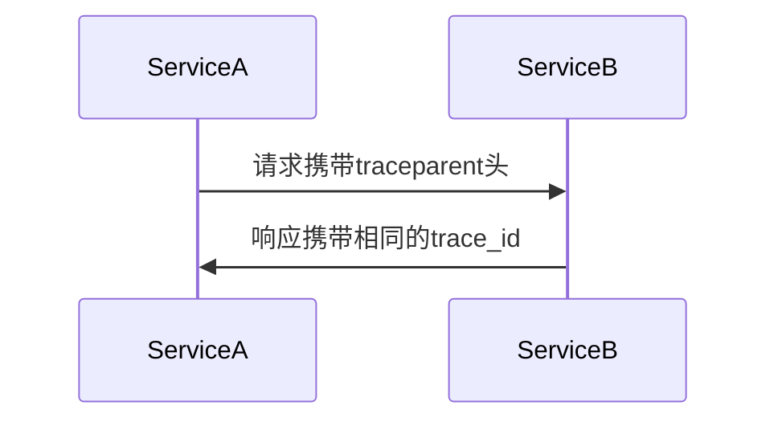

# OpenTelemetry Python实现

## 介绍

OpenTelemetry是一个开源的观测性框架，用于生成、收集和管理遥测数据（如指标、日志和追踪）。Python作为流行的编程语言之一，提供了完整的OpenTelemetry实现库。本指南将帮助你快速上手OpenTelemetry的Python实现，从基础概念到实际应用。

:::note
OpenTelemetry的核心组件：
- **Tracing**：记录请求在分布式系统中的流转路径
- **Metrics**：收集系统运行时的数值指标
- **Logging**：结构化日志记录（正在开发中）
:::

## 安装与设置

首先安装必要的Python包：

```bash
pip install opentelemetry-api opentelemetry-sdk opentelemetry-instrumentation
```

## 基础追踪示例

以下是一个最简单的追踪示例：

```python
from opentelemetry import trace
from opentelemetry.sdk.trace import TracerProvider
from opentelemetry.sdk.trace.export import ConsoleSpanExporter, SimpleSpanProcessor

# 设置追踪提供者
trace.set_tracer_provider(TracerProvider())
tracer = trace.get_tracer(__name__)

# 添加控制台输出
trace.get_tracer_provider().add_span_processor(
    SimpleSpanProcessor(ConsoleSpanExporter())
)

# 创建span
with tracer.start_as_current_span("parent_span"):
    with tracer.start_as_current_span("child_span"):
        print("正在执行操作...")
```

运行后将在控制台看到类似输出：
```
{
    "name": "child_span",
    "context": {...},
    "parent_span_id": "...",
    "start_time": "...",
    "end_time": "..."
}
```

## 关键概念详解

### 1. TracerProvider

追踪系统的入口点，负责创建`Tracer`实例：

```python
from opentelemetry.sdk.trace import TracerProvider

provider = TracerProvider()
trace.set_tracer_provider(provider)
```

### 2. Span

代表工作单元，包含：
- 开始/结束时间
- 状态码
- 属性（键值对）
- 事件（带时间戳的日志）

```python
with tracer.start_as_current_span("operation") as span:
    span.set_attribute("http.method", "GET")
    span.add_event("开始处理请求")
```

### 3. 上下文传播

分布式追踪的关键机制：



## 实际应用案例

### 监控Flask应用

```python
from flask import Flask
from opentelemetry.instrumentation.flask import FlaskInstrumentor

app = Flask(__name__)
FlaskInstrumentor().instrument_app(app)

@app.route("/")
def hello():
    return "Hello, OpenTelemetry!"

if __name__ == "__main__":
    app.run()
```

### 集成Prometheus指标

```python
from opentelemetry import metrics
from opentelemetry.exporter.prometheus import PrometheusMetricReader
from opentelemetry.sdk.metrics import MeterProvider

reader = PrometheusMetricReader()
metrics.set_meter_provider(MeterProvider(metric_readers=[reader]))

meter = metrics.get_meter(__name__)
requests_counter = meter.create_counter(
    "http_requests",
    description="总请求数"
)

# 在请求处理中增加计数
requests_counter.add(1, {"route": "/home"})
```

## 最佳实践

1. **采样策略**：生产环境建议使用概率采样
   ```python
   from opentelemetry.sdk.trace.sampling import TraceIdRatioBased
   trace.set_tracer_provider(TracerProvider(
       sampler=TraceIdRatioBased(0.5)  # 50%采样率
   ))
   ```

2. **资源标识**：标记服务信息
   ```python
   from opentelemetry.sdk.resources import Resource
   resource = Resource.create({
       "service.name": "payment-service",
       "service.version": "1.0.0"
   })
   ```

3. **批量导出**：使用`BatchSpanProcessor`提高性能
   ```python
   from opentelemetry.sdk.trace.export import BatchSpanProcessor
   trace.get_tracer_provider().add_span_processor(
       BatchSpanProcessor(ConsoleSpanExporter())
   )
   ```

## 总结

通过本指南，你已学习到：
- OpenTelemetry Python SDK的基本用法
- 如何创建和配置追踪span
- 实际Web应用的集成方法
- 指标收集和导出配置

## 扩展学习

1. 官方文档：[OpenTelemetry Python](https://opentelemetry.io/docs/instrumentation/python/)
2. 尝试集成到Django或FastAPI项目
3. 配置Jaeger或Zipkin作为后端存储
4. 实验不同采样策略对性能的影响

:::tip 练习建议
1. 创建一个包含3个span的追踪链
2. 为Flask应用添加自定义属性
3. 配置Prometheus导出并可视化指标
:::