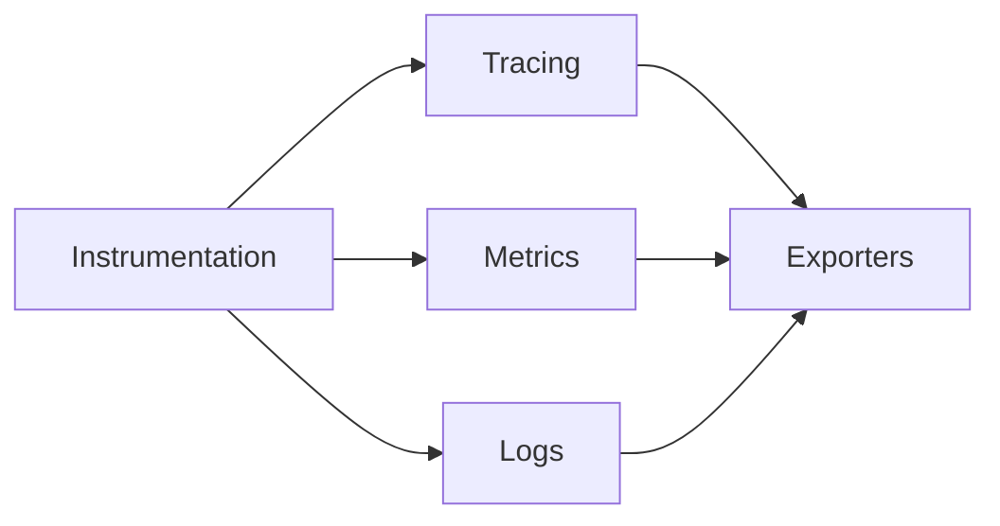

## 介绍

OpenTelemetry是一个开源的观测框架，用于生成、收集和管理遥测数据（如追踪、指标和日志）。它的JavaScript实现允许开发者在Node.js和浏览器环境中集成分布式追踪和指标收集功能。本文将介绍OpenTelemetry JavaScript的核心概念、安装配置方法以及实际应用场景。

:::note
OpenTelemetry是CNCF（云原生计算基金会）的项目，旨在提供统一的标准来观测分布式系统。
:::

## 核心概念

OpenTelemetry JavaScript实现包含以下核心组件：

1. **Tracing（追踪）**：记录请求在分布式系统中的流转路径。
2. **Metrics（指标）**：收集系统性能数据（如CPU使用率、请求延迟）。
3. **Logs（日志）**：结构化日志记录（当前处于实验阶段）。



## 安装与配置

### 1. 安装核心包

```bash
npm install @opentelemetry/api @opentelemetry/sdk-trace-base
```

### 2. 基础追踪示例

以下代码展示如何初始化一个简单的追踪器并创建span：

```javascript
const { trace } = require('@opentelemetry/api');
const { BasicTracerProvider, SimpleSpanProcessor } = require('@opentelemetry/sdk-trace-base');
const { ConsoleSpanExporter } = require('@opentelemetry/sdk-trace-base');

// 1. 创建Tracer Provider
const provider = new BasicTracerProvider();

// 2. 添加处理器（这里使用控制台导出器）
provider.addSpanProcessor(new SimpleSpanProcessor(new ConsoleSpanExporter()));

// 3. 注册Provider
trace.setGlobalTracerProvider(provider);

// 4. 获取Tracer实例
const tracer = trace.getTracer('example-tracer');

// 5. 创建Span
tracer.startActiveSpan('main', (span) => {
  console.log('Inside main span');
  
  // 模拟工作
  setTimeout(() => {
    span.end();
    console.log('Span ended');
  }, 1000);
});
```

输出示例：
```
{
  "traceId": "7b3b3b5b3b3b3b3b5b3b3b3b5b3b3b3b",
  "name": "main",
  "kind": 0,
  "timestamp": 1620000000000,
  "duration": 1000,
  "status": { "code": 0 }
}
```

## 实际应用场景

### 案例：Express.js集成

```javascript
const express = require('express');
const { NodeTracerProvider } = require('@opentelemetry/sdk-trace-node');
const { registerInstrumentations } = require('@opentelemetry/instrumentation');
const { ExpressInstrumentation } = require('@opentelemetry/instrumentation-express');

// 初始化Tracer Provider
const provider = new NodeTracerProvider();
provider.register();

// 自动注入Express instrumentation
registerInstrumentations({
  instrumentations: [new ExpressInstrumentation()]
});

const app = express();

app.get('/', (req, res) => {
  const activeSpan = trace.getActiveSpan();
  activeSpan.setAttribute('route', '/');
  res.send('Hello OpenTelemetry!');
});

app.listen(3000);
```

:::tip
使用`@opentelemetry/auto-instrumentations-node`可以一键式启用所有常用库的自动检测。
:::

## 高级主题

### 1. 自定义属性

```javascript
span.setAttribute('user.id', '12345');
span.setAttributes({
  'service.version': '1.0.0',
  'http.method': 'GET'
});
```

### 2. 上下文传播

```javascript
const { propagation } = require('@opentelemetry/api');
const { W3CTraceContextPropagator } = require('@opentelemetry/core');

// 设置传播方式
propagation.setGlobalPropagator(new W3CTraceContextPropagator());

// 注入上下文
const carrier = {};
propagation.inject(trace.setSpan(context.active(), span), carrier);
```

## 总结

OpenTelemetry JavaScript实现为Node.js和浏览器应用提供了强大的可观测性能力：

- 自动和手动检测代码
- 支持多种导出后端（Jaeger、Prometheus等）
- 符合W3C Trace Context标准
- 活跃的社区支持

## 扩展资源

1. [官方文档](https://opentelemetry.io/docs/instrumentation/js/)
2. [GitHub仓库](https://github.com/open-telemetry/opentelemetry-js)
3. 练习：尝试将追踪数据导出到Jaeger
4. 练习：为你的Koa/Fastify应用添加OpenTelemetry支持

:::caution
生产环境请确保使用异步导出器（如`BatchSpanProcessor`）而非示例中的`SimpleSpanProcessor`，以避免性能问题。
:::