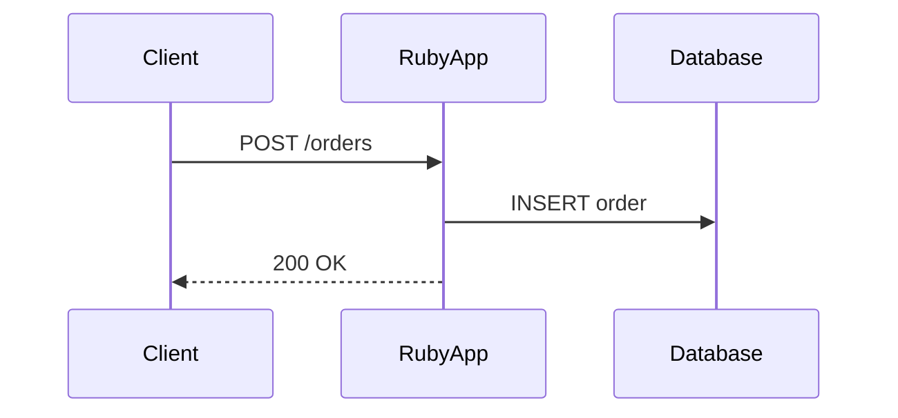

## 介绍

OpenTelemetry 是一个开源的观测性框架，用于生成、收集和管理遥测数据（如追踪、指标和日志）。Ruby 作为一门动态语言，通过 `opentelemetry-ruby` 库提供了对 OpenTelemetry 标准的原生支持。本文将介绍如何在 Ruby 应用中集成 OpenTelemetry，并通过实际示例展示其核心功能。

:::note
**关键概念**：  
- **Tracing（追踪）**：记录请求在分布式系统中的流转路径。  
- **Metrics（指标）**：量化系统性能（如请求速率、错误率）。  
- **Exporters（导出器）**：将数据发送到后端（如 Jaeger、Prometheus）。  
:::

---

## 安装与基础配置

### 1. 添加依赖
在 `Gemfile` 中引入必要的库：

```ruby
gem 'opentelemetry-sdk'
gem 'opentelemetry-exporter-otlp' # 导出到OTLP兼容的后端
gem 'opentelemetry-instrumentation-rails' # Rails专用（可选）
```

运行 `bundle install` 安装依赖。

### 2. 初始化SDK
创建一个初始化文件（如 `config/initializers/opentelemetry.rb`）：

```ruby
require 'opentelemetry/sdk'
require 'opentelemetry/exporter/otlp'

# 配置SDK
OpenTelemetry::SDK.configure do |c|
  c.service_name = 'my-ruby-app'
  c.use_all # 加载所有可用插件（如HTTP、Rails等）
end
```

---

## 核心功能示例

### 1. 手动创建Span
追踪一个方法的执行时间：

```ruby
tracer = OpenTelemetry.tracer_provider.tracer('my-tracer')

def process_order(order_id)
  tracer.in_span('process_order') do |span|
    span.set_attribute('order.id', order_id)
    # 业务逻辑...
    puts "Order #{order_id} processed"
  end
end

process_order(123)
```

**输出到Jaeger的效果**：  
- 一个名为 `process_order` 的Span，包含属性 `order.id=123`。

### 2. 记录指标
统计请求耗时：

```ruby
meter = OpenTelemetry.meter_provider.meter('my-meter')
request_duration = meter.create_histogram('http.request.duration', unit: 'ms')

# 在请求处理中记录
request_duration.record(150, attributes: { 'path' => '/orders' })
```

---

## 实际应用场景

### 案例：Rails应用集成
在 `config/application.rb` 中启用自动插装：

```ruby
config.middleware.use OpenTelemetry::Instrumentation::Rack::Middlewares::TracerMiddleware
```

**自动追踪的路由请求**：  
- 每个HTTP请求会自动生成Span，包含URL、状态码等信息。

:::tip
使用 `OpenTelemetry::Instrumentation` 下的库（如 `opentelemetry-instrumentation-redis`）可自动追踪Redis、PostgreSQL等依赖调用。
:::

---

## 数据可视化

以下是一个简单的追踪流程图：



---

## 总结

通过 OpenTelemetry Ruby SDK，你可以轻松实现：
1. **分布式追踪**：定位跨服务的性能瓶颈。  
2. **指标监控**：实时观测系统健康状态。  
3. **自动插装**：减少手动埋点工作量。

---

## 扩展资源

1. [官方Ruby SDK文档](https://opentelemetry.io/docs/ruby/)  
2. 练习：尝试将数据导出到本地Jaeger实例，并分析追踪结果。  
3. 高级话题：自定义Span处理器或采样策略。