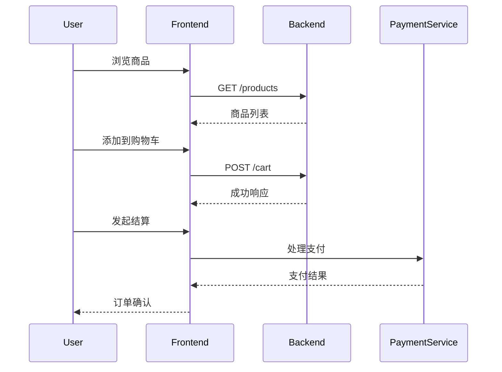

# OpenTelemetry PHP实现

## 介绍

OpenTelemetry是一个开源的观测性框架，用于生成、收集和管理遥测数据（如追踪、指标和日志）。PHP作为广泛使用的服务器端脚本语言，通过OpenTelemetry PHP SDK可以实现对应用程序性能的监控和问题诊断。本文将介绍如何在PHP应用中集成OpenTelemetry，并通过实际示例展示其用法。

## 安装与设置

首先，你需要通过Composer安装OpenTelemetry PHP SDK和相关扩展包：

```bash
composer require open-telemetry/opentelemetry
```

## 基本配置

以下是一个简单的配置示例，展示如何初始化OpenTelemetry的追踪功能：

```php
<?php
require 'vendor/autoload.php';

use OpenTelemetry\API\Trace\SpanKind;
use OpenTelemetry\SDK\Trace\TracerProviderFactory;

$tracerProvider = (new TracerProviderFactory())->create();
$tracer = $tracerProvider->getTracer('example-tracer');

// 创建一个根span
$rootSpan = $tracer->spanBuilder('root-span')->startSpan();
$rootSpan->activate();

try {
    // 业务逻辑代码
    $rootSpan->addEvent('Processing started');
    // ...
    $rootSpan->addEvent('Processing completed');
} finally {
    $rootSpan->end();
    $tracerProvider->shutdown();
}
```

## 追踪示例

下面的代码展示了如何创建嵌套的span来追踪更复杂的操作：

```php
$rootSpan = $tracer->spanBuilder('parent-operation')->startSpan();
$scope = $rootSpan->activate();

try {
    $childSpan = $tracer->spanBuilder('child-operation')
        ->setParent($rootSpan->getContext())
        ->startSpan();
    
    // 执行子操作
    usleep(100000); // 模拟耗时操作
    
    $childSpan->end();
} finally {
    $rootSpan->end();
    $scope->detach();
}
```

## 指标收集

OpenTelemetry也支持指标收集。以下示例展示如何记录一个简单的计数器指标：

```php
use OpenTelemetry\API\Metrics\MeterProvider;
use OpenTelemetry\SDK\Metrics\MeterProviderFactory;

$meterProvider = (new MeterProviderFactory())->create();
$meter = $meterProvider->getMeter('example-meter');

$counter = $meter->createCounter('requests.count');
$counter->add(1, ['endpoint' => '/home']);
```

## 实际应用场景

### 电子商务网站

在一个电子商务网站中，你可以使用OpenTelemetry追踪以下操作：
1. 用户浏览商品列表
2. 添加到购物车
3. 结算流程



## 总结

通过本文，你学会了：
- 如何安装和配置OpenTelemetry PHP SDK
- 创建基本的追踪span和嵌套span
- 收集和记录指标数据
- 在实际应用中的典型使用场景

## 附加资源

1. [OpenTelemetry PHP官方文档](https://opentelemetry.io/docs/instrumentation/php/)
2. [OpenTelemetry PHP GitHub仓库](https://github.com/open-telemetry/opentelemetry-php)
3. [分布式追踪概念指南](https://opentelemetry.io/docs/concepts/observability-primer/)

:::tip 练习
尝试在你现有的PHP项目中集成OpenTelemetry：
1. 追踪一个关键API端点
2. 记录该端点的请求次数指标
3. 将数据导出到Jaeger或Zipkin进行可视化
:::