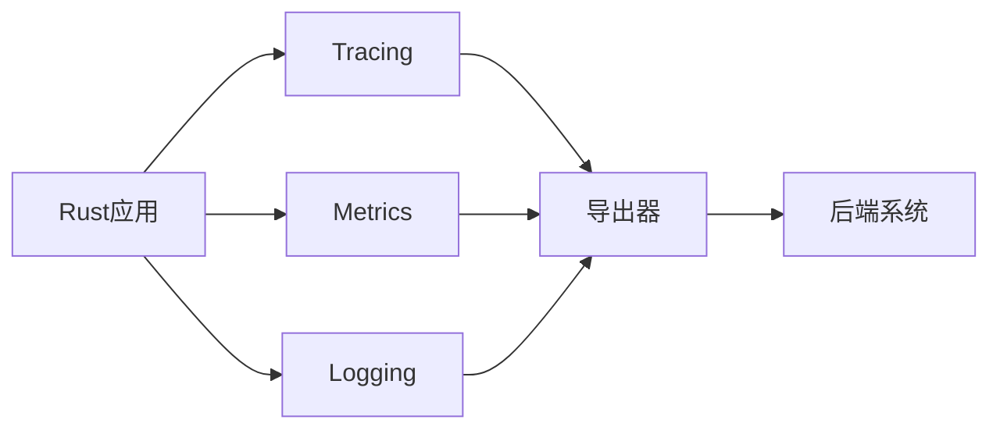

# OpenTelemetry Rust实现

OpenTelemetry是一个开源的观测性框架，用于生成、收集和管理遥测数据（如追踪、指标和日志）。Rust作为一门系统编程语言，因其性能和安全特性，在构建高可靠性观测工具方面表现出色。本文将介绍如何在Rust项目中集成OpenTelemetry。

## 基本概念

OpenTelemetry在Rust中的实现包含三个核心组件：

1. **Tracing** - 分布式请求追踪
2. **Metrics** - 系统指标收集
3. **Logging** - 结构化日志记录（通过桥接）



## 环境准备

首先在`Cargo.toml`中添加依赖：

```toml
[dependencies]
opentelemetry = { version = "0.18", features = ["rt-tokio"] }
opentelemetry-jaeger = "0.17"
tokio = { version = "1.0", features = ["full"] }
tracing = "0.1"
tracing-opentelemetry = "0.18"
tracing-subscriber = "0.3"
```

## 基础追踪示例

下面是一个简单的分布式追踪示例：

```rust
use opentelemetry::global;
use opentelemetry::trace::Tracer;
use opentelemetry::sdk::trace as sdktrace;

fn init_tracer() -> sdktrace::Tracer {
    global::set_text_map_propagator(opentelemetry_jaeger::Propagator::new());
    opentelemetry_jaeger::new_agent_pipeline()
        .with_service_name("rust-otel-demo")
        .install_simple()
        .unwrap()
}

#[tokio::main]
async fn main() {
    let tracer = init_tracer();
    
    // 创建一个span（追踪的基本单元）
    let mut span = tracer.start("main_operation");
    span.add_event("开始处理".to_string(), vec![]);
    
    // 模拟业务逻辑
    process_data().await;
    
    span.add_event("处理完成".to_string(), vec![]);
    span.end();
}

async fn process_data() {
    let tracer = global::tracer("process_tracer");
    let _span = tracer.start("data_processing");
    // 处理逻辑...
}
```

:::note
每个`span`代表一个操作单元，可以嵌套形成调用链。Jaeger等可视化工具会将这些span展示为时间线。
:::

## 指标收集

OpenTelemetry Rust也支持指标收集：

```rust
use opentelemetry::{global, sdk::metrics::MeterProvider};
use opentelemetry::metrics::Counter;

fn setup_metrics() -> Counter<u64> {
    let meter_provider = MeterProvider::default();
    global::set_meter_provider(meter_provider);
    
    let meter = global::meter("app_metrics");
    meter.u64_counter("requests.count")
        .with_description("总请求数")
        .init()
}

fn main() {
    let counter = setup_metrics();
    counter.add(1, &[KeyValue::new("endpoint", "/api")]);
}
```

## 实际应用场景

### 案例：Web服务监控

假设我们有一个Actix-web服务：

```rust
use actix_web::{get, App, HttpServer};
use opentelemetry::global;
use tracing_actix_web::TracingLogger;

#[get("/")]
async fn index() -> &'static str {
    let tracer = global::tracer("request_tracer");
    let _span = tracer.start("index_handler");
    "Hello OpenTelemetry!"
}

#[actix_web::main]
async fn main() -> std::io::Result<()> {
    init_tracer(); // 使用前面的初始化函数
    
    HttpServer::new(|| {
        App::new()
            .wrap(TracingLogger::default())
            .service(index)
    })
    .bind("127.0.0.1:8080")?
    .run()
    .await
}
```

:::tip
`tracing-actix-web`中间件会自动为每个请求创建span，并捕获响应时间和状态码等信息。
:::

## 高级配置

### 自定义导出目标

除了Jaeger，还可以导出到其他后端：

```rust
use opentelemetry_otlp::new_exporter;

let exporter = new_exporter()
    .tonic()
    .with_endpoint("http://collector:4317");
    
let tracer = opentelemetry_otlp::new_pipeline()
    .tracing()
    .with_exporter(exporter)
    .install_batch(opentelemetry::runtime::Tokio)
    .unwrap();
```

## 总结

通过OpenTelemetry Rust实现，你可以：

1. 轻松集成分布式追踪到Rust应用
2. 收集关键系统指标
3. 与现有日志系统桥接
4. 将数据导出到多种可视化工具

## 进一步学习

推荐资源：
- [OpenTelemetry Rust文档](https://docs.rs/opentelemetry/)
- [tracing项目文档](https://docs.rs/tracing/)
- [Jaeger官方文档](https://www.jaegertracing.io/)

练习建议：
1. 创建一个简单的HTTP服务，为每个端点添加自定义span
2. 尝试将指标数据导出到Prometheus
3. 实现一个自定义的日志导出器