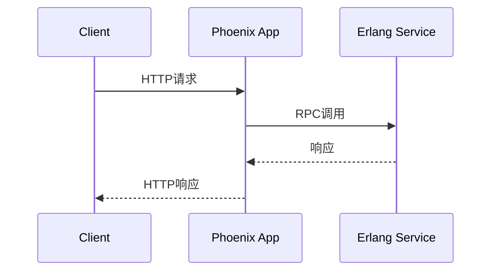

# OpenTelemetry Erlang/Elixir实现

## 介绍

OpenTelemetry是一个开源的观测性框架，用于生成、收集和管理遥测数据（如追踪、指标和日志）。Erlang/Elixir的实现允许你在BEAM虚拟机（Erlang VM）上运行的应用程序中集成OpenTelemetry，从而实现对分布式系统的监控和调试。

:::note
Erlang和Elixir共享相同的BEAM虚拟机，因此它们的OpenTelemetry实现是兼容的。
:::

## 核心概念

OpenTelemetry在Erlang/Elixir中的实现包含以下主要组件：

1. **Tracing（追踪）**：记录请求在分布式系统中的流转路径
2. **Metrics（指标）**：收集系统运行时的量化数据
3. **Context Propagation（上下文传播）**：在服务间传递追踪上下文

## 安装与配置

### 1. 添加依赖

在Elixir的`mix.exs`文件中添加依赖：

```elixir
defp deps do
  [
    {:opentelemetry, "~> 1.0"},
    {:opentelemetry_api, "~> 1.0"},
    {:opentelemetry_exporter, "~> 1.0"}
  ]
end
```

对于Erlang项目，在`rebar.config`中添加：

```erlang
{deps, [
  {opentelemetry_api, "1.0.0"},
  {opentelemetry, "1.0.0"}
]}.
```

### 2. 初始化配置

创建配置文件`config/config.exs`：

```elixir
config :opentelemetry,
  processors: [
    otel_batch_processor: %{
      exporter: {:otel_exporter_stdout, []}
    }
  ]
```

## 基本用法

### 创建Span（追踪单元）

在Elixir中创建span：

```elixir
require OpenTelemetry.Tracer

defmodule MyApp.TracingExample do
  def do_work do
    OpenTelemetry.Tracer.with_span "my_span" do
      # 你的业务逻辑
      :timer.sleep(100)
      OpenTelemetry.Tracer.set_attribute("work.duration", 100)
    end
  end
end
```

在Erlang中：

```erlang
-include_lib("opentelemetry_api/include/otel_tracer.hrl").

do_work() ->
    ?with_span(<<"my_span">>, #{}, 
        fun(_SpanCtx) ->
            timer:sleep(100),
            ?set_attribute(<<"work.duration">>, 100)
        end).
```

### 记录指标

Elixir示例：

```elixir
require OpenTelemetry.Metrics

OpenTelemetry.Metrics.record("http.requests", 1, 
  attributes: %{method: "GET", status: 200})
```

## 实际案例：分布式追踪

假设我们有一个Elixir Phoenix应用和一个Erlang服务需要追踪：



配置跨服务追踪：

```elixir
# Phoenix应用中的控制器
defmodule MyAppWeb.PageController do
  use MyAppWeb, :controller

  def index(conn, _params) do
    :erlang_service.call_rpc()  # 跨服务调用
    render(conn, "index.html")
  end
end
```

在Erlang服务中：

```erlang
handle_rpc_call() ->
    ?with_span(<<"rpc_processing">>, #{},
        fun(_) ->
            % 处理逻辑
            {ok, Result}
        end).
```

## 高级主题

### 自定义导出器

配置将数据导出到Jaeger：

```elixir
config :opentelemetry,
  processors: [
    otel_batch_processor: %{
      exporter: {:opentelemetry_exporter, %{
        endpoints: ["http://localhost:14268/api/traces"]
      }}
    }
  ]
```

### 采样配置

```elixir
config :opentelemetry,
  sampler: {:parent_based, %{
    root: {:always_on, []},
    remote_parent_sampled: {:always_on, []},
    remote_parent_not_sampled: {:always_off, []}
  }}
```

## 总结

OpenTelemetry为Erlang/Elixir应用提供了强大的观测能力，通过本文你学会了：

- 如何安装和配置OpenTelemetry
- 创建基本的追踪span和记录指标
- 实现跨服务分布式追踪
- 配置导出器和采样策略

## 进一步学习

1. [OpenTelemetry Erlang/Elixir官方文档](https://opentelemetry.io/docs/instrumentation/erlang/)
2. 尝试将OpenTelemetry集成到现有Phoenix项目中
3. 探索OpenTelemetry与Prometheus和Grafana的集成

:::tip 练习
1. 创建一个简单的Elixir应用，实现两个服务间的追踪
2. 尝试配置将数据导出到不同的后端（如Zipkin）
3. 为关键业务指标添加监控
:::