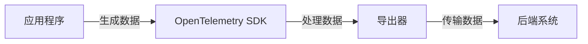

# OpenTelemetry 导出器概述

## 介绍

OpenTelemetry是一个开源的观测性框架，用于生成、收集和管理遥测数据（如指标、日志和追踪）。**导出器（Exporters）**是OpenTelemetry的核心组件之一，负责将采集到的数据发送到指定的后端系统（如Prometheus、Jaeger或云服务）。本文将详细介绍导出器的工作原理、常见类型及实际应用。

---

## 导出器的作用

导出器的主要功能是将OpenTelemetry收集的数据转换为特定后端系统支持的格式，并通过网络传输。例如：
- 将追踪数据发送到Jaeger。
- 将指标数据导出到Prometheus。
- 将日志推送到Elasticsearch。

:::note
导出器通常与**SDK（软件开发工具包）**配合使用，SDK负责生成数据，导出器负责传输数据。
:::

---

## 常见的导出器类型

OpenTelemetry支持多种导出器，以下是几种典型的类型：

### 1. **控制台导出器（Console Exporter）**
   - 将数据输出到控制台，用于本地调试。
   - 示例代码（Python）：
     ```python
     from opentelemetry import trace
     from opentelemetry.sdk.trace.export import ConsoleSpanExporter, SimpleSpanProcessor

     exporter = ConsoleSpanExporter()
     processor = SimpleSpanProcessor(exporter)
     trace.get_tracer_provider().add_span_processor(processor)
     ```
   - 输出示例：
     ```
     {
       "name": "my_span",
       "context": {"trace_id": "abc123", "span_id": "def456"},
       "attributes": {"key": "value"}
     }
     ```

### 2. **Jaeger导出器**
   - 将追踪数据发送到Jaeger后端。
   - 示例代码（Go）：
     ```go
     import (
         "go.opentelemetry.io/otel/exporters/jaeger"
         "go.opentelemetry.io/otel/sdk/trace"
     )

     exporter, _ := jaeger.New(jaeger.WithCollectorEndpoint(jaeger.WithEndpoint("http://localhost:14268/api/traces")))
     tp := trace.NewTracerProvider(trace.WithBatcher(exporter))
     ```

### 3. **Prometheus导出器**
   - 将指标数据暴露为Prometheus可抓取的端点。
   - 示例代码（Java）：
     ```java
     OpenTelemetrySdk openTelemetry = OpenTelemetrySdk.builder()
         .setMeterProvider(
             SdkMeterProvider.builder()
                 .registerMetricReader(
                     PrometheusHttpServer.builder().setPort(9464).build())
                 .build())
         .build();
     ```

---

## 导出器的工作流程

以下是一个典型的OpenTelemetry数据流图：



1. **数据生成**：应用程序通过SDK生成遥测数据。
2. **数据处理**：导出器将数据转换为目标格式（如JSON、Protobuf）。
3. **数据传输**：通过HTTP/gRPC等协议发送到后端。

---

## 实际案例：电商系统的监控

假设你正在开发一个电商网站，需要监控用户下单流程：
1. 使用Jaeger导出器追踪订单创建的调用链。
2. 使用Prometheus导出器统计下单成功率。
3. 使用控制台导出器在开发阶段调试数据。

:::tip
在开发环境中优先使用控制台导出器，生产环境切换为Jaeger或Prometheus。
:::

---

## 总结

- 导出器是OpenTelemetry中负责数据传输的组件。
- 支持多种后端系统（如Jaeger、Prometheus、控制台）。
- 开发时需根据场景选择合适的导出器。

### 下一步
- 尝试在本地运行一个Jaeger实例并导出数据。
- 阅读[OpenTelemetry官方文档](https://opentelemetry.io/docs/)了解更多导出器配置。