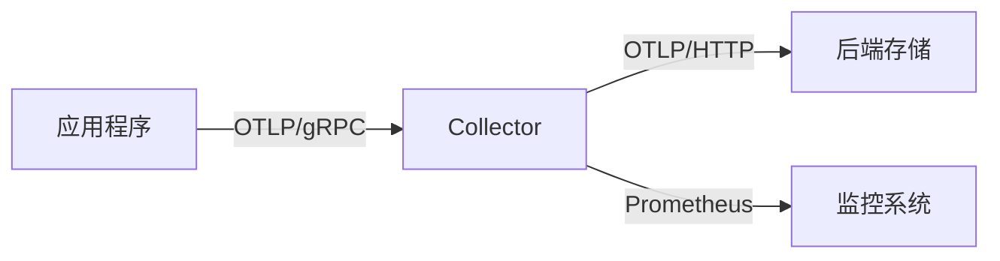
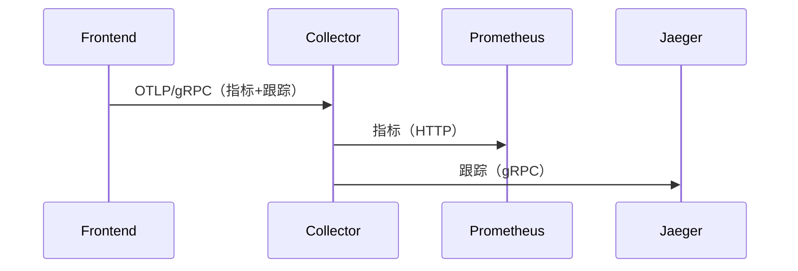

## 简介

OpenTelemetry Protocol（OTLP）是OpenTelemetry项目定义的一种通用协议，用于将遥测数据（如指标、日志和跟踪）从应用程序传输到后端系统。OTLP设计为高效、可靠且与语言无关，支持多种传输方式（如HTTP/gRPC），是OpenTelemetry生态中的核心组件。

:::note
OTLP取代了旧版协议（如Jaeger或Zipkin的专用协议），成为OpenTelemetry的默认导出格式。
:::

## OTLP的核心特性

1. **多数据类型支持**：统一传输跟踪（Traces）、指标（Metrics）和日志（Logs）。<br />
2. **多传输协议**：默认使用gRPC，也支持HTTP/JSON。<br />
3. **高效编码**：基于Protocol Buffers的二进制编码，减少带宽占用。<br />
4. **端到端可靠性**：内置重试、队列和批处理机制。

## 协议架构



## 配置OTLP导出器

以下是一个使用OpenTelemetry SDK配置OTLP导出器的示例（以Python为例）：

```python
from opentelemetry import trace
from opentelemetry.sdk.trace import TracerProvider
from opentelemetry.sdk.trace.export import BatchSpanProcessor
from opentelemetry.exporter.otlp.proto.grpc.trace_exporter import OTLPSpanExporter

# 初始化OTLP导出器（默认连接本地Collector的gRPC端口4317）
otlp_exporter = OTLPSpanExporter()

# 设置批处理处理器
tracer_provider = TracerProvider()
tracer_provider.add_span_processor(BatchSpanProcessor(otlp_exporter))
trace.set_tracer_provider(tracer_provider)

# 生成跟踪数据
tracer = trace.get_tracer(__name__)
with tracer.start_as_current_span("example_span"):
    print("遥测数据已通过OTLP发送！")
```

:::tip
在本地开发时，可先运行OpenTelemetry Collector的Docker镜像快速测试：
```bash
docker run -p 4317:4317 otel/opentelemetry-collector
```
:::

## 实际应用场景

**电商系统监控**：<br />
1. 前端服务通过OTLP将延迟数据发送到Collector<br />
2. Collector将数据转发到Prometheus进行告警分析<br />
3. 同时将采样后的跟踪数据存储到Jaeger用于故障排查



## 高级配置选项

### 自定义端点与安全
```python
otlp_exporter = OTLPSpanExporter(
    endpoint="https://your-collector:443",
    headers={"Authorization": "Bearer YOUR_TOKEN"}
)
```

### 协议切换（HTTP/JSON）
```python
from opentelemetry.exporter.otlp.proto.http.trace_exporter import OTLPSpanExporter

exporter = OTLPSpanExporter(
    endpoint="http://localhost:4318/v1/traces"
)
```

## 总结

OTLP协议的关键优势：
- 统一了三种遥测数据的传输方式
- 通过Protocol Buffers实现高性能序列化
- 灵活的传输层支持（gRPC/HTTP）

:::warning 常见问题
1. 确保Collector的端口（默认4317）可访问<br />
2. 生产环境建议启用TLS加密<br />
3. 大数据量时需调整批处理参数
:::

## 扩展学习

1. [OTLP协议规范](https://github.com/open-telemetry/opentelemetry-specification/blob/main/specification/protocol/otlp.md)
2. 实践练习：部署Collector并将数据转发到Jaeger和Prometheus
3. 尝试比较OTLP与Jaeger原生协议的传输效率