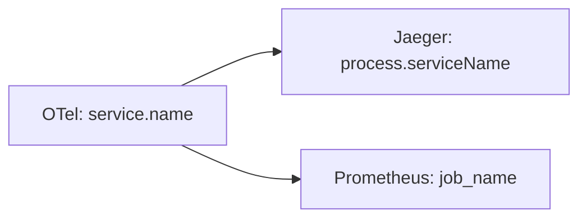

# OpenTelemetry 数据转换

## 介绍

OpenTelemetry（简称OTel）是一个开源的观测性框架，用于生成、收集和管理遥测数据（如指标、日志和跟踪）。在实际应用中，原始遥测数据通常需要经过**转换**才能被后端系统（如Prometheus、Jaeger或云服务）正确解析和使用。数据转换是OpenTelemetry管道中的关键步骤，涉及格式调整、协议适配和字段映射等操作。

:::note
数据转换的核心目标：  
1. **兼容性**：确保数据格式与后端系统匹配。  
2. **效率**：减少不必要的数据传输和存储开销。  
3. **可读性**：优化字段命名或结构以便分析。  
:::

---

## 数据转换的基本类型

### 1. 格式转换
将数据从一种序列化格式转换为另一种，例如：
- **OTLP（OpenTelemetry Protocol）** → **JSON**  
- **Protobuf** → **Prometheus文本格式**  

#### 示例：OTLP Span 转 JSON
**输入（OTLP Protobuf）**：  
```protobuf
resource_spans {
  resource { attributes { key: "service.name" value { string_value: "auth-service" } } }
  scope_spans {
    spans {
      trace_id: "abc123",
      span_id: "def456",
      name: "validate-token",
      kind: SPAN_KIND_SERVER
    }
  }
}
```

**输出（JSON）**：  
```json
{
  "resource": { "service.name": "auth-service" },
  "spans": [{
    "trace_id": "abc123",
    "span_id": "def456",
    "name": "validate-token",
    "kind": "server"
  }]
}
```

### 2. 协议适配
调整数据传输协议以满足后端要求，例如：
- **gRPC** → **HTTP/1.1**  
- **OTLP/gRPC** → **Zipkin API**  

---

## 逐步实现数据转换

### 步骤1：使用OpenTelemetry Collector
OpenTelemetry Collector是数据转换的核心组件，通过配置处理器（Processors）实现转换逻辑。

#### 示例：添加`transform`处理器
编辑Collector配置文件（`otel-collector-config.yaml`）：
```yaml
processors:
  transform:
    traces:
      queries:
        - name: "rename-service"
          query: "set(attributes[\"service.name\"], \"auth-v2\")"
```

### 步骤2：字段映射
将字段名映射为后端系统支持的名称。例如，将OpenTelemetry的`service.name`映射为Jaeger的`process.serviceName`。



---

## 实际案例：转换并导出到Prometheus

### 场景
将自定义指标从OTLP格式转换为Prometheus支持的格式，并导出。

#### 配置示例
```yaml
exporters:
  prometheus:
    endpoint: "0.0.0.0:8889"

processors:
  # 转换指标名称
  transform:
    metrics:
      queries:
        - name: "rename-latency-metric"
          query: "set(name, \"http_request_duration_seconds\") where name == \"latency\""
```

:::tip
使用`transform`处理器时，可以通过[OTTL语法](https://opentelemetry.io/docs/collector/configuration/transform/)灵活操作数据字段。
:::

---

## 总结

- **为什么需要转换**：后端系统的差异性和数据优化需求。  
- **核心工具**：OpenTelemetry Collector及其处理器（如`transform`、`batch`）。  
- **关键操作**：格式转换、协议适配、字段映射。  

## 扩展练习
1. 在本地部署OpenTelemetry Collector，尝试将Jaeger格式的跟踪数据转换为Zipkin格式。  
2. 使用`transform`处理器将指标`error.count`重命名为`http_errors_total`。  

## 附加资源
- [OpenTelemetry Collector官方文档](https://opentelemetry.io/docs/collector/)  
- [OTTL语法参考](https://opentelemetry.io/docs/collector/configuration/transform/)