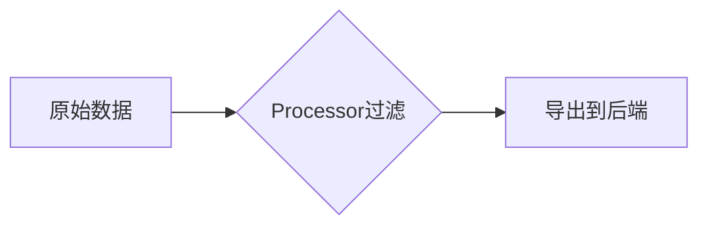
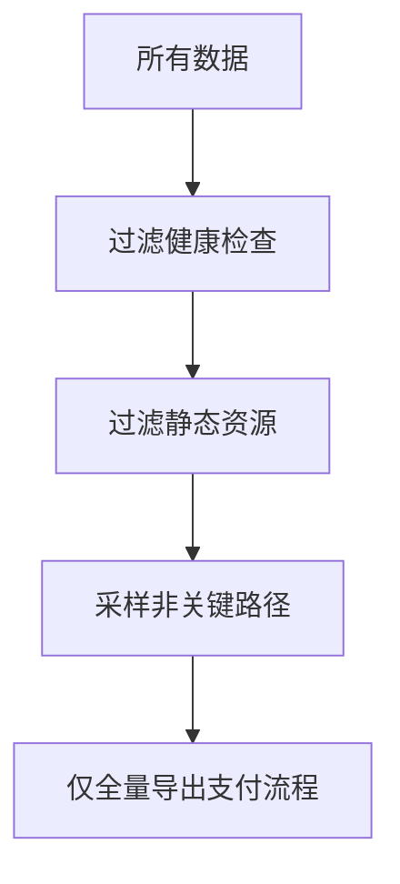

## 介绍

在分布式系统中，OpenTelemetry收集的遥测数据（如跟踪、指标、日志）可能非常庞大。直接导出所有数据会导致存储成本高且难以分析。**过滤导出**允许你通过规则筛选出有价值的数据，例如：

- 仅导出错误率高的请求
- 忽略健康检查等低价值跟踪
- 按服务名称或属性过滤指标

## 基本过滤原理

OpenTelemetry通过**处理器（Processor）**实现过滤。以下是典型数据处理流程：



### 常用过滤方式
1. **属性过滤**：基于资源/跨度中的键值对
2. **采样过滤**：按比例或条件采样
3. **严重性过滤**：如仅导出ERROR级别日志

## 代码示例：属性过滤

以下示例展示如何只导出包含 `http.status_code=500` 的跟踪：

```javascript
const { NodeSDK } = require('@opentelemetry/sdk-node');
const { SimpleSpanProcessor } = require('@opentelemetry/sdk-trace-node');
const { FilterProcessor } = require('@opentelemetry/processor-filter');

const filter = new FilterProcessor({
  // 只保留失败的HTTP请求
  spanFilter: (span) => span.attributes['http.status_code'] === 500
});

const sdk = new NodeSDK({
  spanProcessor: new SimpleSpanProcessor(exporter, filter)
});
```

**输入数据**（原始跟踪）：
```json
[
  { "name": "HTTP GET /", "attributes": { "http.status_code": 200 }},
  { "name": "HTTP POST /submit", "attributes": { "http.status_code": 500 }}
]
```

**输出数据**（过滤后）：
```json
[
  { "name": "HTTP POST /submit", "attributes": { "http.status_code": 500 }}
]
```

## 实际案例：电商平台过滤策略

假设电商平台需要优化监控成本：



具体实现：
```javascript
const { BatchSpanProcessor } = require('@opentelemetry/sdk-trace-node');

const paymentFilter = {
  spanFilter: (span) => {
    const isPayment = span.attributes['service.name'] === 'payment-service';
    const isError = span.status.code === 2; // ERROR状态
    return isPayment || isError;
  }
};

sdk.configureTracerProvider({
  spanProcessor: new BatchSpanProcessor(exporter, paymentFilter)
});
```

## 高级技巧

:::tip 动态过滤
结合环境变量实现动态规则：
```javascript
const filterRules = JSON.parse(process.env.OTEL_FILTER_RULES || '{}');

new FilterProcessor({
  spanFilter: (span) => 
    filterRules.services?.includes(span.resource.service.name)
});
```
:::

## 总结

关键要点：
- 过滤可减少70%以上的存储成本（根据实际业务差异）
- 优先过滤高频低价值数据（如健康检查）
- 生产环境建议结合采样策略

## 延伸学习

1. [OpenTelemetry官方文档：处理器](https://opentelemetry.io/docs/concepts/processors/)
2. 练习：为你的项目添加过滤规则，比较过滤前后的数据量差异
3. 进阶：研究如何将过滤规则配置为外部YAML文件

:::caution 注意事项
过度过滤可能导致问题排查困难，建议保留：
- 所有错误请求
- 关键业务路径样本
:::