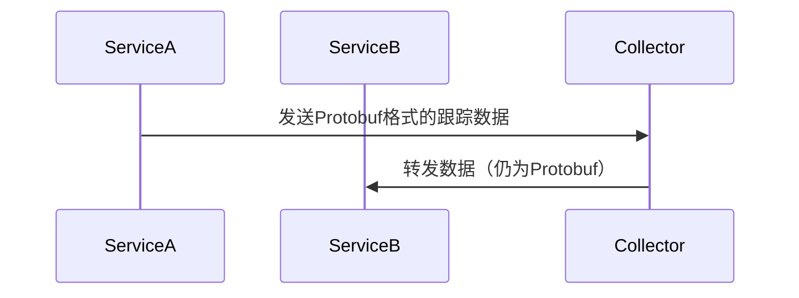

# OpenTelemetry 数据格式

## 介绍

OpenTelemetry（简称OTel）是一个开源的观测性框架，用于生成、收集和管理遥测数据（如指标、日志和跟踪）。为了在不同系统之间传输数据，OpenTelemetry定义了一套标准化的数据格式。这些格式确保了数据的互操作性，并支持高效传输和存储。

本文将介绍OpenTelemetry的主要数据格式，包括协议缓冲区（Protocol Buffers）和JSON，以及它们的实际应用场景。

---

## 协议缓冲区（Protocol Buffers）

协议缓冲区（Protobuf）是OpenTelemetry默认的数据序列化格式。它是一种高效的二进制格式，由Google开发，具有以下特点：
- **高效**：比JSON或XML更小、更快。
- **跨语言支持**：支持多种编程语言。
- **结构化**：通过`.proto`文件定义数据结构。

### 示例：Protobuf定义
OpenTelemetry的Protobuf定义可以在其官方仓库中找到。以下是一个简化的跟踪数据（Trace）的Protobuf定义示例：

```protobuf
message Span {
  string trace_id = 1;
  string span_id = 2;
  string name = 3;
  int64 start_time_unix_nano = 4;
  int64 end_time_unix_nano = 5;
  repeated KeyValue attributes = 6;
}
```

### 输入与输出
假设我们有一个简单的跟踪数据，其Protobuf编码后的二进制输出可能如下（以十六进制表示）：
```
0A 24 3662383030303030303030303030303030303030303030303030303030303030
12 16 31323334353637383930313233343536
1A 0A 48656C6C6F576F726C64
```

:::note
Protobuf是二进制格式，通常需要通过工具（如`protoc`）解码才能查看其内容。
:::

---

## JSON格式

虽然Protobuf是默认格式，但OpenTelemetry也支持JSON格式，尤其是在调试或与不支持Protobuf的系统交互时。JSON格式易于阅读，但体积较大。

### 示例：JSON格式的跟踪数据
以下是一个JSON格式的跟踪数据示例：

```json
{
  "resourceSpans": [
    {
      "resource": {
        "attributes": [
          {
            "key": "service.name",
            "value": { "stringValue": "my-service" }
          }
        ]
      },
      "scopeSpans": [
        {
          "spans": [
            {
              "traceId": "36623830303030303030303030303030",
              "spanId": "31323334353637383930313233343536",
              "name": "HelloWorld",
              "startTimeUnixNano": "1623456789000000000",
              "endTimeUnixNano": "1623456790000000000"
            }
          ]
        }
      ]
    }
  ]
}
```

:::tip
JSON格式适合在开发或调试阶段使用，但在生产环境中建议使用Protobuf以提高性能。
:::

---

## 数据格式的转换

在某些场景中，可能需要将数据从一种格式转换为另一种格式。OpenTelemetry提供了工具（如OTLP导出器）来完成这一任务。

### 示例：Protobuf转JSON
以下是一个使用Python将Protobuf数据转换为JSON的示例：

```python
from opentelemetry.proto.trace.v1.trace_pb2 import TracesData
import json

# 假设`protobuf_data`是Protobuf编码的二进制数据
traces_data = TracesData()
traces_data.ParseFromString(protobuf_data)

# 转换为JSON
json_data = json.loads(traces_data.to_json())
print(json_data)
```

---

## 实际应用场景

### 场景1：分布式跟踪
在微服务架构中，服务A调用服务B，两者的跟踪数据需要通过OpenTelemetry Collector传输。使用Protobuf格式可以减少网络开销。



### 场景2：调试与分析
开发者在本地调试时，可以将数据导出为JSON格式，便于查看和分析。

---

## 总结

OpenTelemetry支持多种数据格式，包括高效的Protobuf和易读的JSON。选择哪种格式取决于具体场景：
- **Protobuf**：生产环境，高性能需求。
- **JSON**：开发调试，兼容性需求。

---

## 附加资源与练习

### 资源
1. [OpenTelemetry官方文档](https://opentelemetry.io/docs/)
2. [Protocol Buffers文档](https://developers.google.com/protocol-buffers)

### 练习
1. 尝试使用OpenTelemetry导出跟踪数据，并分别保存为Protobuf和JSON格式。
2. 编写一个脚本，将Protobuf格式的跟踪数据转换为JSON格式。