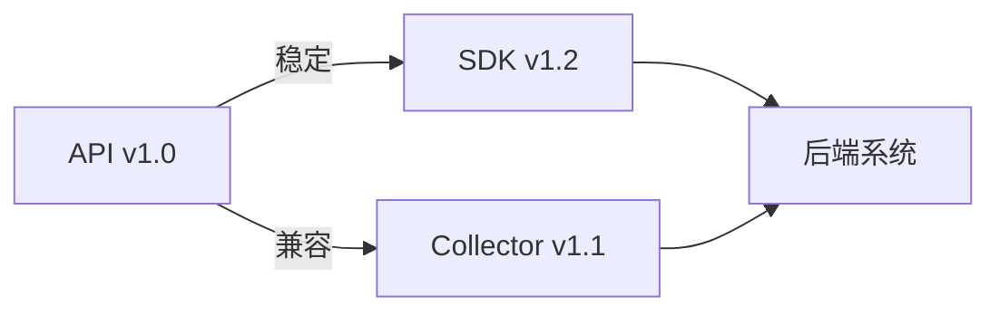
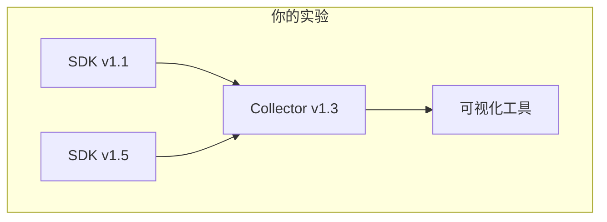

# OpenTelemetry 兼容性保证

## 介绍

OpenTelemetry（简称OTel）是一个开源的观测性框架，用于生成、收集和管理遥测数据（如指标、日志和追踪）。它的核心目标之一是提供**跨语言和工具的兼容性**。本文将解释OpenTelemetry如何通过**版本控制策略**和**稳定性承诺**实现这一目标，并展示实际应用场景。

:::note 关键概念
兼容性保证意味着：  
1. 不同版本的SDK/API可以协同工作  
2. 数据格式在不同后端系统中保持一致性  
3. 长期维护的稳定性  
:::

## 版本控制策略

OpenTelemetry采用语义化版本（SemVer）规范：`MAJOR.MINOR.PATCH`  
- **MAJOR**：破坏性变更（需显式升级）  
- **MINOR**：向后兼容的功能新增  
- **PATCH**：向后兼容的问题修复  



## 稳定性等级

OpenTelemetry定义了三类稳定性等级：

1. **Stable**（稳定）  
   - 长期支持，破坏性变更需大版本升级  
   - 示例：Trace API（v1.0+）

2. **Beta**（测试版）  
   - 功能基本完成，但可能调整细节  
   - 示例：Logs SDK（截至2023年）

3. **Experimental**（实验性）  
   - 可能随时变更，不建议生产环境使用  
   - 示例：某些处理器扩展  

:::warning 生产环境建议
优先选择标记为`Stable`的组件，Beta功能需评估风险！
:::

## 代码示例：版本兼容性检查

以下展示如何通过代码验证SDK与API的兼容性：

```python
# Python示例：检查OpenTelemetry版本
import pkg_resources
from opentelemetry import trace

# 获取已安装版本
otel_version = pkg_resources.get_distribution("opentelemetry-sdk").version
print(f"当前SDK版本: {otel_version}")

# 验证API兼容性
if trace.__version__.startswith("1."):
    print("兼容Trace API v1.x")
else:
    print("警告: 可能需要升级API!")
```

**输出示例**：
```
当前SDK版本: 1.15.0
兼容Trace API v1.x
```

## 实际案例：跨版本数据收集

假设一个微服务架构：
- 服务A使用**Java OTel SDK v1.10**  
- 服务B使用**Go OTel SDK v1.20**  
- 统一由**Collector v1.0**处理数据  

由于所有组件均兼容API v1.x，数据能无缝传递至后端（如Jaeger/Prometheus）。

:::tip 最佳实践
即使小版本升级（如v1.10 → v1.20），也应：  
1. 测试自定义的处理器/导出器  
2. 检查采样率等配置是否保持预期  
:::

## 总结

OpenTelemetry通过以下机制保障兼容性：
- 严格的语义化版本控制  
- 明确的稳定性分级  
- 跨语言规范的一致性实现  

## 扩展资源

1. [官方版本支持政策](https://opentelemetry.io/docs/reference/specification/versioning-and-stability/)  
2. 练习：尝试在本地同时运行不同版本的SDK和Collector，观察数据流是否中断  

