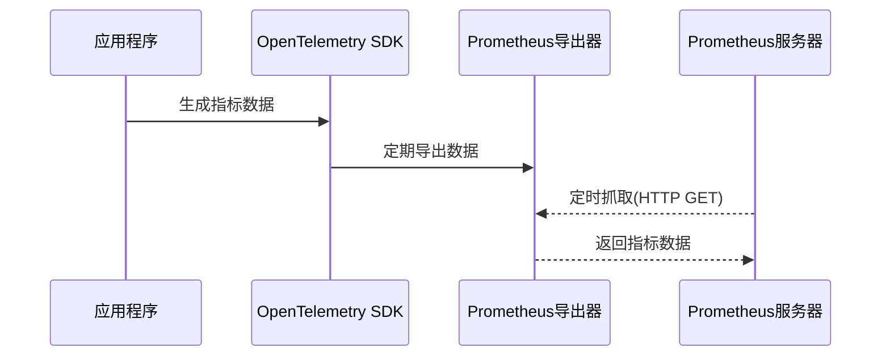

# OpenTelemetry Prometheus集成

## 介绍

OpenTelemetry是一个开源的观测性框架，用于生成、收集和管理遥测数据（指标、日志和追踪）。Prometheus则是一个流行的开源监控系统，专注于时间序列数据的收集与查询。将两者集成可以充分发挥各自优势：OpenTelemetry提供标准化的数据采集，而Prometheus提供强大的存储和查询能力。

:::tip 关键概念
- **指标(Metrics)**: 数值型测量数据（如CPU使用率、请求延迟）
- **Prometheus Exporters**: 将数据转换为Prometheus可读格式的组件
- **Pull vs Push模型**: Prometheus默认使用拉取(pull)模式获取数据
:::

## 基础集成步骤

### 1. 安装依赖
首先需要安装OpenTelemetry的Prometheus导出器：

```bash
npm install @opentelemetry/exporter-prometheus
# 或对于Python
pip install opentelemetry-exporter-prometheus
```

### 2. 配置Prometheus导出器

以下是Node.js的配置示例：

```javascript
const { PrometheusExporter } = require('@opentelemetry/exporter-prometheus');
const { MeterProvider } = require('@opentelemetry/metrics');

const exporter = new PrometheusExporter({
  port: 9464, // Prometheus默认抓取端口
  startServer: true
});

const meter = new MeterProvider({
  exporter,
  interval: 1000 // 收集间隔(毫秒)
}).getMeter('your-meter-name');
```

### 3. 定义和记录指标

```javascript
// 创建计数器
const requestCounter = meter.createCounter('requests', {
  description: 'Count all incoming requests'
});

// 在请求处理中使用
app.use((req, res, next) => {
  requestCounter.add(1);
  next();
});
```

## 数据流示意图



## 实际应用案例

### 监控Web应用性能

假设我们需要监控一个Express应用的以下指标：
- 请求总数
- 请求延迟分布
- 错误请求数

```javascript
const httpRequestDuration = meter.createHistogram('http_request_duration', {
  description: 'Duration of HTTP requests',
  boundaries: [0.1, 0.5, 1, 2, 5] // 单位为秒
});

app.use((req, res, next) => {
  const start = Date.now();
  
  res.on('finish', () => {
    const duration = (Date.now() - start) / 1000;
    httpRequestDuration.record(duration);
    
    if(res.statusCode >= 400) {
      errorCounter.add(1);
    }
  });
  
  next();
});
```

在Prometheus中查询这些指标：
```
# 请求率
rate(http_request_duration_count[1m])

# 99百分位延迟
histogram_quantile(0.99, rate(http_request_duration_bucket[1m]))
```

## 高级配置

### 自定义指标端点

默认情况下，导出器会在 `/metrics` 路径提供数据。可以自定义：

```javascript
new PrometheusExporter({
  endpoint: '/custom-metrics'
});
```

### 添加元数据标签

```javascript
requestCounter.add(1, {
  route: '/api/users',
  method: 'GET',
  status: '200'
});
```

## 常见问题解决

:::caution 注意
1. **端口冲突**: 确保Prometheus导出器使用的端口未被占用
2. **数据类型匹配**: Prometheus只接受特定格式的指标（Counter/Gauge/Histogram/Summary）
3. **标签命名**: 避免使用特殊字符，推荐`snake_case`格式
:::

## 总结

通过OpenTelemetry与Prometheus的集成，开发者可以：

- 使用标准化API收集应用指标
- 利用Prometheus强大的查询和告警功能
- 避免厂商锁定，保持架构灵活性

## 延伸学习

1. **官方文档**:
   - [OpenTelemetry Prometheus Exporter](https://opentelemetry.io/docs/instrumentation/js/exporters/)
   - [Prometheus Querying](https://prometheus.io/docs/prometheus/latest/querying/basics/)

2. **实践练习**:
   - 为你的应用添加自定义业务指标
   - 配置Prometheus的告警规则
   - 尝试使用Grafana可视化指标数据

3. **进阶主题**:
   - 长期存储与Thanos集成
   - 跨服务指标关联（使用Trace ID）
   - 资源消耗优化