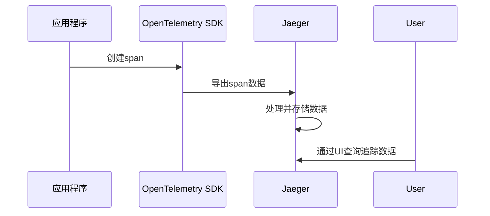

# OpenTelemetry Jaeger集成

## 介绍

OpenTelemetry是一个开源的观测性框架，用于生成、收集和管理遥测数据（如追踪、指标和日志）。Jaeger是一个流行的分布式追踪系统，可以帮助开发者可视化和分析请求在微服务架构中的流转路径。本文将介绍如何将OpenTelemetry与Jaeger集成，以便将追踪数据导出到Jaeger进行可视化分析。

## 为什么需要Jaeger集成？

在分布式系统中，一个请求可能会经过多个服务，每个服务可能会调用其他服务或数据库。Jaeger可以帮助你：
- 可视化请求的完整路径
- 分析性能瓶颈
- 调试跨服务的问题

通过OpenTelemetry导出数据到Jaeger，你可以利用OpenTelemetry的标准化API和SDK，同时享受Jaeger强大的可视化能力。

## 前置条件

在开始之前，请确保：
1. 已安装OpenTelemetry SDK（支持你使用的编程语言）
2. 已安装Jaeger（可以本地运行或使用云服务）
3. 基本了解分布式追踪概念

## 集成步骤

### 1. 设置Jaeger

首先，你需要运行Jaeger服务。最简单的方法是使用Docker运行Jaeger的all-in-one容器：

```bash
docker run -d --name jaeger \
  -e COLLECTOR_ZIPKIN_HOST_PORT=:9411 \
  -p 5775:5775/udp \
  -p 6831:6831/udp \
  -p 6832:6832/udp \
  -p 5778:5778 \
  -p 16686:16686 \
  -p 14268:14268 \
  -p 14250:14250 \
  -p 9411:9411 \
  jaegertracing/all-in-one:latest
```

运行后，Jaeger UI将在 `http://localhost:16686` 可用。

### 2. 配置OpenTelemetry导出器

根据你的编程语言，配置OpenTelemetry导出器将数据发送到Jaeger。以下是几种常见语言的示例：

#### Python示例

```python
from opentelemetry import trace
from opentelemetry.exporter.jaeger.thrift import JaegerExporter
from opentelemetry.sdk.trace import TracerProvider
from opentelemetry.sdk.trace.export import BatchSpanProcessor

# 设置追踪提供者
trace.set_tracer_provider(TracerProvider())

# 创建Jaeger导出器
jaeger_exporter = JaegerExporter(
    agent_host_name="localhost",
    agent_port=6831,
)

# 添加批处理处理器
trace.get_tracer_provider().add_span_processor(
    BatchSpanProcessor(jaeger_exporter)
)

# 获取追踪器
tracer = trace.get_tracer(__name__)

# 创建一个简单的span
with tracer.start_as_current_span("example_span"):
    print("This is a sample span!")
```

#### Java示例

```java
import io.opentelemetry.api.trace.Tracer;
import io.opentelemetry.exporter.jaeger.JaegerGrpcSpanExporter;
import io.opentelemetry.sdk.trace.SdkTracerProvider;
import io.opentelemetry.sdk.trace.export.BatchSpanProcessor;

public class JaegerIntegration {
    public static void main(String[] args) {
        // 创建Jaeger导出器
        JaegerGrpcSpanExporter jaegerExporter =
            JaegerGrpcSpanExporter.builder()
                .setEndpoint("http://localhost:14250")
                .build();

        // 设置追踪提供者
        SdkTracerProvider tracerProvider = SdkTracerProvider.builder()
            .addSpanProcessor(BatchSpanProcessor.builder(jaegerExporter).build())
            .build();

        // 获取追踪器
        Tracer tracer = tracerProvider.get("example-tracer");

        // 创建一个简单的span
        Span span = tracer.spanBuilder("example-span").startSpan();
        try {
            System.out.println("This is a sample span!");
        } finally {
            span.end();
        }
    }
}
```

### 3. 运行应用并查看结果

运行你的应用程序后，访问Jaeger UI (`http://localhost:16686`)，你应该能看到你的追踪数据。

## 追踪数据流

以下图表展示了数据如何从你的应用程序流向Jaeger：



## 实际应用场景

假设你有一个电子商务应用，包含以下服务：
1. 用户服务
2. 产品服务
3. 订单服务
4. 支付服务

当用户下订单时，请求会流经所有这些服务。通过OpenTelemetry和Jaeger集成，你可以：

1. 查看整个订单流程的完整追踪
2. 识别哪个服务响应最慢
3. 分析跨服务的错误传播

## 高级配置

### 采样率控制

在生产环境中，你可能不想记录所有请求的追踪数据。OpenTelemetry允许你配置采样率：

```python
from opentelemetry.sdk.trace.sampling import TraceIdRatioBased

# 只采样50%的请求
sampler = TraceIdRatioBased(0.5)
trace.set_tracer_provider(TracerProvider(sampler=sampler))
```

### 自定义元数据

你可以为span添加自定义标签，以便在Jaeger中更好地过滤和分析：

```python
with tracer.start_as_current_span("checkout") as span:
    span.set_attribute("user.id", user_id)
    span.set_attribute("order.total", order_total)
```

## 常见问题

:::caution 问题：看不到追踪数据？
1. 确保Jaeger服务正在运行
2. 检查导出器配置是否正确（主机、端口）
3. 验证应用程序是否实际生成了span
4. 检查采样率是否设置得太低
:::

:::tip 性能优化
对于高流量应用，考虑：
1. 使用批处理导出器（如示例中所示）
2. 调整采样率
3. 使用Jaeger的远程存储（如Elasticsearch）而非内存存储
:::

## 总结

通过本文，你学会了：
- 如何设置Jaeger服务
- 如何配置OpenTelemetry导出器将数据发送到Jaeger
- 如何查看和分析追踪数据
- 一些高级配置选项和最佳实践

OpenTelemetry与Jaeger的集成为分布式系统的可观测性提供了强大工具，帮助你理解复杂的服务交互并快速定位问题。

## 进一步学习

1. [Jaeger官方文档](https://www.jaegertracing.io/docs/)
2. [OpenTelemetry文档](https://opentelemetry.io/docs/)
3. 练习：尝试在你的微服务应用中实现OpenTelemetry和Jaeger集成
4. 挑战：配置Jaeger使用持久化存储（如Elasticsearch）而非内存存储