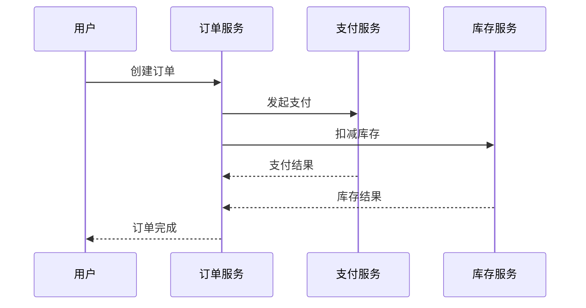

# OpenTelemetry Zipkin集成

## 介绍

OpenTelemetry是一个开源的观测性框架，用于生成、收集和导出遥测数据（如追踪、指标和日志）。Zipkin是一个流行的分布式追踪系统，可以帮助开发者可视化服务之间的调用关系。本指南将演示如何将OpenTelemetry的追踪数据导出到Zipkin后端。

:::note 关键概念
- **Span**: 表示一个独立的工作单元（如HTTP请求或数据库调用）。
- **Trace**: 由多个Span组成的调用链，代表完整的请求生命周期。
- **Exporter**: 负责将遥测数据发送到后端系统（如Zipkin）。
:::

## 准备工作

在开始之前，请确保：
1. 已安装Java/Python/Node.js等语言的OpenTelemetry SDK
2. 本地或远程运行了Zipkin服务（默认地址 `http://localhost:9411`）

## 集成步骤

### 1. 添加依赖

根据你的语言环境安装必要的包：

```bash
# Node.js示例
npm install @opentelemetry/sdk-trace-base @opentelemetry/exporter-zipkin
```

### 2. 配置Zipkin导出器

以下是一个Node.js的配置示例：

```javascript
const { ZipkinExporter } = require('@opentelemetry/exporter-zipkin');
const { SimpleSpanProcessor } = require('@opentelemetry/sdk-trace-base');

const exporter = new ZipkinExporter({
  url: 'http://localhost:9411/api/v2/spans',
  serviceName: 'your-service-name'
});

// 将导出器添加到Span处理器
tracerProvider.addSpanProcessor(new SimpleSpanProcessor(exporter));
```

### 3. 生成和导出追踪数据

创建一个简单的Span并观察其导出：

```javascript
const tracer = trace.getTracer('example-tracer');
const span = tracer.startSpan('main-operation');

// 模拟工作
setTimeout(() => {
  span.end();
}, 500);
```

### 4. 验证数据

访问Zipkin UI (`http://localhost:9411`)，你应该能看到类似这样的追踪数据：

```json
{
  "traceId": "7b9b8f8e6d5c4b3a",
  "name": "main-operation",
  "duration": 500,
  "tags": { "service.name": "your-service-name" }
}
```

## 实际案例：电商订单流程

假设我们有一个电商系统，包含以下服务：
1. 订单服务
2. 支付服务
3. 库存服务



配置OpenTelemetry后，Zipkin将显示完整的调用链，帮助开发者：
- 识别性能瓶颈（如支付服务延迟）
- 诊断跨服务错误
- 分析服务依赖关系

## 高级配置

### 自定义元数据

可以为Span添加业务相关的标签：

```javascript
span.setAttribute('order.id', '12345');
span.setAttribute('payment.method', 'credit_card');
```

### 采样控制

通过采样减少数据量：

```javascript
const { AlwaysOnSampler } = require('@opentelemetry/core');

tracerProvider.addSpanProcessor(
  new SimpleSpanProcessor(exporter, {
    sampler: new AlwaysOnSampler() // 或使用概率采样
  })
);
```

## 常见问题

:::caution 数据未显示？
1. 检查Zipkin服务是否运行
2. 验证导出器URL是否正确
3. 确保Span已调用`.end()`
:::

:::tip 性能优化
- 批量导出Span（使用`BatchSpanProcessor`）
- 在生产环境使用异步导出
- 合理设置采样率
:::

## 总结

通过OpenTelemetry与Zipkin的集成，你可以：
- 可视化微服务架构中的调用链路
- 快速定位跨服务问题
- 收集端到端的性能指标

## 延伸学习

1. [Zipkin官方文档](https://zipkin.io/)
2. OpenTelemetry的上下文传播机制
3. 与Prometheus/Grafana的指标集成

尝试以下练习：
1. 创建一个包含3个服务的模拟系统并导出追踪数据
2. 在Zipkin中比较同步和异步调用的延迟差异
3. 为关键业务操作添加自定义标签