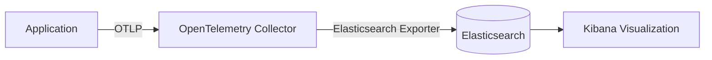

# OpenTelemetry Elasticsearch集成

## 介绍

OpenTelemetry是一个开源的观测性框架，用于生成、收集和导出遥测数据（如追踪、指标和日志）。Elasticsearch是一个分布式搜索和分析引擎，常用于存储和查询大规模数据。将两者集成后，开发者可以利用Elasticsearch强大的搜索和可视化能力（通过Kibana）来分析OpenTelemetry收集的应用程序性能数据。

本教程将逐步指导你如何配置OpenTelemetry导出器，将数据发送到Elasticsearch，并通过实际案例展示集成效果。

---

## 前置条件

1. 已安装OpenTelemetry SDK（如Python、Java或Node.js版本）
2. 运行中的Elasticsearch实例（本地或云端）
3. 基础了解OpenTelemetry的核心概念（如`TracerProvider`、`Span`等）

---

## 配置OpenTelemetry导出到Elasticsearch

### 1. 安装依赖

以Python为例，安装OpenTelemetry导出器和Elasticsearch客户端库：

```bash
pip install opentelemetry-sdk opentelemetry-exporter-otlp elasticsearch
```

### 2. 设置OpenTelemetry导出器

OpenTelemetry默认不直接支持Elasticsearch导出，但可以通过以下两种方式实现：
- **方法1**：通过OTLP导出到OpenTelemetry Collector，再由Collector转发到Elasticsearch
- **方法2**：使用Elasticsearch的APM Server（推荐生产环境使用）

#### 方法1示例代码（OTLP + Collector）

```python
from opentelemetry import trace
from opentelemetry.sdk.trace import TracerProvider
from opentelemetry.sdk.trace.export import BatchSpanProcessor
from opentelemetry.exporter.otlp.proto.grpc.trace_exporter import OTLPSpanExporter

# 初始化TracerProvider
provider = TracerProvider()
trace.set_tracer_provider(provider)

# 创建OTLP导出器（指向Collector）
otlp_exporter = OTLPSpanExporter(endpoint="http://localhost:4317")
provider.add_span_processor(BatchSpanProcessor(otlp_exporter))

# 生成一个示例Span
tracer = trace.get_tracer(__name__)
with tracer.start_as_current_span("elasticsearch-integration-test"):
    print("Trace data will be sent to Elasticsearch via OTLP!")
```

:::note
确保已配置OpenTelemetry Collector的Elasticsearch导出器。以下是Collector配置片段（`otel-collector-config.yaml`）：
```yaml
exporters:
  elasticsearch:
    endpoints: ["http://elasticsearch:9200"]
    logs_index: "otel-logs"
    traces_index: "otel-traces"
```
:::

---

## 数据流示意图



---

## 实际案例：追踪电商订单流程

假设你有一个电商应用，需要追踪订单创建流程的性能。以下是一个Node.js示例：

```javascript
const { NodeTracerProvider } = require('@opentelemetry/sdk-trace-node');
const { OTLPTraceExporter } = require('@opentelemetry/exporter-trace-otlp-grpc');
const { BatchSpanProcessor } = require('@opentelemetry/sdk-trace-base');

// 初始化导出器
const exporter = new OTLPTraceExporter({ url: 'http://collector:4317' });
const provider = new NodeTracerProvider();

provider.addSpanProcessor(new BatchSpanProcessor(exporter));
provider.register();

// 模拟订单处理
const tracer = provider.getTracer('ecommerce-app');
async function processOrder(orderId) {
  const span = tracer.startSpan('process-order');
  span.setAttribute('order.id', orderId);
  
  // 模拟耗时操作
  await new Promise(resolve => setTimeout(resolve, 100));
  span.end();
  return `Order ${orderId} processed`;
}
```

在Elasticsearch中查询到的追踪数据格式示例：
```json
{
  "_index": "otel-traces",
  "_source": {
    "traceId": "abc123",
    "name": "process-order",
    "duration_ms": 105,
    "attributes": { "order.id": "789" }
  }
}
```

---

## 常见问题解决

:::caution 数据未出现在Elasticsearch中？
1. 检查Collector日志是否有导出错误
2. 验证Elasticsearch索引模板是否正确（OpenTelemetry数据需要特定映射）
3. 确保网络连通性（如`curl -XGET http://elasticsearch:9200`）
:::

---

## 总结

通过本教程，你学会了：
- 将OpenTelemetry数据通过OTLP导出到Collector
- 配置Collector将数据转发到Elasticsearch
- 在Kibana中可视化追踪数据

## 扩展练习

1. 尝试在本地使用Docker Compose部署Elasticsearch + OpenTelemetry Collector
2. 为你的Web应用添加OpenTelemetry插桩，并观察Elasticsearch中的数据变化
3. 在Kibana中创建基于OpenTelemetry指标的仪表盘

## 附加资源

- [Elasticsearch APM集成文档](https://www.elastic.co/guide/en/apm/get-started/current/open-telemetry-elastic.html)
- [OpenTelemetry Collector导出器列表](https://opentelemetry.io/docs/collector/configuration/#exporters)