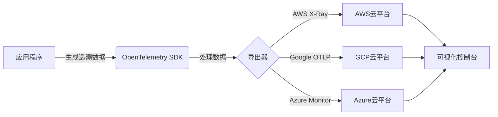

# OpenTelemetry 云平台集成

## 介绍

OpenTelemetry是一个开源的观测性框架，用于生成、收集和导出遥测数据（指标、日志和追踪）。云平台集成是指将这些数据发送到云服务提供商的后端系统（如AWS X-Ray、Google Cloud Operations或Azure Monitor），以便集中存储和分析。

对于初学者来说，理解这一过程的关键在于掌握三个核心步骤：
1. **数据生成**：通过OpenTelemetry SDK自动或手动生成遥测数据
2. **数据导出**：配置导出器(Exporter)将数据发送到云平台
3. **数据可视化**：在云平台的控制台中查看和分析数据

## 核心概念

### 1. 导出器(Exporters)

OpenTelemetry使用导出器将数据发送到不同后端。常见的云平台导出器包括：

- `OTLP Exporter`（通用，需云平台支持OTLP协议）
- `AWS X-Ray Exporter`
- `Google Cloud Monitoring Exporter`
- `Azure Monitor Exporter`

### 2. 端点配置

每个云平台都提供特定的接收端点(Endpoint)和认证方式（通常是API密钥或IAM角色）。

## 集成实战

### 示例1：与AWS X-Ray集成

以下是一个Node.js应用的配置示例：

```javascript
const { NodeTracerProvider } = require('@opentelemetry/sdk-node');
const { AWSXRayPropagator } = require('@opentelemetry/propagator-aws-xray');
const { AWSXRayIdGenerator } = require('@opentelemetry/id-generator-aws-xray');
const { AWSXRayExporter } = require('@opentelemetry/exporter-aws-xray');
const { BatchSpanProcessor } = require('@opentelemetry/sdk-trace-base');

const provider = new NodeTracerProvider({
  idGenerator: new AWSXRayIdGenerator(),
});

provider.register({
  propagator: new AWSXRayPropagator(),
});

const xrayExporter = new AWSXRayExporter({
  region: 'us-west-2' // 你的AWS区域
});

provider.addSpanProcessor(new BatchSpanProcessor(xrayExporter));
```

:::note
确保你的AWS凭证已正确配置，通常通过`~/.aws/credentials`文件或环境变量
:::

### 示例2：与Google Cloud Operations集成

对于GCP，使用OTLP导出器：

```python
from opentelemetry import trace
from opentelemetry.sdk.trace import TracerProvider
from opentelemetry.sdk.trace.export import BatchSpanProcessor
from opentelemetry.exporter.otlp.proto.grpc.trace_exporter import OTLPSpanExporter

# 设置导出器指向GCP端点
otlp_exporter = OTLPSpanExporter(
    endpoint="https://cloudtrace.googleapis.com:443",
    insecure=False,  # 使用TLS
)

trace.set_tracer_provider(TracerProvider())
tracer = trace.get_tracer(__name__)
trace.get_tracer_provider().add_span_processor(
    BatchSpanProcessor(otlp_exporter)
)

# 示例追踪
with tracer.start_as_current_span("gcp-operation"):
    print("This trace will be sent to Google Cloud Trace")
```

## 数据流示意图



## 实际应用场景

**电商平台监控案例**：

1. **需求**：监控用户从浏览商品到完成支付的完整流程
2. **实现**：
   - 使用OpenTelemetry自动检测HTTP请求
   - 添加自定义跨度(span)记录关键业务事件
   - 通过AWS X-Ray导出器发送数据
3. **结果**：
   - 在AWS控制台查看服务地图
   - 识别支付流程中的延迟问题
   - 分析跨服务的错误传播路径

## 常见问题解决

:::caution 认证失败
如果遇到认证错误：
1. 检查云平台的IAM权限设置
2. 验证本地凭证是否有效（如AWS CLI的`aws sts get-caller-identity`）
3. 确保导出器配置了正确的区域和项目ID
:::

:::tip 性能考虑
对于高流量应用：
- 使用`BatchSpanProcessor`减少网络请求
- 调整批处理参数（队列大小、延迟等）
- 考虑使用收集器(Collector)作为中介
:::

## 总结

OpenTelemetry的云平台集成使开发者能够：
- 利用云服务商提供的强大分析工具
- 实现跨服务的统一观测
- 无需自建监控基础设施

关键步骤记忆点：
1. 选择正确的导出器
2. 配置认证和端点
3. 验证数据是否到达云平台

## 扩展学习

推荐练习：
1. 在AWS免费层账户中部署示例应用并查看X-Ray追踪
2. 比较直接导出与通过OpenTelemetry Collector导出的差异
3. 尝试在不同云平台间切换导出器

附加资源：
- OpenTelemetry官方文档的"Exporters"章节
- 各云平台的OpenTelemetry集成指南
- OpenTelemetry Collector的配置示例