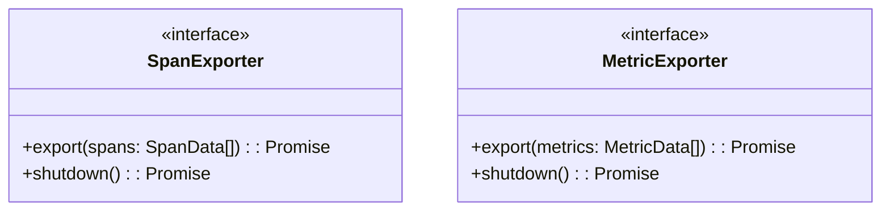

# OpenTelemetry 自定义导出器

## 介绍

OpenTelemetry是一个开源的观测性框架，用于生成、收集和导出遥测数据（指标、日志和追踪）。虽然OpenTelemetry提供了多种内置导出器（如Jaeger、Prometheus等），但有时我们需要将数据发送到**自定义后端**或**专有系统**。这时就需要创建**自定义导出器**。

自定义导出器允许你：
- 将数据适配到非标准协议
- 实现特定的数据转换逻辑
- 集成到内部监控系统

## 导出器基础架构

在OpenTelemetry中，所有导出器都实现特定的接口：



## 创建自定义Span导出器

下面是一个最基本的自定义Span导出器实现示例：

```typescript
import { ReadableSpan, SpanExporter } from '@opentelemetry/sdk-trace-base';

class MyCustomSpanExporter implements SpanExporter {
  async export(spans: ReadableSpan[]): Promise<ExportResult> {
    try {
      // 转换和发送数据
      const transformed = spans.map(span => ({
        traceId: span.spanContext().traceId,
        name: span.name,
        duration: span.duration
      }));
      
      await fetch('https://my-backend/api/traces', {
        method: 'POST',
        body: JSON.stringify(transformed)
      });
      
      return { code: ExportResultCode.SUCCESS };
    } catch (error) {
      return { code: ExportResultCode.FAILED };
    }
  }

  async shutdown(): Promise<void> {
    // 清理资源
  }
}
```

## 实际案例：导出到CSV文件

让我们看一个将Span数据导出到CSV文件的实用案例：

```typescript
import { writeFileSync } from 'fs';

class CsvSpanExporter implements SpanExporter {
  private filePath: string;
  
  constructor(filePath: string) {
    this.filePath = filePath;
  }

  async export(spans: ReadableSpan[]): Promise<ExportResult> {
    const csvRows = spans.map(span => 
      `${span.spanContext().traceId},${span.name},${span.duration}`
    ).join('\n');
    
    writeFileSync(this.filePath, 'traceId,name,duration\n' + csvRows);
    return { code: ExportResultCode.SUCCESS };
  }

  async shutdown(): Promise<void> {
    // 无资源需要清理
  }
}
```

:::tip 性能考虑
对于生产环境，考虑：
- 批量处理数据
- 实现队列机制
- 添加重试逻辑
:::

## 注册自定义导出器

创建导出器后，需要将其注册到OpenTelemetry SDK：

```typescript
import { NodeTracerProvider } from '@opentelemetry/sdk-trace-node';

const provider = new NodeTracerProvider();
provider.addSpanProcessor(new SimpleSpanProcessor(new MyCustomSpanExporter()));
provider.register();
```

## 测试你的导出器

使用OpenTelemetry测试工具验证导出器：

```typescript
import { BasicTracerProvider } from '@opentelemetry/sdk-trace-base';

describe('MyCustomSpanExporter', () => {
  it('should export spans correctly', async () => {
    const exporter = new MyCustomSpanExporter();
    const provider = new BasicTracerProvider();
    
    provider.addSpanProcessor(new SimpleSpanProcessor(exporter));
    
    const tracer = provider.getTracer('test');
    tracer.startSpan('test-span').end();
    
    // 添加验证逻辑
  });
});
```

## 总结

通过创建自定义导出器，你可以将OpenTelemetry数据发送到任何需要的目的地。关键步骤包括：

1. 实现适当的导出器接口（`SpanExporter`或`MetricExporter`）
2. 处理数据转换和传输
3. 注册导出器到OpenTelemetry SDK
4. 测试导出逻辑

## 进一步学习

- [OpenTelemetry 导出器规范](https://github.com/open-telemetry/opentelemetry-specification/blob/main/specification/trace/sdk.md#span-exporter)
- [参考实现：Zipkin导出器源码](https://github.com/open-telemetry/opentelemetry-js/tree/main/packages/opentelemetry-exporter-zipkin)
- [OpenTelemetry Collector 自定义导出器](https://opentelemetry.io/docs/collector/configuration/#exporters)

**练习**：尝试创建一个将Span数据发送到WebSocket服务器的导出器，并添加重试机制。