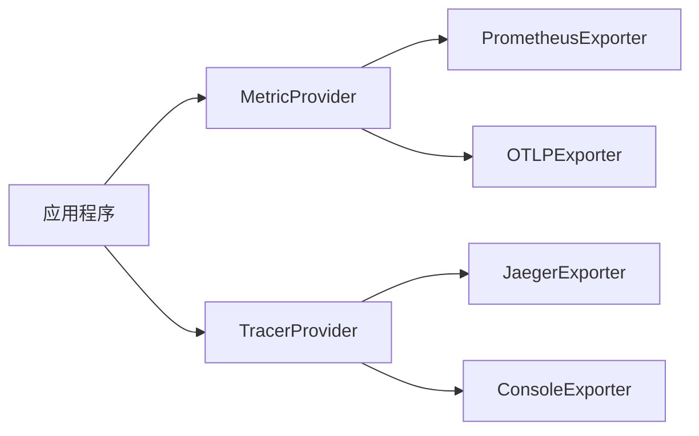

## 介绍

OpenTelemetry（简称OTel）是一个开源的观测性框架，用于生成、收集和导出遥测数据（如指标、日志和跟踪）。在实际生产环境中，我们可能需要将数据同时发送到多个后端系统，比如同时使用Prometheus监控指标和Jaeger分析分布式跟踪。这就是**多后端导出**的典型场景。

本指南将介绍如何配置OpenTelemetry SDK，实现数据向多个后端的并行导出。

---

## 核心概念

### 1. 导出器（Exporters）的作用
OpenTelemetry通过导出器将数据发送到后端系统。每个导出器负责特定协议或后端的适配，例如：
- `OTLPExporter`（OpenTelemetry协议）
- `JaegerExporter`
- `PrometheusExporter`
- `ConsoleExporter`（用于调试）

### 2. 多导出器配置原理
通过创建多个导出器实例并注册到Provider中，可以实现数据的分发。例如：



---

## 实战配置

### 示例：同时导出到Jaeger和控制台

以下是一个Node.js示例，展示如何配置多后端导出：

```javascript
const { NodeTracerProvider } = require('@opentelemetry/sdk-trace-node');
const { SimpleSpanProcessor } = require('@opentelemetry/sdk-trace-base');
const { JaegerExporter } = require('@opentelemetry/exporter-jaeger');
const { ConsoleSpanExporter } = require('@opentelemetry/sdk-trace-base');

// 1. 创建TracerProvider
const provider = new NodeTracerProvider();

// 2. 创建多个导出器
const jaegerExporter = new JaegerExporter({
  endpoint: 'http://localhost:14268/api/traces',
});
const consoleExporter = new ConsoleSpanExporter();

// 3. 注册多个处理器
provider.addSpanProcessor(new SimpleSpanProcessor(jaegerExporter));
provider.addSpanProcessor(new SimpleSpanProcessor(consoleExporter));

// 4. 注册Provider
provider.register();
```

运行后，跟踪数据会同时出现在：
- Jaeger UI `http://localhost:16686`
- 终端控制台

---

## 进阶技巧

### 1. 选择性导出
通过过滤器实现按条件导出，例如只导出错误span：

```javascript
const { BatchSpanProcessor } = require('@opentelemetry/sdk-trace-base');

provider.addSpanProcessor(new BatchSpanProcessor(jaegerExporter, {
  // 只导出状态为错误的span
  filter: (span) => span.status.code === 2
}));
```

### 2. 资源优化
当使用多个批处理导出器时，注意调整队列参数：

```javascript
new BatchSpanProcessor(exporter, {
  maxQueueSize: 2048,  // 默认2048
  scheduledDelayMillis: 5000  // 默认5000ms
});
```

---

## 真实案例：电商平台监控

某电商系统需要：
1. 将指标发送到Prometheus用于实时告警
2. 跟踪数据发送到Jaeger用于性能分析
3. 同时备份所有数据到AWS X-Ray

配置示例：

```javascript
// 指标配置
const meterProvider = new MeterProvider({
  exporters: [
    new PrometheusExporter({ port: 9464 }),
    new OTLPMetricExporter({ url: 'https://xray.amazonaws.com' })
  ]
});

// 跟踪配置
const traceProvider = new NodeTracerProvider();
traceProvider.addSpanProcessor(new BatchSpanProcessor(new JaegerExporter()));
traceProvider.addSpanProcessor(new SimpleSpanProcessor(new AWSXRayExporter()));
```

---

## 总结

关键要点：
- 通过创建多个导出器实例实现多后端导出
- 每个导出器可以独立配置处理器参数
- 生产环境建议使用`BatchSpanProcessor`提升性能
- 注意监控导出队列避免内存溢出

:::tip 最佳实践
1. 关键业务数据建议至少配置2个导出目的地
2. 开发环境保留ConsoleExporter便于调试
3. 不同后端可能对数据格式有特殊要求，需测试验证
:::

---

## 延伸学习

1. [OpenTelemetry官方导出器文档](https://opentelemetry.io/docs/concepts/exporters/)
2. 动手实验：尝试将同一份指标同时导出到Prometheus和Google Cloud Monitoring
3. 思考题：如何设计一个导出失败时的回退机制？