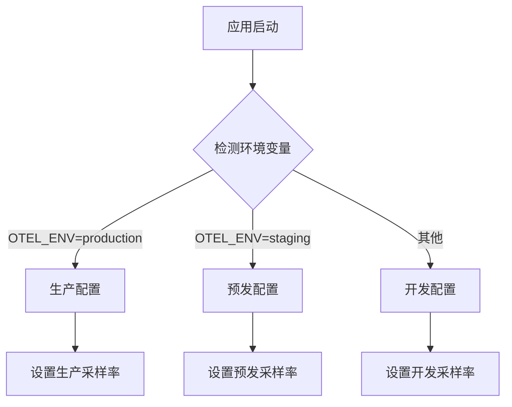

# OpenTelemetry 多环境配置

## 介绍

在实际项目中，我们通常需要在**开发**、**测试**和**生产**等不同环境中部署应用。OpenTelemetry的多环境配置能帮助我们：

1. 在不同环境中启用不同级别的数据收集
2. 避免生产环境泄露敏感数据
3. 根据环境调整采样率和导出频率
4. 使用不同的导出目标（如开发环境用控制台，生产环境用Prometheus）

## 基础配置策略

### 1. 环境变量区分

最常用的方法是通过环境变量区分配置：

```javascript
// 初始化OpenTelemetry时读取环境变量
const { NodeSDK } = require('@opentelemetry/sdk-node');
const { getEnv } = require('@opentelemetry/core');

const env = getEnv().OTEL_ENV || 'development';

const sdk = new NodeSDK({
  resource: new Resource({
    [SemanticResourceAttributes.SERVICE_NAME]: 'my-service',
    'environment': env  // 添加环境标签
  }),
  // 其他配置...
});
```

### 2. 条件化采样率

不同环境设置不同的采样率：

```javascript
const { AlwaysOnSampler, ParentBasedSampler } = require('@opentelemetry/core');

function getSampler(env) {
  switch(env) {
    case 'production':
      return new ParentBasedSampler({ root: new AlwaysOnSampler() });
    case 'staging':
      return new ParentBasedSampler({ root: new AlwaysOnSampler() });
    default: // development
      return new AlwaysOnSampler(); // 开发环境记录所有数据
  }
}
```

## 进阶配置示例

### 多环境导出器配置

```javascript
const { ConsoleSpanExporter, OTLPTraceExporter } = require('@opentelemetry/sdk-trace-base');
const { OTLPMetricExporter } = require('@opentelemetry/sdk-metrics');

function getExporters(env) {
  const exporters = {
    trace: null,
    metric: null
  };

  switch(env) {
    case 'production':
      exporters.trace = new OTLPTraceExporter({ url: 'https://prod-collector:4317' });
      exporters.metric = new OTLPMetricExporter({ url: 'https://prod-collector:4317' });
      break;
    case 'staging':
      exporters.trace = new OTLPTraceExporter({ url: 'https://stage-collector:4317' });
      exporters.metric = new OTLPMetricExporter({ url: 'https://stage-collector:4317' });
      break;
    default:
      exporters.trace = new ConsoleSpanExporter();
      exporters.metric = new ConsoleMetricExporter();
  }

  return exporters;
}
```

### 环境感知的资源配置



## 实际案例

### 案例：电商平台的多环境配置

1. **开发环境**：
   - 控制台输出所有span
   - 100%采样率
   - 添加`developer=name`标签

2. **测试环境**：
   - 导出到测试用Jaeger实例
   - 50%采样率
   - 模拟生产环境配置

3. **生产环境**：
   - 导出到生产用OTLP收集器
   - 动态采样（重要事务100%，其他1%）
   - 严格的敏感数据过滤

```javascript
// 生产环境敏感数据过滤处理器
const { SimpleSpanProcessor } = require('@opentelemetry/sdk-trace-base');

if (env === 'production') {
  tracerProvider.addSpanProcessor(new SimpleSpanProcessor({
    onEnd(span) {
      if (span.attributes['credit_card']) {
        span.attributes['credit_card'] = 'REDACTED';
      }
    }
  }));
}
```

## 总结

OpenTelemetry的多环境配置能帮助团队：

- 保持开发环境的调试便利性
- 在测试环境获得足够数据
- 确保生产环境的性能和安全性

:::tip 最佳实践
1. 始终通过环境变量控制配置
2. 为每个环境创建明确的配置预设
3. 生产环境务必启用敏感数据过滤
4. 定期验证各环境的配置差异
:::

## 扩展资源

1. [OpenTelemetry环境变量规范](https://opentelemetry.io/docs/concepts/sdk-configuration/)
2. [多环境部署策略](https://12factor.net/config)
3. [生产环境可观测性指南](https://landing.google.com/sre/sre-book/chapters/monitoring-distributed-systems/)

## 练习

1. 创建一个Node.js应用，根据`NODE_ENV`自动切换OpenTelemetry配置
2. 为开发环境添加一个控制台导出器，为生产环境添加Jaeger导出器
3. 实现一个自定义处理器，在非生产环境添加额外的调试属性