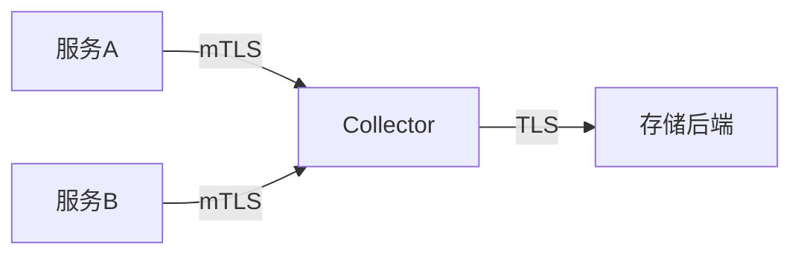

# OpenTelemetry 加密配置

## 介绍

在现代分布式系统中，确保可观测性数据（如追踪、指标和日志）的安全传输至关重要。OpenTelemetry提供了灵活的加密配置选项，允许开发者通过TLS/SSL保护数据在传输过程中的安全性。本文将介绍如何为OpenTelemetry Collector和SDK配置加密通信。

## 为什么需要加密？

当OpenTelemetry数据跨越网络边界传输时（例如从应用程序到Collector，或从Collector到后端存储），可能会面临以下风险：
- 数据被窃听
- 数据被篡改
- 中间人攻击

加密配置可以防止这些安全威胁，特别是在生产环境中或处理敏感数据时。

## 基础概念

### TLS/SSL简介
TLS（Transport Layer Security）是SSL的继任者，为网络通信提供：
1. **加密**：防止数据被窃听
2. **身份验证**：确保通信双方的身份
3. **完整性**：防止数据被篡改

## OpenTelemetry Collector加密配置

### 启用HTTPS接收器

以下示例展示如何配置Collector使用HTTPS接收数据：

```yaml
receivers:
  otlp:
    protocols:
      http:
        endpoint: 0.0.0.0:4318
        tls:
          cert_file: /path/to/server.crt
          key_file: /path/to/server.key
```

:::note
需要准备有效的证书和私钥文件。可以使用OpenSSL生成自签名证书用于测试：
```bash
openssl req -x509 -newkey rsa:4096 -keyout server.key -out server.crt -days 365 -nodes
```
:::

### 客户端证书验证（双向TLS）

如需更高级别的安全，可以要求客户端提供证书：

```yaml
receivers:
  otlp:
    protocols:
      http:
        tls:
          client_ca_file: /path/to/ca.crt  # 信任的CA证书
          require_client_cert: true        # 要求客户端证书
```

## SDK端加密配置

### Go SDK示例

```go
import (
	"go.opentelemetry.io/otel/exporters/otlp/otlptrace/otlptracehttp"
)

func initTracer() (*tracesdk.TracerProvider, error) {
	client := otlptracehttp.NewClient(
		otlptracehttp.WithEndpoint("collector.example.com"),
		otlptracehttp.WithURLPath("/v1/traces"),
		otlptracehttp.WithTLSClientConfig(
			&tls.Config{
				InsecureSkipVerify: false, // 生产环境应为false
				RootCAs:            loadCertPool("/path/to/ca.crt"),
			},
		),
	)
	return tracesdk.NewTracerProvider(tracesdk.WithBatcher(client))
}

func loadCertPool(path string) *x509.CertPool {
	caCert, err := os.ReadFile(path)
	if err != nil {
		panic(err)
	}
	pool := x509.NewCertPool()
	pool.AppendCertsFromPEM(caCert)
	return pool
}
```

## 实际应用场景

### 场景：金融系统监控

在一个金融系统中，监控数据可能包含敏感信息：
1. 所有服务到Collector的通信使用双向TLS
2. Collector到存储后端的通信也加密
3. 使用组织内部CA颁发证书



## 常见问题解决

:::caution 证书验证失败
如果遇到证书验证错误：
1. 确保证书没有过期
2. 检查主机名是否匹配证书中的SAN
3. 验证证书链是否完整
:::

## 总结

OpenTelemetry的加密配置提供了强大的安全保障：
- 支持单向和双向TLS
- 灵活的证书管理选项
- 与现有PKI基础设施集成

## 延伸学习

1. 实践：使用Let's Encrypt为生产环境配置自动证书更新
2. 探索：如何在Kubernetes环境中使用证书管理器自动配置TLS
3. 阅读：OpenTelemetry安全最佳实践文档

:::tip 下一步
尝试在自己的开发环境中配置加密通信，并使用Wireshark验证数据是否确实被加密。
:::