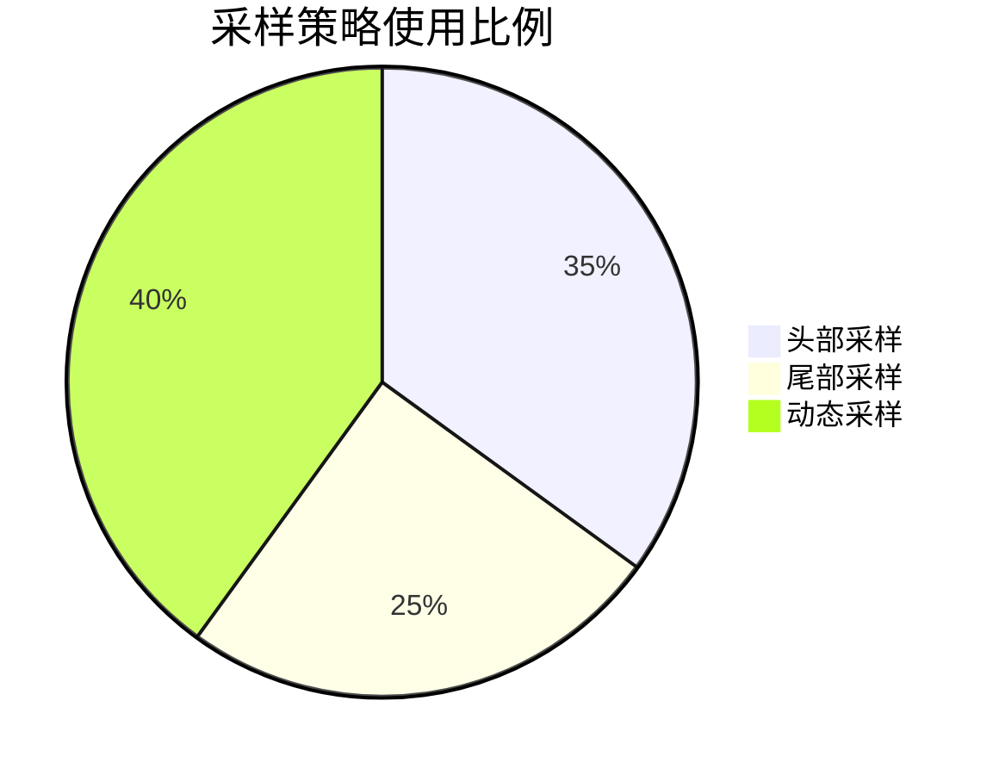
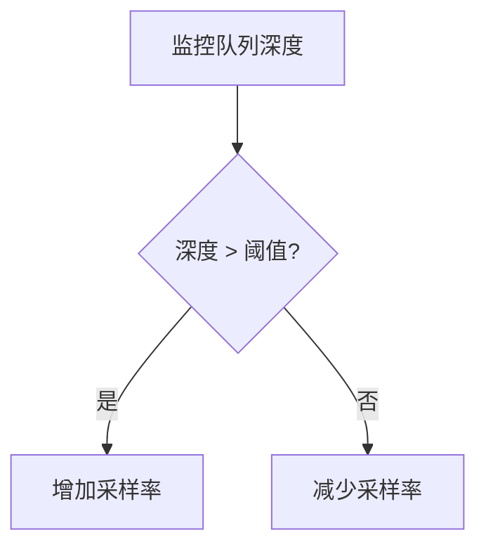

# OpenTelemetry 配置最佳实践

## 介绍
OpenTelemetry（简称OTel）是云原生应用的可观测性标准工具集。正确配置OTel能帮助开发者高效收集、处理和导出遥测数据（指标、日志、链路）。本文将从资源定义、采样策略到处理器管道，逐步讲解配置中的关键决策点。

:::note 目标读者
- 已了解OpenTelemetry基础概念的初学者
- 需要优化现有OTel配置的开发者
:::

## 1. 资源定义最佳实践
资源(Resource)是描述被监控实体的元数据，正确配置可确保数据上下文清晰。

### 关键属性
```javascript
const { Resource } = require('@opentelemetry/resources');
const { SemanticResourceAttributes } = require('@opentelemetry/semantic-conventions');

const resource = new Resource({
  [SemanticResourceAttributes.SERVICE_NAME]: 'payment-service',
  [SemanticResourceAttributes.SERVICE_VERSION]: '1.2.0',
  [SemanticResourceAttributes.DEPLOYMENT_ENVIRONMENT]: 'production'
});
```

:::tip 建议
- 必填`service.name`，否则部分后端无法关联数据
- 添加`deployment.environment`区分开发/生产环境
- 通过环境变量动态注入配置（如`OTEL_RESOURCE_ATTRIBUTES`）
:::

## 2. 采样策略优化
采样可控制数据量和服务负载，平衡成本与精度。

### 动态采样示例
```python
from opentelemetry.sdk.trace.sampling import DynamicSampler

sampler = DynamicSampler(
    rate=500,  # 每秒最大采样数
    attribute_filter=lambda span: "high_priority" in span.attributes
)
```

常见策略对比：


## 3. 处理器管道配置
处理器控制数据如何处理和导出，直接影响性能。

### 典型生产配置
```yaml
processors:
  batch:
    timeout: 5s
    send_batch_size: 1000
  memory_limiter:
    limit_mib: 400
    spike_limit_mib: 100
```

:::warning 注意
- 内存限制应小于容器总内存的50%
- 批处理超时需短于上游服务的超时设置
:::

## 4. 实际案例：电商系统配置

### 场景需求
- 支付服务需要100%采样关键事务
- 商品浏览服务只需10%采样率
- 所有数据需添加业务部门标签

### 实现方案
```go
import (
	"go.opentelemetry.io/otel/sdk/resource"
	sdktrace "go.opentelemetry.io/otel/sdk/trace"
)

func initTracer() {
	res := resource.NewWithAttributes(
		semconv.SchemaURL,
		semconv.ServiceNameKey.String("ecommerce"),
		semconv.ServiceNamespaceKey.String("checkout"),
	)

	tp := sdktrace.NewTracerProvider(
		sdktrace.WithResource(res),
		sdktrace.WithSampler(
			sdktrace.ParentBased(
				sdktrace.TraceIDRatioBased(0.1),
				sdktrace.WithRemoteSamplerConfig(
					sdktrace.RemoteSamplerConfig{
						Endpoint:    "sampling-service:55678",
						ServiceName: "payment",
					},
				),
			),
		),
	)
}
```

## 5. 高级技巧

### 自动缩放配置


### 属性过滤
减少不必要的数据传输：
```java
SpanProcessor attributeFilter = AttributeFilter
    .create(Set.of("user.id", "transaction.amount"))
    .toSpanProcessor();
```

## 总结

关键配置要点：
1. **资源定义**：确保完整的服务标识
2. **采样策略**：根据业务重要性分级
3. **处理器管道**：平衡吞吐量与资源消耗
4. **环境适配**：开发/生产环境差异化配置

## 延伸学习

推荐练习：
1. 为你的服务添加环境标签
2. 实现一个动态采样器，在错误率升高时增加采样率
3. 比较批处理与直接导出的性能差异

官方资源：
- [OpenTelemetry配置文档](https://opentelemetry.io/docs/concepts/configuration/)
- [语义约定完整列表](https://github.com/open-telemetry/semantic-conventions)