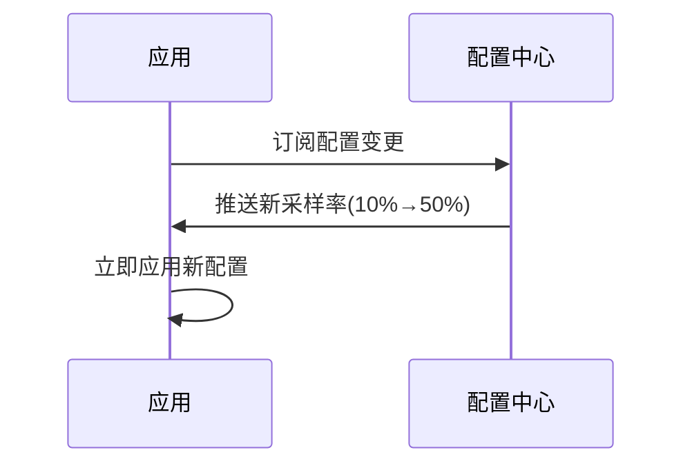

## 介绍

OpenTelemetry动态配置允许开发者在运行时修改遥测数据的收集行为，无需重启应用程序。这对于生产环境中的调试、临时采样率调整或协议切换至关重要。本文将介绍动态配置的核心机制、实现方式及实际应用场景。

---

## 为什么需要动态配置？

传统配置方式需要重启应用才能生效，而动态配置解决了以下问题：
- **快速故障排查**：临时增加日志级别或采样率
- **灵活调整**：根据系统负载动态降低采样频率
- **零停机更新**：切换导出协议（如HTTP→gRPC）

:::tip 典型场景
当线上服务出现异常时，临时将采样率从1%提升到100%进行全量数据捕获
:::

---

## 核心实现方式

### 1. 环境变量动态加载

```javascript
// 初始化时启用环境变量自动重载
const { NodeSDK } = require('@opentelemetry/sdk-node');
const sdk = new NodeSDK({
  autoDetectResources: true,
  // 每5分钟检查环境变量变更
  envVarLoaderOptions: { interval: 300_000 } 
});
```

### 2. 配置服务集成

通过外部配置中心（如Consul、ZooKeeper）推送变更：



### 3. 编程式动态API

直接通过SDK提供的API修改：

```python
from opentelemetry.sdk.trace import TracerProvider
from opentelemetry.sdk.trace.export import BatchSpanProcessor

tracer_provider = TracerProvider()
# 初始处理器
original_processor = BatchSpanProcessor(...)
tracer_provider.add_span_processor(original_processor)

# 运行时动态添加新处理器
new_processor = BatchSpanProcessor(...)
tracer_provider.add_span_processor(new_processor)

# 也可以移除处理器
tracer_provider.remove_span_processor(original_processor)
```

---

## 实战案例：动态采样率调整

### 初始配置
```yaml
# opentelemetry-config.yaml
samplers:
  trace:
    type: parent_based
    root: 
      type: probabilistic
      ratio: 0.1 # 10%采样率
```

### 动态更新步骤
1. 通过API端点暴露配置接口：
```go
func updateSampling(c *gin.Context) {
  newRatio := c.Query("ratio")
  provider := otel.GetTracerProvider()
  if tsp, ok := provider.(*sdktrace.TracerProvider); ok {
    tsp.UpdateSampler(sdktrace.ParentBased(
      sdktrace.TraceIDRatioBased(parseFloat(newRatio))))
  }
}
```

2. 发送更新请求：
```bash
curl -X POST http://localhost:8080/sampling?ratio=0.5
```

3. 验证效果：
```text
# 更新前
2023-01-01T10:00:00 TraceID=1 sampled=false
# 更新后 
2023-01-01T10:01:00 TraceID=2 sampled=true
```

:::caution 注意事项
- 动态修改可能造成短暂的数据不一致
- 高频率更新可能影响性能
- 需要做好配置变更的审计日志
:::

---

## 最佳实践

1. **版本兼容**：确保新旧配置的协议兼容性
2. **渐进式变更**：先在小范围实例测试
3. **回滚机制**：保留最近3个有效配置版本
4. **权限控制**：动态配置接口需严格鉴权

```javascript
// 示例：配置变更验证中间件
app.use('/config', (req, res, next) => {
  if (!req.user.hasRole('observability-admin')) {
    return res.status(403).end()
  }
  next()
})
```

---

## 总结

OpenTelemetry动态配置为可观测性系统提供了关键灵活性，通过：
- 环境变量热加载
- 配置中心集成
- 编程式API控制

**延伸学习**：
1. [OpenTelemetry Configuration SDK文档](https://opentelemetry.io/docs/)
2. 实验：尝试在Kubernetes环境中通过ConfigMap实现动态配置
3. 挑战：设计一个配置变更的A/B测试方案

> 下节预告：我们将探讨如何通过OpenTelemetry Collector实现更复杂的动态管道配置。